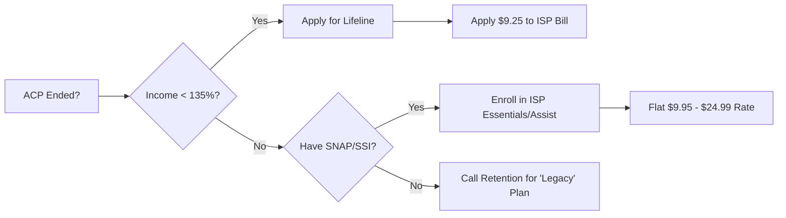

Most people think their $30 internet discount just vanished into thin air when the ACP ended. It didn't—it just moved, and your ISP is hoping you won't ask where it went.

The Affordable Connectivity Program (ACP) is officially dry, but the **Lifeline program** and private "Essentials" tiers are still active. If your bill just jumped by $30 or more, you're likely sitting on a plan you can't afford because you haven't forced your provider to move you to their low-income legacy tiers. 

```markmap
# Post-ACP Internet Strategy

<!--more-->

## Federal Subsidy
### Lifeline Program
- $9.25 monthly credit
- Can apply to phone or internet
- Stricter eligibility than ACP
## Private ISP Tiers
### Comcast Internet Essentials
- $9.95/month
- No credit check
- No equipment fees
### Spectrum Internet Assist
- $24.99/month
- 50 Mbps speeds
- Includes modem
## Non-Profit Options
### PCs for People / Human-I-T
- Refurbished hotspots
- Low-cost monthly data
- Income verification required
```

## Low Income Internet Alternative Programs: Replacing the ACP Discount

The federal government didn't leave the cupboard completely bare. The **Lifeline program** has existed since the 80s and it isn't going anywhere. While the ACP offered a generous $30, Lifeline provides a **$9.25 monthly subsidy**. It’s not a total bill-killer, but it’s a permanent floor that helps offset the cost of a basic plan.

### The Lifeline Program: The $9.25 Federal Floor

Lifeline is the steady, boring cousin of the ACP. You qualify if your income is at or below 135% of the Federal Poverty Guidelines or if you participate in SNAP, Medicaid, or SSI. The biggest hurdle isn't the money—it's the paperwork. You have to use the National Verifier to prove you're eligible before you even talk to an internet provider.

Don't expect your ISP to volunteer this info. You have to get your approval code from the FCC first, then call your provider’s "Retention" or "Billing" department. Tell them you have a Lifeline eligibility code and you want it applied to your account. If they try to upsell you to a "High Speed" plan that negates the discount, refuse it. You're there for the subsidy, not the bloatware.

### Private ISP Tiers: Finding the "Secret" Menus

Major providers like Comcast and Spectrum have private programs that don't rely on government funding. These are the real winners for post-ACP households. **Comcast Internet Essentials** is the gold standard here, costing **$9.95 per month**. It includes a modem, has no credit check, and doesn't require a contract. 

Spectrum's version, **Internet Assist**, is slightly pricier at **$24.99**, but it offers higher speeds that can actually handle a household with two people streaming at once. The catch? You usually can't have an outstanding balance with the provider to sign up. If the ACP ending left you with a "past due" notice, you'll need to clear that or negotiate a payment plan before they'll let you switch to these lower tiers.

### The Eligibility Trap: Why Your Old ACP Status Might Not Carry Over

Here’s where people get stuck. Just because you had the ACP doesn't mean you automatically get Lifeline or an ISP's private discount. The ACP's income cap was 200% of the poverty level; Lifeline is much tighter at **135%**. If you were right on the edge, you might find yourself "too rich" for the federal subsidy but still eligible for the ISP's internal programs.

A recent online thread highlighted a common frustration: users calling their ISP to ask for "the low-income plan" and being told it doesn't exist. That's because you're using the wrong words. You have to ask for the program by its **specific brand name** (e.g., "Internet Essentials" or "Internet Assist"). If you just ask for a "discount," the representative will look for a temporary promotional code that expires in six months. You want the permanent tier.


## Which Program Should You Pick?

Stop looking for a "one-size-fits-all" fix. Your choice depends entirely on who provides service to your front door and exactly how much you make.

| Program | Monthly Cost | Best For | Key Requirement |
| :--- | :--- | :--- | :--- |
| **Lifeline** | -$9.25 (Credit) | Adding to any plan | 135% Poverty Level or SNAP/SSI |
| **Comcast Internet Essentials** | $9.95 | Extreme budget | Must live in Xfinity service area |
| **Spectrum Internet Assist** | $24.99 | Small families | At least one person on SNAP/SSI |
| **PCs for People** | ~$15 | Rural/Mobile | Income verification + hardware purchase |


If you're a senior on Social Security, call your ISP and specifically mention you are on **Supplemental Security Income (SSI)**. This is often the "magic word" that bypasses the standard sales script and gets you to the low-income enrollment team.


### The "Retention" Strategy for Mid-Tier Users

If you don't qualify for Lifeline but the ACP loss is still hurting, you have to play the "Retention" game. Call your provider and tell them you're planning to cancel because the bill is no longer affordable. Don't be rude, just be firm. 

Ask for the **Loyalty Department**. These employees have the power to put you on "legacy" plans that aren't advertised on the website. Often, they can find a $30 or $40 flat-rate plan that isn't as cheap as the $10 Essentials tier but is significantly better than the $80 retail price you're likely paying now.



### [Frequently Asked Questions]

**Can I still get free internet without ACP?**
Completely free internet is rare now. However, if you combine the **Lifeline $9.25 credit** with a low-cost plan like **Comcast Internet Essentials ($9.95)**, your out-of-pocket cost drops to pennies. Some local non-profits or "Mesh" networks in cities like NYC or Detroit offer free access, but for most of the country, $10 is the new floor.

**Can I have Lifeline and an ISP discount at the same time?**
Yes. You can use your Lifeline credit on a plan that is already discounted by the ISP. For example, you can apply the $9.25 federal credit to a $25 Spectrum Internet Assist plan, bringing your total monthly bill down to about $15.75.

**What happens if I owe my ISP money?**
This is the biggest roadblock. Most ISPs won't let you move to a low-income tier if you have an active debt. You must **settle the balance** or ask for a "Fresh Start" program. Some providers will waive old debt if you agree to stay on a low-income tier for a set period.

### [References]
- [FCC Lifeline Support for Affordable Communications](https://www.fcc.gov/lifeline-consumers)
- [Xfinity Internet Essentials Official Site](https://www.xfinity.com/learn/internet-service/internet-essentials)
- [Spectrum Internet Assist Eligibility](https://www.spectrum.com/internet/spectrum-internet-assist)