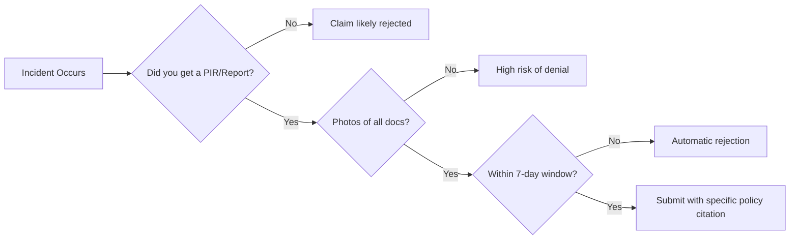

Most airline passenger rights guides make it sound like a simple form and a check in the mail. They skip the part where a single missing photo or a 24-hour delay in reporting can void a $2,500 claim instantly. If you've already filed and been hit with a "we are not liable" email, you're likely falling into one of three specific traps.

<!--more-->

## Why Your Compensation Claim Is Already in the Trash

The reality of **airline claim rejection reasons** usually comes down to the "Contract of Carriage"—that massive document you agreed to when you bought the ticket. Airlines count on you not reading it. Most claims fail because the passenger treats the airline like a customer service desk rather than a legal opponent.

If you don't have a **Property Irregularity Report (PIR)** for baggage or a timestamped photo of a delay board, the airline’s system is designed to auto-reject you. They aren't looking for "what happened"; they're looking for the specific legal trigger that forces them to pay.

```markmap
# Airline Claim Roadmap
## Pre-Filing
### Property Irregularity Report (PIR)
### Timestamped Photos
### Witness Contacts
## The "Big Three" Rejections
### Extraordinary Circumstances (Weather/War)
### Missed Deadlines (The 7-Day Rule)
### Insufficient Documentation
## Escalation
### DOT/IATA Complaint
### Small Claims Court
### Third-party Advocates
```

## The "Extraordinary Circumstances" Trap: Jet Fuel and Global Conflict

Recent disruptions have shown a new trend in rejections. Airlines worldwide have begun canceling flights as regional conflicts strain jet fuel supplies and push prices to extremes. When this happens, carriers often hide behind the "extraordinary circumstances" clause to avoid paying out for hotel stays or rebooking fees.

**The systemic blind spot** here is that while a war is outside an airline's control, managing their fuel supply is technically an operational risk. By labeling fuel-related cancellations as "unforeseeable," airlines attempt to bypass standard passenger protections. For you, this means navigating a confusing web of rules that vary wildly between the DOT in the U.S. and IATA regulations globally.

**Your defensive step:** If your flight is canceled due to "operational reasons" or "fuel issues," do not accept a simple apology. Demand the specific reason in writing. If they cite fuel, point to the fact that fuel procurement is a business operation, not an Act of God like a volcano eruption.


Never leave the airport without a written statement explaining the reason for a delay or cancellation. Once you leave, the airline's story often changes to something "non-compensable."


## When the Airline Backtracks on Verbal Offers

A common friction point involves "voluntary" compensation. In one recent case, a major carrier offered $2,500 to passengers willing to give up their seats on an oversold flight. After the passengers agreed and the flight took off, the airline retracted the offer just two hours later, claiming the "system" hadn't authorized that amount.

The failure here is relying on a gate agent's word or a fleeting screen notification. Airlines use these high-pressure moments to clear the gate, knowing that once the plane is gone, your leverage disappears. If you don't have a voucher code or a confirmed email **before the plane pushes back**, the airline can—and often will—steadfastly maintain a denial position.

**The hidden lever:** If you are volunteering, stay at the desk until you see the credit in your app or hold a physical voucher. If they refuse to print it, take a clear photo of the gate agent's screen showing the offer amount and their employee ID.


## The "Indigo Fiasco" and the Copy-Paste Wall

When mass disruptions happen—like the recent "Indigo fiasco" where thousands were stranded—airlines pivot to "damage control mode." This usually involves sending out thousands of identical, copy-pasted emails that offer a generic apology but zero financial compensation. 

Most people see the corporate letterhead and assume the case is closed. That's exactly what the airline wants. These mass rejections are often a filter to see who will actually put in the effort to escalate. The conventional fix (replying to the email) fails because those inboxes are often unmonitored or handled by low-level bots.

**The workaround:** Move the conversation to a public-facing platform or a formal regulatory body. Filing a complaint with the **Department of Transportation (DOT)** or the equivalent consumer agency in your region forces a human in the airline's legal department to actually open your file. 

## Mandatory Deadlines You Can't Ignore

If you miss these windows, your claim is dead on arrival. No amount of "customer loyalty" will bypass these hard-coded system dates.

| Claim Type | Reporting Deadline (Typical) | Evidence Needed |
| :--- | :--- | :--- |
| **Damaged Baggage** | 7 Days | PIR, Photos of damage + original tags |
| **Delayed Baggage** | 21 Days | PIR, Receipts for "essential" purchases |
| **Flight Delay (EU/UK)** | 2–6 Years | Boarding pass, Delay duration proof |
| **Personal Injury** | Immediate / Varies | Onboard incident report, Medical records |


For baggage claims, "essential purchases" doesn't mean a designer suit. Stick to toiletries and basic clothing, and keep every single receipt. Digital copies are better than paper.


## Final Checklist Before You Hit "Submit"

Before you send that claim form, run through this logic. If you're missing one of these, you're giving them a reason to say no.



### [References]
- [What to know if your flight is canceled over rising jet fuel costs](https://thehill.com/business/personal-finance/5846935-what-to-know-if-your-flight-is-canceled-over-rising-jet-fuel-costs/)
- [What to know if your flight is canceled amid rising jet fuel costs](https://travel.yahoo.com/advice/safety/articles/know-flight-canceled-amid-rising-043043734.html)
- [The Endangered Species of the Global Citizen - fugitive margins](https://fugitivemargins.substack.com/p/the-end-of-elsewhere)