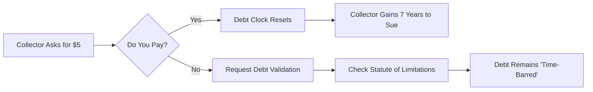

The collector says if you just send $5, they'll stop the calls. It sounds like a cheap way to buy some peace. In reality, you just handed them a loaded gun. That tiny payment isn't a peace offering—it's a legal confession that can revive a "dead" debt and give them a brand new window to garnish your wages.

<!--more-->

## The $5 Trap: How a Small Payment Triggers a Debt Statute of Limitations Restart

When a debt gets old enough, it hits the **statute of limitations**. This doesn't mean you don't owe the money, but it does mean the collector loses the legal right to sue you to get it. This is where "zombie debt" comes in. Collectors buy these old accounts for pennies and try to trick you into making a "good faith" payment.

Here’s the catch: the moment you send even one dollar, you "acknowledge" the debt. In many jurisdictions, this act alone **restarts the statute of limitations**, potentially giving collectors **7 more years to sue you**. You aren't paying off the debt; you're resetting the countdown on your own legal vulnerability.



### Finishing Debt Relief Doesn't Mean the Creditor Door Is Locked

Completing a debt relief or settlement program is a massive milestone, but it isn't a magic shield. Recent reports show that even after you've "finished" a program, some creditors or third-party buyers still attempt to restart collection activity. 

The systemic blind spot here is the hand-off between the debt relief agency and the original creditor. Sometimes, the settlement only covers a portion of the balance, or the administrative "closing" of the account isn't communicated to the **Credit Bureau** correctly. If you don't have a written "settled in full" agreement, you're still a target. The moment the program ends, if there's a lingering balance, the calls can start all over again. You need to keep every piece of completion paperwork like it's gold; it's your only defense when a new collector claims you still owe the "remainder."

### Why "Final Notice" Lawsuit Threats Are Often Real

Many people ignore collection letters because they think "court action pending" is just a scare tactic. While some low-tier agencies use bluster, institutional debt buyers are increasingly following through. If you receive a notice with legal-sounding language, don't assume it's a bluff.

The reason is simple: default judgments. Collectors know that most people won't show up to court. If you don't show up, they win by default. This allows them to freeze bank accounts or garnish paychecks—actions they couldn't take with just a phone call. The damage here is downstream; once a judgment is entered, the **statute of limitations** conversation is over. You're no longer arguing about an old debt; you're dealing with a court order. If you're served, you must respond, even if the debt is ten years old.


### The Aggressive Shift: Why 21% Interest Changes the Collection Game

We're currently in an environment where credit card balances are sticking around longer and costing significantly more. If you're carrying a revolving balance, it's likely accruing interest at a rate of **21% or higher**. 

This high interest creates a "compounding trap." Even if you make consistent small payments, the balance grows faster than you can kill it. For collectors, this makes your old debt a high-value asset. They aren't just looking for the original $1,000 you owed; they want the $3,000 it became after years of interest and fees. This is why they've become more aggressive. They aren't just looking for a settlement; they're looking for a way to lock you into a new payment cycle that restarts the legal clock.


Never give a debt collector access to your primary bank account for a "one-time" small payment. They often use that info to verify where your funds are for future garnishment.


### Using a Tax Refund to Kill Debt: The Strategy You're Missing

A common scenario involves getting a $2,000 tax refund and wondering whether to spread it across three maxed-out cards or hit one big balance. Most people try to "spread the love" to lower their overall utilization, but that’s often the wrong move if one of those debts is near the statute of limitations.

If you have a debt that is 5 years old and the limit is 6 years, putting a "dent" in it with your refund is the worst thing you can do. You’ve just paid to keep yourself in legal jeopardy for another several years. Instead, use that leverage to negotiate a "Pay for Delete" settlement where the collector agrees, in writing, to remove the entry from your **Credit Bureau** report entirely. If you can't get that in writing, you're better off putting that money into an emergency fund or a debt that is already "fresh" and can't be ignored.

## Three Defensive Steps to Stop Zombie Debt in Its Tracks

Before you pick up the phone or open your wallet, you need to move from defense to offense.

1.  **Demand a Debt Validation Letter:** Under the **Fair Debt Collection Practices Act**, you have the right to demand proof that the debt is yours, the amount is correct, and the agency actually has the right to collect it.
2.  **Check Your State's Clock:** Every state has a different limit (usually 3 to 10 years). Find out exactly when the clock started on your debt. If it's "time-barred," you don't owe them a conversation, let alone a payment.
3.  **Send a Cease and Desist:** If the debt is past the statute of limitations, you can send a written notice telling the collector to stop contacting you. Once they receive it, they can only contact you to say they are stopping or to notify you of a specific legal action (which they likely can't take if the debt is too old).

```markmap
# Debt Defense Strategy
## Step 1: Verification
- Demand Validation Letter
- Check Original Creditor
- Verify Amount
## Step 2: Legal Status
- Check State Statute of Limitations
- Determine "Date of Last Activity"
- Identify if "Time-Barred"
## Step 3: Action
- If Old: Cease & Desist
- If New: Negotiate "Pay for Delete"
- Never make "Good Faith" payments
```

### [References]
- [Can creditors restart collections after a debt relief program ends?](https://www.cbsnews.com/news/creditors-restart-collections-after-debt-relief-ends/)
- [How often do debt collectors follow through on lawsuits?](https://www.cbsnews.com/news/how-often-debt-collectors-follow-through-lawsuits/)
- [Can debt relief trigger more aggressive collection attempts?](https://www.cbsnews.com/news/debt-relief-trigger-aggressive-collections/)