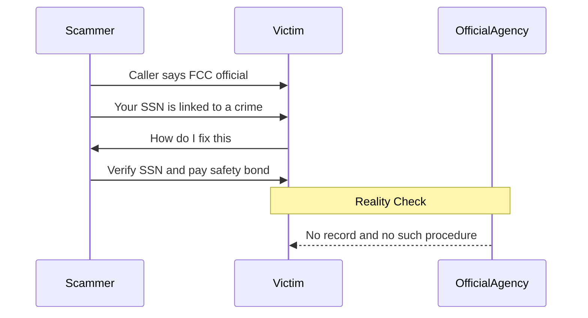

The Federal Communications Commission (FCC) has zero jurisdiction over your Social Security number. If you get a call from someone claiming to be an FCC official warning you about a "compromised" SSN, **hang up immediately**. These callers are using spoofed numbers to mimic government agencies, but the premise of the call is a total fabrication.

### The 'FCC Compromise' Script: Why It's Surging Now

Most generic warnings tell you to "be careful," but they don't explain why this specific script is currently effective. A report on Reddit's r/Scams from April 28, 2026, highlights a wave of these calls that use high-pressure tactics to bypass your logic.

Scammers aren't just guessing anymore; they're leveraging current events to sound legitimate. They've begun referencing the **David Morens NIH indictment** news to manufacture a sense of a "government-wide" investigation. By tying their fake script to real-world headlines about federal probes, they make the "compromise" of your SSN feel like part of a larger, legitimate legal sweep.

### How to Tell If a Call From the FCC is Real

The FCC regulates radio, television, wire, satellite, and cable. They don't investigate financial crimes or Social Security fraud. That is the job of the Social Security Administration (SSA) or the Office of the Inspector General (OIG).

*   **The Jurisdiction Gap:** The FCC will **never call individuals to 'verify' Social Security numbers** or threaten them with immediate arrest.
*   **The Payment Trap:** No federal agency accepts payment via gift cards, wire transfers, or cryptocurrency.
*   **Spoofing Reality:** Scammers can make your caller ID say "FCC" or "Washington D.C." with a simple software tweak. Never trust the display name.


If the caller mentions a "suspension" of your Social Security number, it’s a lie. The government does not "suspend" SSNs.


### Safe Steps to Verify Your Status

If you're genuinely worried about your identity, don't use any contact information provided by the caller. Use official channels only to confirm your status.

1.  **Check the SSA directly:** Log in to your "my Social Security" account at ssa.gov. Any actual issues with your record will be documented there.
2.  **Report the Imposter:** File a report with the FTC at ReportFraud.ftc.gov and notify the FCC about the spoofed number through their consumer complaint center.
3.  **Secure Your Credit:** If you've already shared information, **freeze your credit** at all three major bureaus (Equifax, Experian, and TransUnion) to prevent scammers from opening new accounts in your name.

### [References]
- [US FCC called me: SS compromised?](https://reddit.com/r/Scams/comments/1sxl2s4/us_fcc_called_me_ss_compromised/)