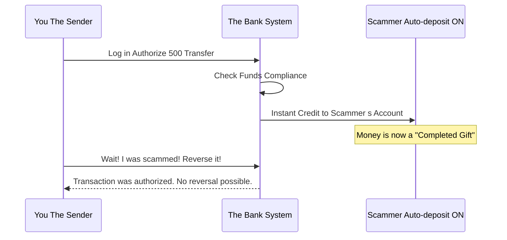
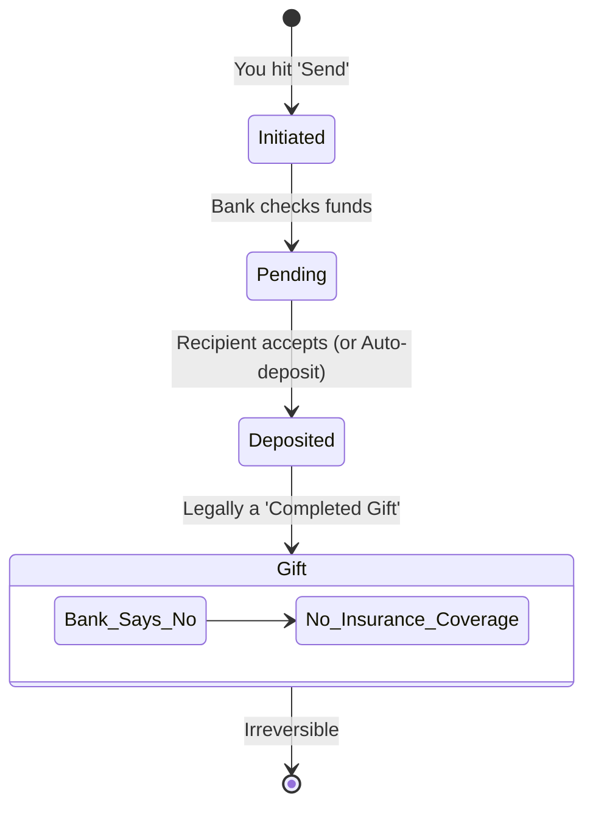

Most people think their bank's fraud department is a safety net for bad decisions. The reality is that **Interac Corp** views your "authorized" scam payment as a legally binding gift the moment it hits the other account. If you've already clicked 'send' and the recipient has Auto-deposit on, that money isn't just in transit—it's legally theirs.

<!--more-->

## The 'Authorized' Trap: Why Interac Corp Won't Reverse Your Scam

The biggest shock for scam victims is the bank's cold shoulder. You call them up, explain you were tricked on Facebook Marketplace, and they tell you there's nothing they can do. This isn't because they're lazy; it's because of how the **Electronic Funds Transfer Act** and bank policies define "authorized." When you log in with your own password and hit the send button, you've authorized the move. The bank fulfilled your request perfectly.

Here's the kicker: Once an Interac e-Transfer is deposited by the recipient—especially via Auto-deposit—it is legally considered a **completed gift**. In the eyes of the law, you didn't just make a mistake; you handed over property. Reversing a completed gift requires a level of legal intervention that costs ten times more than the $500 you lost on a fake couch.

The bank's fraud insurance is designed to protect you from *unauthorized* access. If a hacker in another country breaks into your account and drains it, that's a bank security failure. If you send $300 to a guy named "TotallyRealSeller123" for a PS5 that doesn't exist, that's a "voluntary" transaction. The system is working exactly as intended, which is why an **interac e-transfer reversal** is a ghost story people tell themselves to feel better.

### How Auto-deposit Kills Your Recovery Window

Auto-deposit is marketed as a convenience, but for a scammer, it's a weapon. In the old days, a recipient had to answer a security question. This gave you a tiny window of time—maybe minutes, maybe hours—to realize you were being played and hit the 'cancel' button in your online banking portal. You could claw the money back before the "gift" was accepted.

With Auto-deposit, that window is slammed shut. The moment you hit 'confirm' on your end, the funds are moved from your ledger to theirs. There is no middle ground, no escrow, and no "pending" state that you can interrupt. Scammers will often insist on using e-transfer specifically because they know you're likely using a bank that defaults to these instant settlements.

This is why "test transfers" are a massive red flag. A scammer might ask you to send $1 to "verify" the connection. Once that $1 goes through instantly via Auto-deposit, they know your account is active and you're willing to use the platform. They aren't testing the tech; they're testing your gullibility and the speed at which they can disappear with your real payment.

### The 'Authorized Transaction' Loophole in Bank Policy

Banks have a very specific set of rules for what they will and won't investigate. If you look at your account agreement, you'll see language that puts the "duty of care" on you. You're responsible for verifying the identity of the person you're sending money to. Interac Corp provides the rails, but they don't police who is standing on the platform.

Because these transfers are treated like cash, the bank treats the dispute like you dropped a $20 bill on the sidewalk. They can't go into someone else's account and just take money back because you changed your mind or the "seller" stopped responding. That would actually be a security risk for the *other* person. Imagine if you sold a real bike, and the buyer just "reversed" the e-transfer two days later. The system would collapse.

This loophole is exactly what makes **e-transfer scam recovery** so rare. Unless you can prove that your actual login credentials were stolen and *that's* how the money moved, the bank is going to point to the user agreement you signed. They fulfilled their contract by moving the money where you told them to move it.

## Anatomy of the Facebook Marketplace Fake Payment Script

If you're selling something, the scam usually starts with a script. The "buyer" is too busy to meet, but they'll send a "mover" or a "cousin." They want to pay you via Interac e-Transfer immediately to "hold" the item. This sounds great until you get an email that looks like it's from Interac, but it's actually a phishing link designed to steal your bank login.

The 2026 pivot in these scams involves AI-generated trust signals. Scammers are now using machine-learning tools to create fake profiles with years of "history" and realistic-looking videos of themselves "at the bank." As noted in recent crypto fraud alerts, these machine-made videos are becoming the primary way thieves build unearned trust. They don't just send a clumsy text; they send a video of a "real person" explaining why they need to use a specific transfer method.

Another common tactic is the "overpayment" scam. They "accidentally" send you $1,000 for a $100 item using a stolen bank account. They then ask you to send the $900 difference back to a different email. A few days later, the original bank realizes the $1,000 was sent from a hacked account and claws it back from you. Now you're out the $900 you "refunded" and the original $1,000.

### Phishing for Login Credentials via Fake Notifications

Not every **interac e-transfer reversal scam** involves you sending money. Sometimes, they want to receive it. You'll get a text or email saying "Someone sent you $450.00. Click here to deposit." The link takes you to a page that looks identical to your bank's login portal. 

Once you enter your card number and password, the scammers have everything they need. They don't deposit $450; they log into your real account and send themselves the maximum daily limit. This is one of the few cases where the bank *might* help you, but only if you can prove you weren't "grossly negligent" with your password. 

The problem is that many banks now argue that clicking a suspicious link and typing in your password *is* negligence. They're tightening security, but as industry experts point out, tightening security often adds "friction" that legitimate users hate. Fraudsters exploit this by offering "frictionless" ways to pay that bypass the very security steps meant to save you.

### Friction vs. Security: The Cost of Under-Detection

According to the Association of Certified Fraud Examiners, organizations lose roughly **5% of annual revenue** to fraud each year. In the world of digital payments, this cost is often passed down to the consumer in the form of higher fees or lower protections. Banks are constantly balancing the need to make payments "instant" (low friction) with the need to keep them safe (high friction).

When you use Interac, you're choosing the low-friction option. It's fast, it's easy, and it's ubiquitous. But that speed is exactly what the scammers rely on. If there were a 24-hour holding period on all e-transfers, most scams would fail. However, nobody wants to wait 24 hours to pay their roommate for pizza. We've traded our safety for the ability to move money in seconds.

This "under-detection" is a systemic choice. Modern threat intelligence platforms can block many bad actors at the signup stage, but once a fraudster has a "clean" account, they can operate within the system's rules. They aren't breaking the bank's code; they're breaking your trust.

Never click a link in a text message to "deposit" an e-transfer. If you have Auto-deposit set up, you will never need to click a link. The money will just appear.

## Systemic Failure: Why the Financial Consumer Agency of Canada Can't Help

If you've hit a wall with your bank, your next thought is probably the **Financial Consumer Agency of Canada (FCAC)**. You assume they're the "police" for banks. While the FCAC does oversee federally regulated financial institutions, their role is to ensure banks follow the law and their own public commitments. They don't act as a personal lawyer for your $500 dispute.

The **bank fraud dispute rules** are heavily weighted in favor of the institution when the customer is the one who initiated the transfer. The FCAC's framework focuses on whether the bank gave you clear information about the risks. If your bank's website has a small footer saying "Treat e-transfers like cash," they've likely met their legal obligation to warn you.

Interestingly, other countries are experimenting with better protections. For example, the **National Payments Corporation of India (NPCI)** has seen UPI (Unified Payments Interface) transactions hit record highs, with daily volumes averaging **745 million transactions** in April 2026. Because of this massive volume, the RBI is looking at a "liability framework" that could offer one-time compensation of up to **₹25,000** for victims of "Authorized Push Payment" (APP) fraud. Canada has no such equivalent yet.

### Lessons from Global Systems: The RBI's Liability Framework

The RBI's proposed framework recognizes that social engineering is a systemic risk, not just an individual mistake. They are considering a de facto guarantee to remedy bona fide losses up to a certain amount. This shifts some of the "cost of fraud" back onto the financial system, incentivizing banks to build better detection tools rather than just blaming the user.

In Canada, we aren't there yet. The burden of proof remains entirely on you. You have to prove that you didn't share your password and that you took "reasonable" steps to verify the transaction. In a peer-to-peer marketplace, "reasonable" is a very subjective word that banks love to interpret in their own favor.

Until our regulations catch up to the reality of modern social engineering, you are your own fraud department. The system is designed for speed and finality, not for consumer protection in the face of a lie.

## Defensive Playbook: Treating Digital Cash Like Paper

The only way to win this game is to stop thinking of e-transfers as "bank payments" and start thinking of them as "handing a stranger an envelope of cash." You wouldn't mail $500 in cash to someone you met on the internet and hope they mail you a laptop back. Don't do it with Interac.

**Here is your no-BS checklist for staying safe:**

1.  **Check the "From" Address:** Real Interac notifications come from `notify@payments.interac.ca`. If it's from `interac-support-dept@gmail.com`, it's a scam.
2.  **Enable Auto-deposit:** Ironically, having it on protects you from phishing. If you have it on, you know any "Click here to deposit" link is a lie.
3.  **Verify the Name:** When you add a recipient, many banks now show the name registered to that email. If you're buying from "John" but the bank says the email belongs to "Global Exports Ltd," walk away.
4.  **No Deposits for Marketplace Items:** If a seller asks for a deposit to "hold" an item, they are 99% likely to ghost you. Real sellers take cash or e-transfer *at the time of pickup*.

If you've been hit, report it to the **Canadian Anti-Fraud Centre**, but do it for the statistics, not because you expect a check in the mail. The money is gone. Your job now is to make sure your account is secure and that you never treat a digital transfer with more trust than a physical dollar bill again.

### [References]
- [Stopping Fraud at Each Stage of the Customer Journey Without Adding Friction](https://www.bleepingcomputer.com/news/security/stopping-fraud-at-each-stage-of-the-customer-journey-without-adding-friction/)
- [Crypto Scam Alert 2026: 3 Projects Already Red-Flagged by Experts](https://bitcoinfoundation.org/news/altcoins/crypto-scam-alert-2026-3-projects-already-red-flagged-by-experts/)
- [UPI growth steadies after March peak; daily volumes hit record high in April](https://www.thehindubusinessline.com/companies/upi-growth-steadies-after-march-peak-daily-volumes-hit-record-high-in-april/article70928714.ece)
- [Remedies for digital payment frauds](https://www.thehindubusinessline.com/opinion/remedies-for-digital-payment-frauds/article70948012.ece)
- [Is foreign-earned salary in NRE account taxable in India? Here's what rules say](https://www.livemint.com/money/personal-finance/is-foreign-earned-salary-in-nre-account-taxable-in-india-heres-what-rules-say-11778602888375.html)