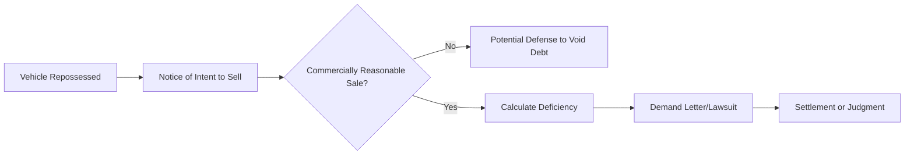

Most people assume that once the tow truck pulls out of the driveway, the [financial](https://gunbin.github.io/en/blog/low-income-financial-advisor-options-free/) nightmare is over. It's a common misconception that surrendering the keys cancels the debt, but the reality is much colder: you're often left with a **Deficiency Judgment** for thousands of dollars. When the bank sells your car at a wholesale auction for a fraction of its value, they don't just eat the loss; they come after you for the difference.

### The "Commercially Reasonable" Trap and the UCC

The law isn't entirely on the lender's side. Under the **Uniform Commercial Code (UCC)**, every aspect of the car's disposition—including the method, manner, time, place, and terms—must be **commercially reasonable**. If a lender sells a vehicle worth $15,000 for $3,000 at a "sweetheart" auction to a buddy, they've likely violated the UCC. 

Lenders often fail to follow these strict sale laws. If they didn't send you a proper "Notice of Our Plan to Sell Property" or a "Notice of Deficiency" with an accurate breakdown of the math, they might lose their right to collect that $8,000 balance entirely. 

### Corporate Sloppiness as Your Legal Shield

The financial industry is currently obsessed with automation, but it's backfiring. A recent analysis in the tech sector points out that most enterprises are burning budgets on AI tools they aren't ready to use because their "messy, siloed data" is a disaster. This applies directly to your car loan. 

Lenders often use automated systems to churn out lawsuits, but their data infrastructure is frequently too weak to stand up in court. If you demand the original contract or proof of the auction's advertising logs, they often can't find them. Just as Fairfax Financial Holdings Limited reported its Q1 2026 results with extreme precision—specifying all amounts in U.S. dollars and adhering to unaudited interim consolidated financial statements—your lender is held to a standard of accuracy. If they can't account for every dollar of the auction fee, storage fee, and sale price, their claim is vulnerable.

### The Law Isn't a Dictatorship

In some global contexts, legal boundaries are shifting; for instance, Nayib Bukele in El Salvador has built the world’s highest imprisonment rate by scrapping term limits and expanding executive power. However, in the U.S. consumer credit market, the **Fair Debt Collection Practices Act (FDCPA)** still acts as a hard ceiling on what creditors can do. 

They cannot threaten you with jail time, and they cannot lie about the amount you owe. If a debt collector tells you that you "must" pay the full $8,000 or face immediate arrest, they have violated federal law, which can lead to the debt being dismissed or you winning damages in a countersuit.


Never acknowledge the debt or make a "good faith" partial payment before checking the **statute of limitations**. In many states, a single payment restarts the clock on a debt that might have been legally uncollectible.


### Your Action Plan: How to Settle for 20-40%

If the lender followed the rules but you simply can't pay, you need a settlement strategy. Banks would rather take **20-40% of the balance** in cash today than spend $3,000 on legal fees to sue someone who has no assets.

| Action Step | Why It Matters | Target Outcome |
| :--- | :--- | :--- |
| **Audit the Sale** | Check if the car sold for at least "Black Book" wholesale. | Identify UCC violations. |
| **Verify Notice** | Did you get a letter *before* the sale? | Void the deficiency claim. |
| **Hardship Letter** | Show you have no assets or other income. | Convince them you're "judgment proof." |
| **Lump Sum Offer** | Start at 15% of the total deficiency. | Settle for roughly 30%. |

### The Settlement Letter Strategy

When you send a settlement offer, don't do it over the phone. Debt collectors are trained to get you emotional and extract a verbal promise. Write a formal letter. State that you are "disputing the validity of the debt" but are willing to offer a "full and final settlement" to avoid the costs of litigation.

If you can prove that your financial situation is dire—similar to how companies like Kiniksa Pharmaceuticals must report their portfolio execution and financial results to show their actual standing—the lender is more likely to take what they can get. 


Always demand a "Satisfaction of Debt" letter after payment. Without it, the "ghost" of that $8,000 can be sold to another debt buyer six months later.


### Is the Debt Actually Yours?

Before paying a dime, make them prove it. Under the FDCPA, you have the right to debt validation. If the lender has sold the debt to a third party, that third party often lacks the "chain of title" (the legal paper trail) to prove they actually own your specific loan. If they can't produce the paperwork, the lawsuit dies before it even reaches a judge.

Are you going to let them profit from their own procedural errors, or are you going to demand they follow the law?

### [References]
- [Who Is Nayib Bukele? El Salvador’s ‘coolest dictator’](https://www.aljazeera.com/features/2026/5/2/who-is-nayib-bukele-el-salvadors-coolest-dictator)
- [Fairfax Financial Holdings Limited: Financial Results for the First Quarter](https://www.globenewswire.com/news-release/2026/04/30/3285557/0/en/Fairfax-Financial-Holdings-Limited-Financial-Results-for-the-First-Quarter.html)
- [Why your data infrastructure — not your AI model — will determine whether Agentic AI scales](https://fortune.com/2026/04/30/agentic-ai-data-infrastructure-readiness-scale/)
- [LKQ Corporation Announces Results for First Quarter 2026](https://www.globenewswire.com/news-release/2026/04/30/3284661/8053/en/LKQ-Corporation-Announces-Results-for-First-Quarter-2026.html)
- [Kiniksa Pharmaceuticals Reports First Quarter 2026 Financial Results and Recent Portfolio Execution](https://www.globenewswire.com/news-release/2026/04/28/3282473/0/en/Kiniksa-Pharmaceuticals-Reports-First-Quarter-2026-Financial-Results-and-Recent-Portfolio-Execution.html)