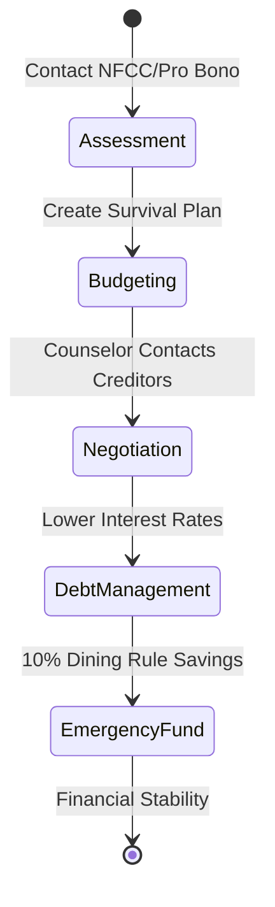

Most people assume financial advisors are a luxury for the 1%. They aren't. If you're struggling with debt or living paycheck to paycheck, you don't need a private wealth manager who charges by the hour. You need a pro bono expert.

A recent thread on r/povertyfinance with 32 upvotes highlighted a massive gap: most people simply don't know that professional, certified financial guidance exists for those with zero savings. If you're drowning in bills, the "standard" advice to just save more is useless. You need a structural intervention.

### Pro Bono Networks: Getting a CFP for $0

While private firms might ignore you if you don't have $100k to invest, several organizations exist specifically to bridge this gap. These aren't "coaches" with a weekend certificate; these are Certified Financial Planners (CFPs) who donate their time.

*   **Foundation for Financial Planning (FFP):** This non-profit links volunteer CFPs with people in crisis. They often partner with local charities to provide one-on-one sessions.
*   **Financial Planning Association (FPA):** Many local chapters have pro bono committees. They offer "Financial Planning Days" in various cities where you can get a 30-minute private consultation without a sales pitch.
*   **Advisers Give Back:** A platform that matches you with a CFP for free, remote sessions to build a basic survival budget.

```markmap
# Financial Survival Ecosystem

<!--more-->

## Pro Bono Networks
### Foundation for Financial Planning
### FPA Local Chapters
### Advisers Give Back
## Credit Counseling (NFCC)
### Debt Management Plans
### Budgeting Assistance
### Bankruptcy Pre-filing
## Government & Local
### VITA (Free Tax Prep)
### 211 Services
```

### NFCC vs. Debt Settlement: The Safety Check

You've likely seen ads promising to "erase your debt for pennies on the dollar." Historically, these predatory debt settlement companies have caused more harm than good, often leaving people with destroyed credit and lawsuits. 

The **National Foundation for Credit Counseling (NFCC)** is the legitimate alternative. As a non-profit network, they focus on "Debt Management Plans" (DMPs) where they negotiate lower interest rates with your creditors directly.

| Feature | Non-Profit Credit Counseling (NFCC) | Predatory Debt Settlement |
| :--- | :--- | :--- |
| **Fees** | Low, regulated monthly fees | High % of total debt |
| **Creditor Relation** | Works with creditors' approval | Often tells you to stop paying creditors |
| **Credit Impact** | Usually neutral or positive over time | Often results in defaults and tanked scores |
| **Fiduciary Duty** | Counselors are certified and regulated | Often unregulated sales agents |

Never pay an upfront fee to a company promising to "settle" your debt before they've actually negotiated anything. Real non-profit counselors charge nominal fees only after the plan starts.

### The "Half-Empty" Execution Strategy

NBA Legend Shaquille O'Neal recently noted he's a "half-empty" type of guy because it means "there's always work to do." When you have no money, your glass is objectively half-empty. Instead of viewing this as a failure, treat it as a project with a clear punch list.

1.  **Locate an NFCC Member:** Go to the official NFCC website and use their locator tool. Ensure the agency is a 501(c)(3) non-profit.
2.  **Audit Your "Future Eating" Habits:** Shark Tank's Kevin O'Leary suggests that if you're smart, you **don't spend more than 10% of your bi-weekly paycheck on dining**. If you're in debt, that number should be even lower.
3.  **Prepare the "Disaster Folder":** Before your first meeting, gather your last 3 months of bank statements, every single debt balance, and your latest pay stubs. A counselor can't help you if the data is fuzzy.
4.  **Request a Fiduciary:** Even in pro bono settings, ask: "Are you acting as a fiduciary?" This ensures they're legally bound to act in your best interest, not pushing a specific debt product.


### Managing the "Stripe" of Your Personal Economy

In the fintech world, companies like Airwallex are trying to challenge the dominance of giants like Stripe by fixing cross-border friction. You need to do the same for your personal economy. Friction—like high-interest credit card debt—is what kills your progress.



### High-Impact FAQ

### Are there really free financial advisors for people with no money?
Yes. Non-profit organizations like the NFCC provide certified credit counselors who offer free or very low-cost budget and debt management advice. Pro bono programs through the FPA also offer free sessions with CFPs.

### What is the difference between a counselor and an advisor?
Financial counselors focus on budgeting, debt survival, and credit repair. Advisors typically focus on wealth management and investing. For low-income needs, a **certified credit counselor** is usually the more effective first step.

### Will seeking free financial help hurt my credit score?
Simply talking to a counselor does not affect your score. If you enter a Debt Management Plan (DMP), it may be noted on your report, but paying down debt through a DMP is generally viewed much more favorably by lenders than defaulting or using a settlement company.

### How do I find free tax help if I can't afford an accountant?
Look for the **VITA (Volunteer Income Tax Assistance)** program. It is an IRS-supported initiative that provides free tax prep for people who generally make $64,000 or less, persons with disabilities, and limited English-speaking taxpayers.

### Can a pro bono advisor help me with bankruptcy?
They can provide the required pre-bankruptcy counseling and help you determine if it's the right path. However, they are not attorneys. If bankruptcy is necessary, they can often refer you to local legal aid societies.

### [References]
- [NBA Legend Shaquille O'Neal Says He's A Glass 'Half Empty' Type of Guy — 'There's Always Work to Do'](https://finance.yahoo.com/markets/stocks/articles/nba-legend-shaquille-oneal-says-154603989.html)
- ['Shark Tank' Star Kevin O' Leary Spends $1000 A Day on Meals – But Says If You're 'Smart,' Don't Spend More Than 10% Of Bi-Weekly Paycheck On Dining](https://finance.yahoo.com/markets/stocks/articles/shark-tank-star-kevin-o-144605755.html)
- ['No Real Competition To Stripe In 15 Years' – Airwallex CEO Jack Zhang Wants To Fix That](https://finance.yahoo.com/markets/crypto/articles/no-real-competition-stripe-15-131603856.html)