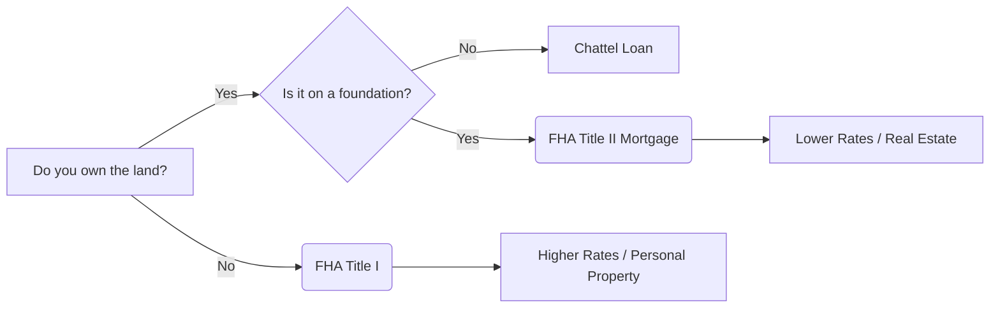

You found a manufactured home that looks perfect and fits the budget. Then you saw the loan quote. While your cousin just locked in a 30-year mortgage at 6.37%, your lender is talking about 9% or 10% for a "chattel loan." You aren't being singled out; you're just hitting the invisible wall between buying a house and buying a vehicle.

<!--more-->

## The Asset Class War: Real Estate vs. Personal Property

The core of the **chattel loan vs mortgage for mobile homes** debate isn't about the walls or the roof; it's about the dirt underneath. If you don't own the land, the bank doesn't see a "home." They see a piece of personal property—chattel—no different from a tractor or a boat. This distinction changes everything from your interest rate to your legal rights if you miss a payment.

```markmap
# Mobile Home Financing Frame
## Chattel Loan (Personal Property)
### Home only
### Rented land/Park
### Higher rates (9%+)
### Faster closing
### Fewer legal protections
## Mortgage (Real Property)
### Home + Land
### Permanent foundation
### Lower rates (6.37% avg)
### Slower FHA/VA process
### Standard foreclosure rights
```

### Why Your Mobile Home Loan Feels Like a Car Note
When you opt for a chattel loan, you're essentially telling the bank you want to finance a vehicle you happen to live in. Because the home is on rented land, the lender has no claim to the "real estate." If you default, they can't take the land; they can only try to repossess a structure that is expensive to move and depreciates the moment you step inside. This is why you'll see interest rates significantly higher than the national mortgage averages.

The systemic reason for these high rates is risk management. Traditional mortgages are backed by the land, which almost always retains value. Chattel loans are backed by a structure that loses value over time. Lenders compensate for this "depreciating asset" risk by front-loading the cost through higher interest. You'll also find that chattel loans have shorter terms—often 15 or 20 years—meaning your monthly payment might be higher than a traditional house despite the lower total price.

Don't expect the same legal safety net either. In many states, a chattel loan doesn't trigger the same lengthy foreclosure process as a mortgage. If you fall behind, the lender can often move to repossess the unit much faster. You're trading the stability of real property laws for the speed of a personal property transaction. If you're looking for long-term security, the chattel route is a steep uphill climb.

### The "Cruel Summer" of Real Estate and Rising Rates
The timing couldn't be worse for buyers on the fence. According to Freddie Mac data from May 7, 2026, the average **30-year fixed-rate mortgage hit 6.37%**, climbing from 6.3% just a week earlier. This volatility is driven largely by geopolitical tensions in the Persian Gulf and uncertainty regarding peace talks involving Iran. For a mobile home buyer, this "real estate" rate is the *floor*. If the 30-year mortgage is at 6.37%, your chattel loan is likely hovering in the double digits.

This rate spike is already cooling the market. Zillow reported a drop in buyer demand in April 2026 compared to March, and the Mortgage Bankers Association saw a 4% drop in applications for new home purchases. When the "big" market slows down, chattel lenders often tighten their belts even further. They become more selective, requiring higher credit scores for loans that are already more expensive than standard mortgages.

If you're waiting for rates to drop, keep an eye on the labor market. A weakening jobs report might send Treasury yields lower, but until then, the "path to lower rates runs squarely through the Persian Gulf," as noted by analysts at Realtor.com. For a budget-conscious buyer, every 0.1% increase in the base mortgage rate translates to a much heavier burden on a chattel loan, where the margins are already razor-thin.

### Florida’s Costly Lesson in Mobile Home Living
Many buyers head to states like Florida looking for affordability, only to find a "crowded, costly, and complicated" mess. Business Insider recently profiled former residents who fled the state because the math on mobile home parks no longer adds up. While a chattel loan might get you into the home, it doesn't protect you from the skyrocketing cost of "lot rent."

In Florida, the combination of rising insurance premiums and corporate-owned parks has turned manufactured housing into a trap for some. You own the home (via a chattel loan), but you have zero control over the land rent. If the park owner raises the rent by $200 a month, your "affordable" chattel payment suddenly looks like a luxury mortgage payment, but without the equity growth. 

Before you sign a chattel agreement in a land-lease community, you need to audit the park's history. Look for "prick-proof" protections or lack thereof. If the park is sold to a developer, your chattel-financed home might have to be moved—at a cost of $5,000 to $15,000—or abandoned entirely. This is the ultimate "hidden cost" of not owning the dirt.

## The Land Ownership Trap: FHA Title I vs. Title II

The government offers help, but only if you follow their very specific map. The FHA has two main paths: Title I and Title II. Understanding the difference is the difference between a 10% interest rate and a 6% interest rate.



### Why Banks Won't Give You a Mortgage Without the Dirt
To qualify for a traditional mortgage (or an FHA Title II loan), the home must be "affixed" to a permanent foundation on land you own. This process, called "titling as real property," involves surrendering the vehicle title to the state and recording the home as an improvement to the land. Only then does the bank feel safe enough to offer you the lower interest rates associated with real estate.

If you're buying a home in a park where you lease the lot, you are stuck with FHA Title I. These loans are capped at lower amounts and come with higher rates because the FHA knows the risk of "moveable" property is higher. The bank's logic is simple: they can't easily sell a house at auction if they have to pay a park owner back-rent just to keep the house on the lot.

**Check your foundation requirements early.** Many lenders won't even consider a Title II mortgage if the home was moved from its original dealership to a temporary site before being placed on your land. They want "one-touch" installation. If you mess this up, you'll be forced into a chattel loan even if you own the land, simply because the paperwork doesn't meet the "real property" standard.

### Zoning "Pricks" and the Battle for Affordable Land
Even if you want to buy land and get a mortgage, local governments might make it impossible. In Marblehead, Massachusetts, a recent viral town meeting highlighted how residents use zoning laws to block new housing—a practice some locals called "being pricks." They upzoned a golf course that will never be built on just to meet state requirements on paper while keeping actual housing out.

This "not in my backyard" (NIMBY) sentiment is the primary enemy of the manufactured home buyer. Many towns have "exclusionary zoning" that bans manufactured homes from being placed on private lots, forcing them into designated parks. This forces you into the chattel loan market by default because you aren't allowed to own the land where your home is permitted to sit.

If you're serious about a mortgage over a chattel loan, you have to look for "manufactured-friendly" zones. Without the right zoning, you can't get the permanent foundation permit, which means you can't surrender the vehicle title, which means you're stuck with high-interest personal property financing. It’s a bureaucratic loop designed to keep these homes classified as vehicles.

## Financial Consequences of Choosing the Wrong Loan

The decision between these two isn't just about the monthly payment; it's about your net worth ten years from now. One builds wealth; the other provides shelter while draining your wallet.

### Interest Rate Whipsaws and Global Uncertainty
As we saw with the Freddie Mac data hitting **6.37% in May 2026**, the market is incredibly sensitive to global events. Mortgage rates are currently "whipsawing with every development in the Middle East." For a chattel loan borrower, this volatility is magnified. While mortgage borrowers have the protection of federal backing and a massive secondary market, chattel loans are often held by smaller, private finance companies that hike rates aggressively when the economy gets shaky.

If you take a chattel loan now, you are betting that you can refinance later. But here's the trap: you can't refinance a chattel loan into a mortgage unless you move the home to land you own. If you stay in the park, you're stuck in that high-interest cycle. **Check for prepayment penalties** in your chattel contract. Many of these loans are designed to keep you paying that high interest for the full term, making it expensive to get out even if market rates drop.

Never sign a chattel loan with a "Rule of 78s" interest calculation. It front-loads the interest so heavily that you'll owe nearly the full principal even after years of payments.

### The European Retirement Escape
The frustration with US housing costs is driving a massive shift. Forbes recently reported that 17% of Americans aged 55 and older want to leave the country—four times the level seen in 1974. Why? Because in places like Portugal, the monthly cost of living is around **$592**, compared to $1,166 in the US. 

For someone considering a chattel loan on a mobile home as a "cheap" retirement option, the math is becoming clear: the high interest rates and rising lot rents in the US often make retiring in Italy or Spain a more financially sound move. In Italy, the cost of living is nearly 27% lower than the US average. 

If you're looking at a chattel loan because you're on a fixed income, realize that you are taking on a variable cost (lot rent) with a high-interest debt (chattel loan). That is a dangerous combination for retirement. If you can't afford the mortgage/land combo in the US, your "mobile" home might actually be more affordable if it's an apartment in Portugal.

## The Final Verdict: When to Walk and When to Sign

Stop trying to find "merit" in both. There is a clear winner based on your situation.

| Feature | Chattel Loan | Traditional Mortgage |
| :--- | :--- | :--- |
| **Asset Type** | Personal Property (Vehicle) | Real Property (Real Estate) |
| **Typical Rate** | 8% - 12%+ | 6% - 7% |
| **Land Status** | Rented / Leased | Owned |
| **Closing Speed** | 7-14 Days | 30-60 Days |
| **Appreciation** | Usually Depreciates | Usually Appreciates |
| **Protections** | Limited (Repossession) | High (Foreclosure Laws) |

**Get the Mortgage if:** You can find a piece of land zoned for manufactured housing. The lower interest rate and the appreciation of the land will save you six figures over the life of the loan. It is worth the 60-day headache of the FHA Title II process.

**Get the Chattel Loan only if:** You have no other choice for shelter, you're in a high-demand park with long-term rent control, or you plan to pay the entire loan off in under 5 years. Otherwise, the interest will eat your soul.

### The Invisible Grid: Connectivity and Power
Finally, consider the infrastructure. As the FCC moves toward banning foreign-made routers to "stamp out cybersecurity threats," the cost of setting up a modern home in a park is rising. Many parks have exclusive deals with internet providers, leaving you with high bills and no options. 

Similarly, if you're looking at "off-grid" manufactured living, look at what's happening in places like Cameroon. Organizations like REI Cameroon are using solar minigrids to power rural areas. In the US, adding solar to a chattel-financed home in a park is often forbidden by park rules. If you own the land (mortgage), you own the sun. If you rent the lot (chattel), you're at the mercy of the park's aging electrical grid.

### [References]
- [America's real estate market is facing another cruel summer](https://www.businessinsider.com/real-estate-market-summer-buyers-mortgate-rates-iran-war-2026-4)
- [More Americans Heading For Retirement In Europe...](https://www.forbes.com/sites/alexledsom/2026/05/10/more-americans-are-heading-for-retirement-in-europe-will-you-join-them/)
- [Mortgage rates rise again on Iran uncertainty](https://finance.yahoo.com/personal-finance/mortgages/article/mortgage-rates-rise-again-on-iran-uncertainty-mortgage-and-refinance-interest-rates-today-may-7-2026-100000003.html)
- [The Need for Prick-Proof Housing Laws](https://reason.com/2026/05/12/the-need-for-prick-proof-housing-laws/)
- [The FCC's Foreign-Made Router Ban Gets Complicated](https://uk.pcmag.com/wireless-routers/164867/the-fccs-foreign-made-router-ban-gets-complicated-what-you-need-to-know)

### The Hard Truth About Financing Your Manufactured Home

**Can I convert a chattel loan to a mortgage?**
Only if you own the land and legally 'affix' the home to a permanent foundation. You'll have to go through a "refinance" process where the old chattel loan is paid off by a new mortgage.

**Is FHA Title I a good deal?**
It’s a "safety net" deal. It allows for lower down payments (around 3.5%), but the interest rates are still much higher than Title II. Use it only if you can't afford to buy the land.

**Do chattel loans require a foundation?**
Usually no, which is why they are faster. They just require the home to be "set" according to local code, which is much cheaper than the permanent concrete foundation required for a mortgage.

**Will my mobile home lose value?**
If it's on a chattel loan in a park, **yes**. It will likely depreciate like a car. If it's on a mortgage with land, it will likely follow the local real estate market and gain value.

**What is the minimum credit score for a chattel loan?**
Most lenders want to see at least a 580 to 620, but because these are higher-risk loans, the best rates are reserved for those above 720. If your score is low, expect double-digit interest.