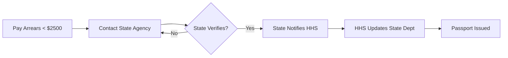

You've got the plane tickets booked and the hotel paid for. Then you get a letter from the U.S. Department of State saying your passport application is dead because you owe child support. You didn't just miss a payment; you hit a federal tripwire that doesn't care about your vacation plans.

```markmap
# Passport Denial for Child Support

<!--more-->

## The Trigger
- Arrears > $2,500
- HHS Certification
- State Dept Block
## The Impact
- No New Passports
- No Renewals
- Potential Revocation
## The Fix
- Pay below $2,500
- State Agency Verification
- 3-Week System Sync
```

## The $2,500 Threshold That Grounds Your Flight

The math is simple and unforgiving. Under the **HHS Passport Denial Program**, if you owe more than **$2,500** in child support arrears, the Office of Child Support Services (OCSS) flags your name. They send that data to the U.S. Department of State, and you're effectively grounded. It's not a suggestion or a "case-by-case" review; it's an automated administrative block.

The problem isn't just the money; it's the lag. Even if you pay the full amount today, you aren't cleared tomorrow. The state agency has to process the payment, notify HHS, and then HHS has to tell the State Department you're good to go. You're looking at a **2 to 3-week delay** minimum. If you try to expedite a passport while you're on that list, you're just throwing away the expedite fee.

### Global Vetting and the Tightening Grip on Travel Rights

Don't think this is just a minor clerical hurdle. The U.S. Department of State is increasingly using travel documents as a tool for enforcement and vetting. We've seen this in other sectors, like the recent reports regarding the **1,100 Afghans** stuck in the USRAP and SIV pipelines at Camp As Sayliyah in Qatar. The government's vetting processes are becoming more rigid and less prone to "exceptions." When you're on a list, you're on it until the system says otherwise.

This isn't just a U.S. phenomenon. Look at the recent case of Frankie Bailey in Australia. A former headmaster was given a **lifetime ban** on providing health services after being placed on a protection register. While the context is different, the mechanism is the same: once a legal threshold is crossed and you're certified on a government list, your "professional" and "personal" mobility is essentially turned off. The State Department doesn't negotiate with individuals; it follows the certification provided by HHS.

### New Legislative Risks to Your Travel Documents

If you think you can just wait it out, keep an eye on the legislative horizon. There's growing momentum to expand the government's power to revoke existing passports, not just deny new ones. Reports from outlets like The Intercept have highlighted proposed bills that would allow the Secretary of State to **revoke passports** for a broader range of reasons, including "terrorism" or other vague security concerns. 

While child support is a civil matter, the infrastructure for passport revocation is already built and getting stronger. Currently, if you're on the child support list, the State Department can already refuse to issue or renew your passport. In some cases, they can even issue a "limited" passport that only allows you to return to the U.S. and nothing else. The days of "flying under the radar" with a valid passport while owing federal-level debt are ending.


### The "Laid Off and Locked Out" Reality

Consider the case of a parent who was paying $800 a month dutifully until a corporate layoff in March 2025. They decided to go all-in on a side business, but in the transition, the arrears ticked past that $2,500 mark. Even with 50/50 shared parenting and a history of compliance, the system doesn't care about your "intent" or your "business plan." 

The "obvious" fix—making a partial payment—often fails because people don't account for the interest or the specific state reporting cycles. If you pay just enough to hit $2,499, you're still at the mercy of the next month's interest or a slow-moving state clerk. This is where most people get stuck: they think a payment plan is enough. It isn't. **You must get the balance below $2,500** and ensure the state agency has actually sent the "release" to HHS.

A payment plan does not remove you from the Passport Denial Program. Only a balance below the $2,500 threshold (or a specific state-level withdrawal) will clear the block.

## How to Clear the Block Before You Get to the Airport

You can't fix this at the passport agency. They don't have the authority to remove your name from the HHS list. Here is the actual sequence you need to follow if you want any hope of making your trip.



1.  **Pay the balance down:** You need to get the total arrears (including interest) below $2,500. Don't cut it close. Aim for $2,000 to account for any processing delays.
2.  **Contact your State Child Support Agency:** Don't wait for them to notice. Call them the moment the payment clears. Ask them to "manually" report the update to the HHS Passport Denial Program.
3.  **Wait for the sync:** HHS and the State Department sync their lists weekly. It usually takes **15 to 20 days** for the State Department to see that you're no longer blocked.
4.  **Confirm with the National Passport Information Center:** Before you head to an appointment, call the NPIC to see if the "hold" has been lifted from your file.

If you're already overseas and your passport is revoked or denied for renewal, you're in a much tighter spot. The State Department may only issue you a **restricted-validity passport** that is good for a direct return to the United States. You won't be going to any other countries on that document.

### [References]
- [Convicted sex offender, former NSW headmaster banned from counselling](https://www.abc.net.au/news/2026-05-05/nsw-former-headmaster-sex-offender-frankie-bailey-counsellor-ban/106642202)
- [The Trump Administration Might Send Afghan Refugees to Danger in Congo](https://reason.com/2026/04/23/the-trump-administration-might-send-afghan-refugees-to-danger-in-congo/)
- [New Bill to allow Sec State to Revoke and Deny Passports](https://theintercept.com/2025/09/13/marco-rubio-revoke-us-passports-terrorism/)