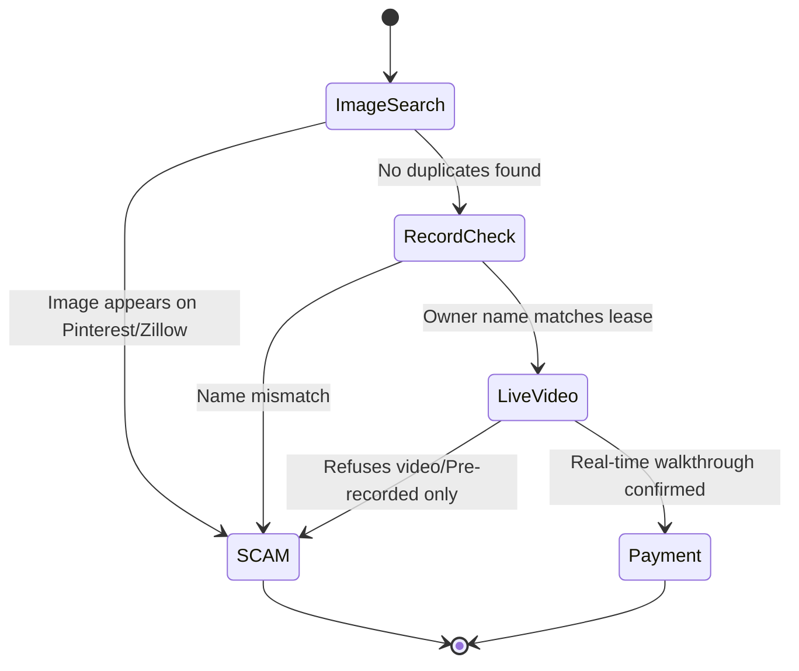

You probably think a professional-looking lease and a photo of a driver's license mean the landlord is legit. They don't. In an era where AI can generate "unnervingly real" IDs and social media profiles, your eyes are no longer reliable witnesses when hunting for an apartment from out of state.

```markmap
# Digital Rental Deposit Fraud Guide

<!--more-->

## Verification Steps
### Reverse Image Search
### County Tax Records
### Live Video Proof
## Payment Red Flags
### Chime/Zelle Only
### Lump-sum Upfront
### 'Out of Town' Excuse
## Recovery & Reporting
### FTC/IC3 Filing
### Bank Reversal Limits
```

## Identifying Digital Rental Deposit Fraud in a High-Volume Market

The rental market is moving fast, with major players like Compass reporting a **7.3% increase in Gross Transaction Value** for their brokerage services recently. When the market is this hot, the pressure to "sign now or lose it" is exactly what scammers use to bypass your logic. You aren't just competing with other renters; you're operating in a space where international fraud rings are treated like a high-growth business.

### The $215 Million Business of Fake Listings
Don't mistake these scammers for bored individuals. A federal jury in the U.S. recently convicted 25 people for running an international hacking and fraud scheme that stole nearly **US$215 million** from over 1,000 victims across 19 countries. These groups use sophisticated "business email compromise" tactics to intercept communications and insert their own payment instructions.

If you're dealing with a listing that seems slightly too good for the current market, you're likely looking at a professional operation. These groups often target out-of-state students and workers because they know you're less likely to demand an in-person showing before the move-in date.

### AI-Generated Identities: Why Photos Prove Nothing
Recent reports highlight how AI is being used to create "unnervingly real" fake IDs and social media personas. Scammers can now generate a photo of a "landlord" holding a makeup brush or a specific ID card that looks flawless to the naked eye. The days of spotting a scam by looking for "six-fingered hands" or physics-defying backgrounds are over.

When a landlord sends you a photo of their ID to "prove" they're real, it's often a stolen or AI-generated image. They use these to build a false sense of security before asking for a deposit. If they refuse to hop on a live video call or meet in person, the ID they sent is worthless as a verification tool.

### The Lump-Sum Trap: Lessons from Global Renters
Community cases, such as the Tokyo Gaijins incident, show that even seemingly established agents can disappear with your money. In that specific case, a renter was pressured into making a **lump-sum upfront payment for 6 months** of rent. The agent was eventually arrested, but only after the deposit was long gone.

In high-demand cities, scammers will tell you that paying several months in advance is the only way to "beat the competition." This is a classic red flag. Standard practice is a security deposit and the first month's rent. Anything beyond that, especially before you've stepped foot in the unit, is a high-risk gamble you'll likely lose.

## The Step-by-Step Verification Protocol

If you can't be there in person, you have to be a digital detective. Follow this sequence before you even think about opening a payment app.



1.  **Run a Reverse Image Search:** Take the listing photos and drop them into Google Images or TinEye. If the same "apartment in Chicago" also appears as a "condo in Miami" or a "Pinterest dream home," **walk away immediately**.
2.  **Verify Ownership via County Records:** Every county has a Tax Assessor or Recorder of Deeds website. Search the property address. If the owner's name is "John Doe" but your landlord is "Jane Smith" claiming to be the owner, you're being played.
3.  **Demand a "Live Detail" Video Call:** Don't accept a pre-recorded video. Ask them to FaceTime or Zoom you from the unit. Tell them to open a specific cupboard or look out a specific window. If they claim they're "out of town" or "on a business trip," it's a scam 99% of the time.

## Payment Red Flags: Chime, Zelle, and Irreversibility

Scammers prefer specific platforms because they function like cash. Once the "send" button is hit, the bank usually cannot get that money back for you.

| Payment Method | Risk Level | Protection Type | Reversibility |
| :--- | :--- | :--- | :--- |
| **Chime / Zelle** | **Critical** | None (Peer-to-Peer) | Nearly Impossible |
| **Wire Transfer** | **High** | Bank Fraud Dept | Very Difficult |
| **Credit Card** | **Low** | Chargeback Rights | High (via Dispute) |
| **Escrow Service** | **Very Low** | Third-party Holding | Guaranteed until Release |


Never use 'Friends and Family' settings on any app for a business transaction. This explicitly waives your right to dispute the charge if the landlord disappears.


If a landlord insists on **Chime-only or Zelle-only** payments, it's because they know those platforms offer almost zero recourse for the victim. Legitimate property management companies will have a dedicated portal or accept checks and credit cards.


### [References]
- [Compass, Inc. Reports First Quarter 2026 Results](https://www.prnewswire.com/news-releases/compass-inc-reports-first-quarter-2026-results-302763188.html)
- [20+ arrested in U.S. as thousands, including Canadians, defrauded in global scam op](https://mobilesyrup.com/2026/05/04/20-plus-arrested-us-thousands-canadians-defrauded-global-scam-op/)
- [Hey Chat, Make Me a Fake ID](https://www.theatlantic.com/technology/2026/05/chatgpt-images-deepfakes-fraud/687023/)