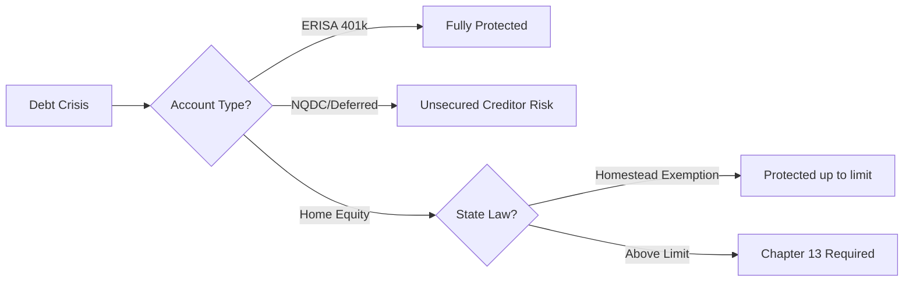

Most debt relief guides will tell you that bankruptcy is a "fresh start" that wipes the slate clean. They leave out the part where your specific assets—the home you've paid off for thirty years and the retirement fund you're living on—are the first things creditors eye when you stop making payments.

You're likely sitting on a pile of medical bills or credit card debt, terrified that filing for Chapter 7 means the bank takes your keys. That's a common fear, but it's usually wrong. The law actually builds a wall around senior assets, provided you know which accounts have a "keep away" sign and which ones are sitting ducks. Here is the shortcut to understanding senior bankruptcy home equity protection without the legal fluff.

```markmap
# Senior Asset Protection Overview

<!--more-->

## Home & Property
### Homestead Exemptions
### Primary Residence Rules
## Retirement Funds
### ERISA-Qualified (Safe)
### NQDC Plans (At Risk)
## Legal Tools
### Irrevocable Trusts
### Wills vs. Probate
```

## The Truth About Senior Bankruptcy Home Equity Protection

When you file for Chapter 7 bankruptcy, the court looks at what you own to see if anything can be sold to pay back people you owe. For most seniors, the primary residence is the biggest "asset" on the list. However, most states allow you to keep your home through something called a homestead exemption. This isn't a gift; it's a legal recognition that the state doesn't want you homeless and relying on public assistance.

The protection works by exempting a specific dollar amount of equity in your home. If your state has a $150,000 homestead exemption and your home has $100,000 in equity, the bankruptcy trustee can't touch it. You stay in the house, and the debt gets wiped. The trap happens when you have "too much" equity. If your home is worth significantly more than the state limit, a Chapter 13 filing might be the better path, as it allows you to keep the property while paying back a portion of the debt over time.

Don't assume your state's limit is low. Some states offer massive exemptions for seniors over 65, specifically to prevent them from being displaced. You need to check your local statutes because the difference between a "standard" exemption and a "senior" exemption can be hundreds of thousands of dollars. If you miss this detail, you're essentially handing the keys to the court.

## ERISA-Qualified Accounts vs. The Deferred Compensation Trap

There's a massive difference between a 401(k) and a "deferred compensation" plan that most people don't realize until the company goes bust. ERISA-qualified plans, which include most 401(k)s and pensions, are held in a trust that is legally separate from your employer. If you file for bankruptcy—or if your employer does—those assets are untouchable by creditors. Congress did this on purpose to make sure workers didn't lose their life savings because of a corporate mistake.

Then there's Non-qualified Deferred Compensation (NQDC). These are common for executives or high earners who wanted to delay taxes. Here's the catch: an NQDC isn't a retirement account in the eyes of the law; it's a "promise to pay." If the company files for bankruptcy, you aren't a protected retiree—you're an unsecured creditor standing in the same line as the vendors and landlords. We saw this with the Enron collapse, where executives had roughly **$465 million** in collective NQDC balances and recovered almost nothing.

The IRS enforces this risk. For you to get the tax deferral on NQDC, the money *must* remain at risk to the employer's general creditors. If it were fully protected, you'd have to pay taxes on it immediately. As interest rates stay high and firms face liquidity crunches, this "cheap debt" from the early 2020s is coming due. If your retirement is tied up in a corporate promise rather than an ERISA-qualified trust, you're essentially gambling on your employer's ability to stay solvent.


Check your latest benefit statement. If it doesn't explicitly say "ERISA-qualified," you are likely holding an unsecured promise that a bankruptcy court can shred.


## The Reciprocal Trust Doctrine: Why You Can't "Hide" Money from Yourself

You've probably heard that putting money in an irrevocable trust makes it invisible to creditors. While that's technically true, there's a judicial principle called the Reciprocal Trust Doctrine (RTD) that stops people from "having their cake and eating it too." If you and a spouse create identical trusts for each other to shield assets while still maintaining control and access, the court will likely see right through it. They'll treat the assets as if you never moved them at all.

Irrevocable trusts are powerful for reducing estate taxes—which, for a married couple, starts hitting hard at a net worth of **$30 million** as of 2026 projections—but they come with a loss of control. The asset no longer belongs to you; it belongs to the trust. If you get sued or file for bankruptcy, a properly structured trust protects the assets because the creditor has a claim against *you*, not the trust. The problem starts when you try to retain "lifetime access" through complex loops that the RTD is designed to break.

For seniors, the goal is often asset protection for long-term care or passing wealth to children. Using a Spousal Lifetime Access Trust (SLAT) is a common move, but it has to be done with enough "economic difference" between the two trusts to avoid the RTD trap. If the trusts are too similar in timing, amount, and terms, the bankruptcy trustee will simply consolidate them and use the funds to pay your medical bills.



## Lessons from the Spirit Airlines Collapse: Why Unsecured Promises Fail

Look at what happened with Spirit Airlines. Before dawn on a Saturday, their website was replaced with a message saying operations had ended and customer service was gone. By noon, terminals like LaGuardia's Marine Air Terminal were silent. This is how fast "unsecured" promises evaporate. If you were a traveler with a Spirit voucher, you weren't a priority; you were just someone holding a piece of paper from a company that no longer existed.

Even the staff felt the burn. Captain Jon Jackson was supposed to fly his retirement flight that Saturday, but the airline shut down before he could take off. He had to hop on a Southwest flight as a passenger just to get home to Baltimore. While Southwest staff gave him a water cannon salute and a warm reception—confirmed by his son Chris, a Southwest pilot—the cold reality is that his "honor" didn't change the fact that his employer's operational life ended overnight.

This corporate collapse is a mirror for your personal bankruptcy. If your "assets" are just promises from a third party (like an NQDC or an unvested benefit), they can vanish in a Saturday morning update. Real protection only exists when the asset is legally walled off, like a home under a homestead exemption or a 401(k) under ERISA. Don't rely on the "honor" of a company or a bank to protect your future; rely on the structural legal protections that survive a shutdown.

## Wills, Trusts, and the Probate Headache in Virginia

Many people confuse a will with asset protection. In places like Virginia, a will is just a set of instructions for a probate court. It doesn't hide your assets from creditors; in fact, it usually makes them public. Every will must generally go through probate before it's executed, which means your debts are settled out of your estate before your kids see a dime. If you die "intestate" (without a plan), the state's family law decides who gets what, which often leads to expensive civil lawsuits.

Trusts, on the other hand, are built to bypass this mess. They are particularly helpful if you own property in multiple states or have minor children. Because a trust holds the assets separately, they don't have to go through the public probate process. This keeps your financial business private and, in many cases, moves the assets out of the reach of standard "after-death" creditors that would otherwise pick your estate clean.

While everyone should have a will, a trust is the actual "protection" tool. If you're a senior worried about creditors seizing your home after you pass, leaving it in a will might not be enough. A living trust or an irrevocable trust (depending on your tax situation) ensures the home passes to your heirs without being sold off to pay for old credit card balances or hospital stays.

## When Family Inheritance Becomes a Liability

The emotional side of bankruptcy and asset protection often gets messy when family is involved. There are countless cases in online communities where a senior parent decides to leave their entire inheritance to one child while living in the home of another. This creates a "missing lever" of friction: the child providing the care feels exploited, and the assets the parent is trying to "protect" become the source of a family breakup.

In one recent thread, a husband told his wife to move her mother out after the mother decided to leave her entire estate to a brother who provided zero support. This isn't just a family drama; it's a warning about how "asset protection" can backfire if it's not transparent. If you are moving assets or equity to protect them from bankruptcy, you have to consider the downstream impact on the people actually taking care of you.

The conventional fix is to "hide" the money or the house title, but if that move triggers a family lawsuit or an eviction, the protection is worthless. The better path is to use legal exemptions—like the senior homestead exemption—which allows you to keep the home in *your* name, protected by law, rather than creating a convoluted family trust that breeds resentment.

### [References]
- ['Godspeed my friend': Inside the final hours at Spirit Airlines](https://www.cnbc.com/2026/05/02/spirit-airlines-shutdown-inside-the-final-hours.html)
- [The Bankruptcy Risk Hiding in Your Deferred Compensation Plan](https://247wallst.com/personal-finance/2026/04/18/the-bankruptcy-risk-hiding-in-your-deferred-compensation-plan/)
- [The Reciprocal Trust Doctrine](https://www.whitecoatinvestor.com/the-reciprocal-trust-doctrine/)
- [What’s the difference between a trust and a will in Virginia?](https://www.arlnow.com/2026/05/12/whats-the-difference-between-a-trust-and-a-will-in-virginia-pji1/)

### How to protect your assets right now

1.  **Check your home equity:** Compare your current equity against your state's "Senior Homestead Exemption" limit. If you're under the limit, your house is likely safe in Chapter 7.
2.  **Verify your retirement type:** Look for the word "ERISA" on your 401(k) or pension documents. If it's an NQDC, talk to a professional about the risk of employer insolvency.
3.  **Audit your trust:** If you have a "reciprocal" trust with a spouse, ensure it has enough unique provisions to survive a court challenge.
4.  **Social Security is safe:** Stop worrying about your monthly check; federal law keeps it out of the hands of bankruptcy trustees.