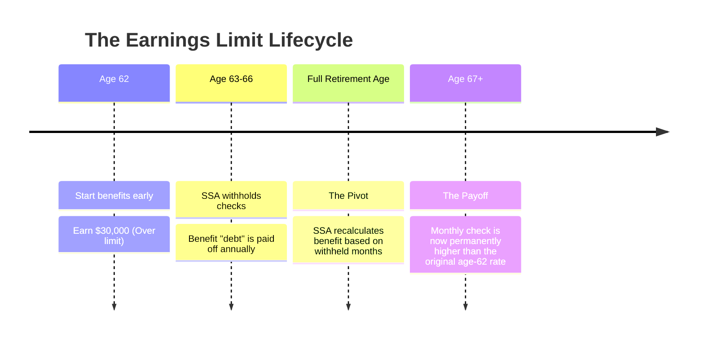

Most HR guides call the Social Security earnings limit a "penalty." They're wrong. It’s actually a forced savings account that the SSA triggers when you earn too much before your Full Retirement Age (FRA).

You've probably heard that the government "steals" your check if you keep working. That's the myth that keeps seniors from making extra money. Here is the reality of the 2024 limits and why the "loss" isn't what it seems.

```markmap
# The Social Security Earnings Guide

<!--more-->

## The Clawback Rules
### Under FRA: $1 for $2 over $22,320
### Year of FRA: $1 for $3 over $59,520
### After FRA: No limit
## What Counts as Earnings
### Wages & Net Self-Employment
### Not Capital Gains/Pensions
## The Long Game
### Benefit Recalculation at FRA
### Insolvency Risks (2032-2033)
```

## The $22,320 Line: How the Math Actually Hits Your Check

If you're between 62 and your Full Retirement Age, the SSA is watching one number: **$22,320**. For every $2 you earn above that limit in 2024, the SSA withholds $1 of your benefits. It's a blunt instrument that catches people off guard during tax season.

### The 2-for-1 Clawback Mechanics
The SSA doesn't just "tax" your check; they stop sending it entirely for a few months until the "debt" is paid. If you earn $30,000, you're $7,680 over the limit. That means the SSA will withhold $3,840 of your benefits. If your monthly check is $1,900, you simply won't get a payment for the first two months of the year. 

The root cause of this friction is the system's design to discourage early retirement for those still capable of high earnings. The downstream damage isn't just the missing check; it's the cash-flow crunch it creates for seniors who already budgeted that money for rent or healthcare. **Check your year-to-date earnings every June** to avoid a total blackout of benefits in November.

### The "Insolvency" Clock: Why 2032 Matters for Your Strategy
Recent warnings from the Committee for a Responsible Federal Budget (CRFB) suggest Social Security could face insolvency by **2032 or 2033**. This is a full year earlier than previous estimates. For a 62-year-old today, that means the system might change right as you hit your 70s.

This looming deadline changes the "wait for FRA" math. If you're worried about future benefit cuts, taking the money now—even with the earnings limit reduction—might feel safer than waiting for a "full" check that the government might trim later. However, the current law still rewards the wait; your monthly benefit increases for every month you don't receive a check due to the earnings limit.

### The Property Sale Trap: What Counts as Earnings
A common panic in community forums involves one-time windfalls. One retiree recently worried that selling their farm equipment and land would wipe out their Social Security check. It won't.

The earnings limit only cares about "earned income"—specifically wages from a job or net earnings from self-employment. It does not care about capital gains, interest, pensions, or the sale of a farm. If you're 86 or even 78, like the couple in that case, the earnings limit doesn't apply anyway. **The limit vanishes the month you hit Full Retirement Age.**

### The Customer Service Crisis: Why You Can't Rely on the Phone
Don't expect to call the SSA to "fix" an earnings limit mistake quickly. The agency is currently reassigning **1,000 customer service reps** from field offices just to handle the overwhelmed 1-800 number. 

Staffing shortages and recent agency changes have created a bottleneck where simple questions take hours on hold. If you're planning to work and draw benefits, you need to report your estimated earnings online through your "my Social Security" account. Waiting for a human to help you on the phone is a recipe for a late-year overpayment notice.


## Comparison: Working Early vs. Waiting for FRA

| Feature | Under Full Retirement Age (FRA) | The Year You Reach FRA | After Full Retirement Age |
| :--- | :--- | :--- | :--- |
| **2024 Earnings Limit** | **$22,320** | **$59,520** | **No Limit** |
| **Penalty Rate** | $1 for every $2 over | $1 for every $3 over | $0 (No reduction) |
| **What is counted?** | Only months before FRA | Only months before FRA | Nothing |
| **Money Recovery?** | Yes, via recalculation | Yes, via recalculation | N/A |

## The Final Call: Should You Keep Working?

Stop looking at the earnings limit as a "loss." If you earn over the limit and the SSA withholds $4,000 this year, they don't keep it. When you hit your Full Retirement Age, they look at all the months they didn't pay you and **permanently increase your monthly check** to compensate.

**The decision is simple:**
1. **Work through the limit** if you need the high salary now and want a "bonus" increase in your check later in life.
2. **Stay under $22,320** if you need the consistent monthly cash flow of your Social Security check to survive right now.

If you are self-employed, the SSA uses your 'net earnings,' not your gross income. Use your business expenses to stay under the $22,320 threshold if you're close.

### When the SSA "Penalty" Actually Helps
The timeline below shows how the "lost" money actually returns to your pocket over time.



### [References]
- [A Fine Country for Old Men](https://www.theatlantic.com/magazine/2026/05/gerontocracy-wealth-power/686585/)
- [Experts say Social Security could run dry earlier than expected](https://finance.yahoo.com/economy/policy/articles/experts-social-security-could-run-110000913.html)

### Common Questions on the Earnings Clawback

#### Do you get the penalized money back later?
Yes. This is the biggest misunderstanding in retirement planning. The SSA doesn't keep the withheld money. Once you reach Full Retirement Age, they recalculate your monthly benefit upward as if you had retired later. You eventually get that money back through higher monthly payments for the rest of your life.

#### Does a house sale count toward the limit?
No. The earnings limit only applies to "earned income" like wages or self-employment profits. Capital gains from selling a home, stocks, or other assets do not trigger the $1-for-$2 penalty.

#### What happens if I earn over the limit in the middle of the year?
You're supposed to notify the SSA. If you don't, and they find out via tax filings later, you'll get an overpayment notice. They will then stop your checks entirely until the balance is paid back. It's always better to over-estimate your earnings to the SSA than to under-estimate and get hit with a surprise bill.

#### Is the $22,320 limit based on gross or net pay?
For W-2 employees, it's based on **gross wages**. For the self-employed, it's based on **net earnings**. If you're a freelancer, your business deductions are your best friend for staying under the limit.