# Mermaid gallery

If diagrams render as shapes and arrows, Mermaid is working.  
If you only see raw code, check theme and Mermaid loader settings.

## Sample: Flowchart (TD)

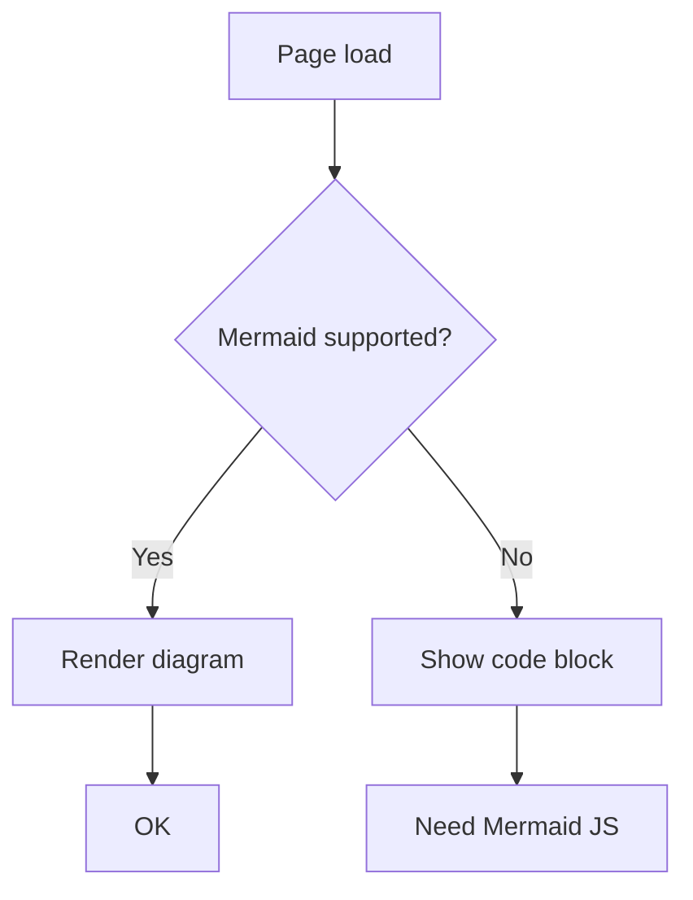

## Checklist

- Boxes and arrows render visually
- Labels are readable
- Light/dark mode contrast is OK

## Sample: Sequence Diagram

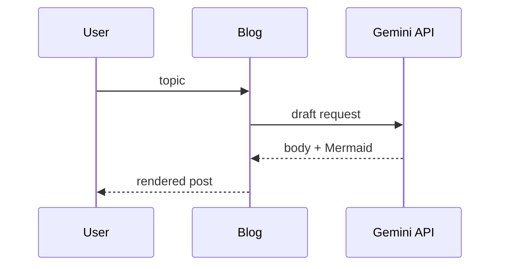

## Sample: Mindmap

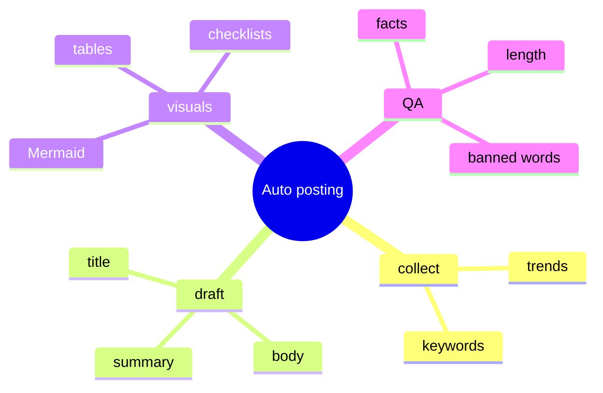

## Sample: Timeline

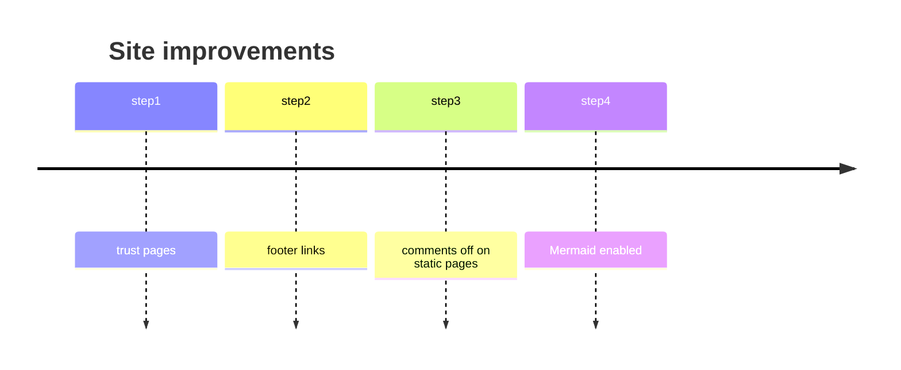

## Sample: Pie

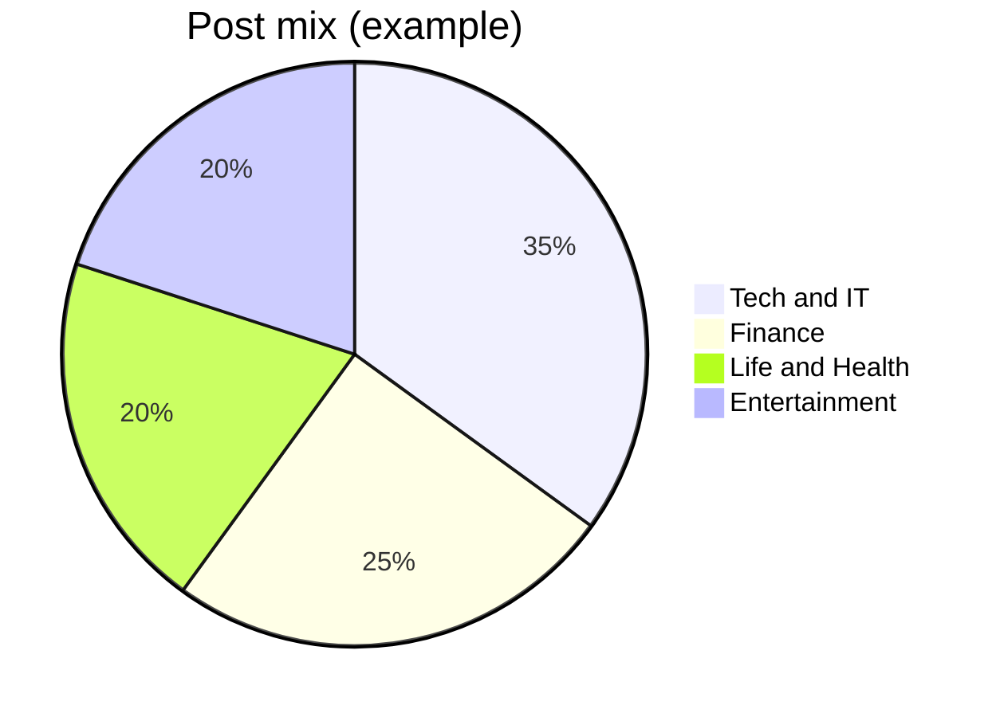

## Sample: Flowchart (LR)

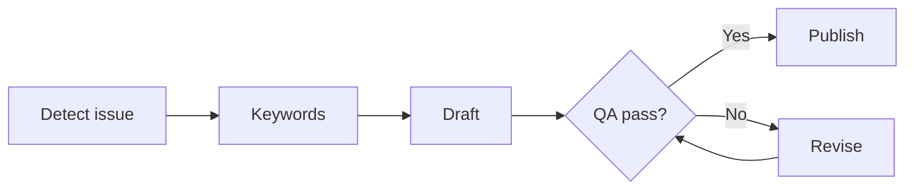

## Sample: State Diagram

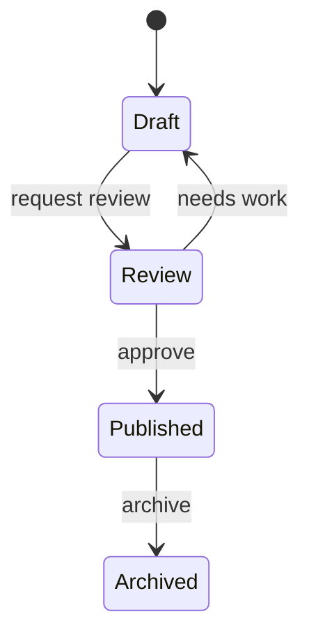

## Sample: Class Diagram

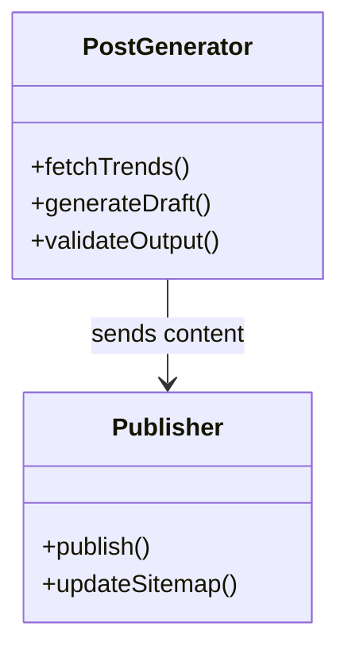

## Sample: ER Diagram

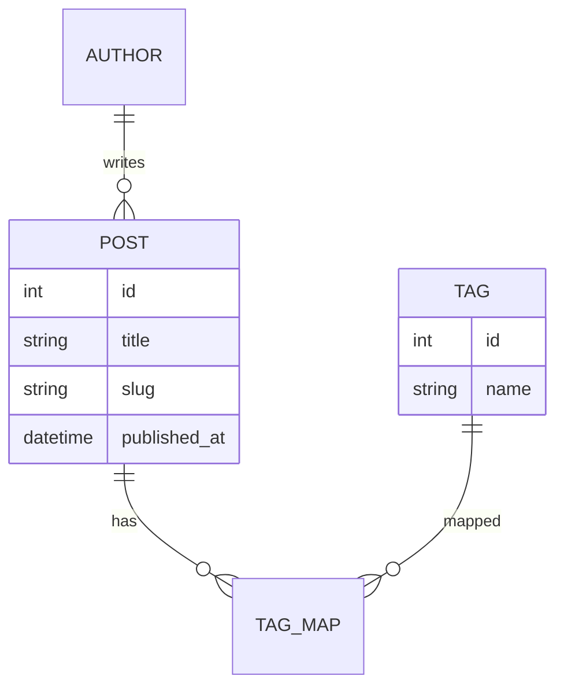

## Sample: Journey

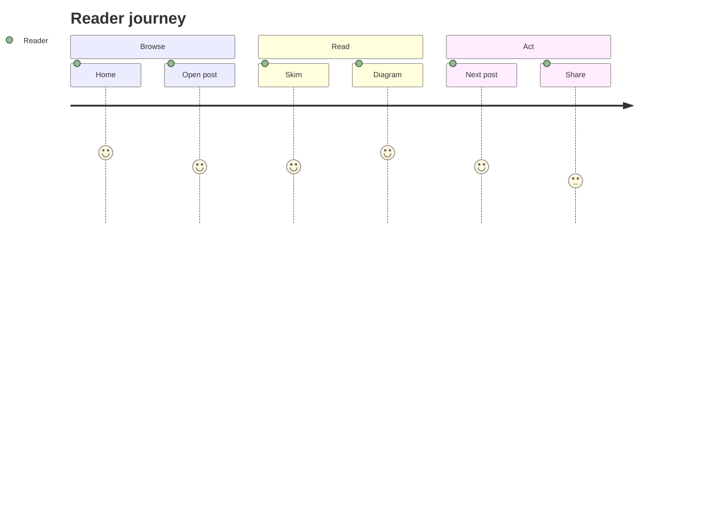

## Sample: Gantt

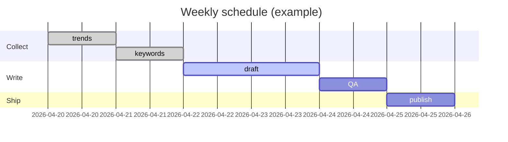

## Sample: Git Graph

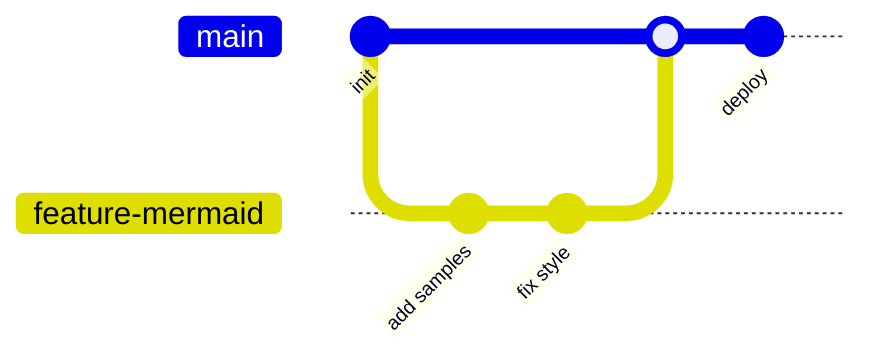
