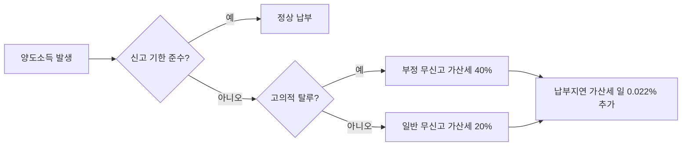

부동산이나 해외주식을 팔고 나서 세금 신고를 깜빡했다면, 지금 가장 먼저 해야 할 일은 '안 걸릴 방법'을 찾는 게 아니라 '얼마나 빨리 매를 맞을지' 결정하는 거예요. 국세청은 이미 2025년 귀속 양도소득세 확정신고 대상자 **약 22만 명**을 확정하고 안내문 발송을 시작했거든요. 안내문을 못 받았다고 해서 내 명단이 빠졌을 거라는 기대는 접는 게 좋아요. 특히 해외주식 투자자라면 더더욱 그렇죠.

<!--more-->

## 양도소득세 무신고 및 과소신고 가산세율 총정리: 기한을 넘긴 대가

세무 행정은 생각보다 꼼꼼하고 집요해요. 신고 기한인 **6월 1일**을 하루라도 넘기는 순간, 여러분이 내야 할 세금의 성격은 '자진 납부'에서 '징벌적 부과'로 바뀐답니다.

### 국세청의 22만 명 정밀 타격, 안내문 없어도 예외는 없어요
이번 확정신고 대상자 22만 명 중 해외주식 투자자가 18만 2천 명으로 압도적이지만, 부동산 거래자 1만 명 역시 국세청의 집중 감시 대상이에요. 예정신고를 아예 안 했거나, 서로 다른 부동산을 두 번 이상 팔고 소득을 합치지 않은 경우가 주요 타겟이죠.

세무서는 여러분의 등기부등본과 계좌 내역을 실시간으로 들여다보고 있다고 생각하면 편해요. "안내문이 안 왔으니 모르겠지"라는 생각으로 버티다가는 나중에 세무조사 통지서를 받게 될 수도 있거든요. 특히 다주택자의 변칙 거래에 대해서는 강도 높은 검증이 예고된 상태라 적당히 넘어가기 어려운 분위기예요.

### 무신고 20% vs 부정 무신고 40%, 선을 넘는 순간 벌금이 두 배예요
단순히 몰라서 신고를 안 한 '일반 무신고'는 납부세액의 **20%**가 가산세로 붙어요. 하지만 세금을 줄이려고 계약서를 허위로 작성하거나 증빙을 조작한 '부정 무신고'로 판단되면 가산세는 **40%**로 수직 상승하죠. 

여기에 '납부지연 가산세'라는 이자 성격의 벌금이 매일 추가돼요. 미납세액의 **0.022%(1일)**가 붙는데, 1년만 버티면 원금의 약 8%가 이자로만 나가는 셈이죠. 은행 예금 이자보다 훨씬 무서운 속도로 불어나니까 고민할 시간에 신고서부터 작성하는 게 지갑을 지키는 길이에요.

### 지방소득세라는 복병, 국세만 냈다고 끝난 게 아니에요
많은 사람이 놓치는 포인트가 바로 개인지방소득세예요. 양도소득세의 10% 별도로 붙는 이 세금 역시 **6월 1일**까지 따로 신고해야 하거든요. 올해부터는 가산세 특례가 종료되어서, 국세인 양도세를 냈더라도 지방소득세를 누락하면 똑같이 무신고 가산세를 물어야 해요.

다행히 5월 한 달간은 각 군·구청에서 통합신고창구를 운영하니까 한 번에 해결할 수 있어요. 100만 원 넘는 세금이 부담스럽다면 2개월 분할 납부 제도라도 활용해서 일단 신고 기한만큼은 반드시 지키길 권해요. 기한 내 신고만 해도 '무신고 가산세 20%'라는 큰 폭탄은 피할 수 있으니까요.

## 가산세 폭탄을 피하기 위한 상황별 페널티 비교

본인이 어떤 상황에 해당하느냐에 따라 내야 할 가산세의 무게가 완전히 달라져요. 아래 표를 보고 본인이 감당해야 할 리스크를 직시해 보세요.

| 구분 | 가산세율 (본세 대비) | 추가 페널티 | 비고 |
| :--- | :--- | :--- | :--- |
| **일반 무신고** | **20%** | 납부지연 가산세 합산 | 단순 착오 및 누락 |
| **과소 신고** | **10%** | 납부지연 가산세 합산 | 신고는 했으나 금액 부족 |
| **부정 무신고/과소** | **40%** | 세무조사 대상 가능성 | 서류 조작, 은닉 등 |
| **납부 지연** | **일 0.022%** | 체납 시 재산 압류 위험 | 미납 기간에 비례해 증가 |


가산세는 시간이 지날수록 유리해지는 법이 절대 없어요. 자진해서 수정신고를 빨리 할수록 가산세를 일정 비율 감면받을 수 있으니, 잘못을 인지한 즉시 홈택스에 접속하세요.


## 지금 당장 실행해야 할 단호한 가이드

결론은 심플해요. 계산기 두드리며 "얼마나 나올까" 걱정만 하는 건 아무런 도움이 안 돼요. 

1.  **홈택스/손택스 접속:** 안내문을 받았든 안 받았든, 작년에 부동산이나 해외주식으로 돈을 벌었다면 일단 들어가서 대상자인지 확인하세요.
2.  **증빙 서류 확보:** 매매계약서, 필요경비 영수증 등을 챙겨서 실제 양도차익을 계산해야 해요. 
3.  **6월 1일 사수:** 세금 낼 돈이 부족하다면 분납 신청을 해서라도 신고서는 기한 내에 제출하세요. **신고만 제때 해도 20%의 생돈은 아낄 수 있습니다.**

어설프게 버티다가 임차인의 세금 체납으로 집이 압류되거나, 개인회생 중에 세금 체납이 발목을 잡는 사례들이 실제 커뮤니티에 수두룩해요. 세금은 소멸시효도 길고 정부의 징수 의지도 강력하다는 걸 잊지 마세요.

### FAQ

**실수로 적게 신고했는데 나중에 걸리면 어떻게 되나요?**
수정신고를 통해 가산세를 감면받을 수 있어요. 세무서에서 연락 오기 전에 먼저 신고하는 게 핵심이에요. 빠를수록 감면율이 높으니 고민하지 말고 실행하세요.

**가산세도 할부로 나눠서 낼 수 있을까요?**
납부할 세액이 일정 금액을 초과하면 분납이 가능하지만, 가산세 자체는 원칙적으로 일시 납부예요. 다만 본세에 대해서는 2개월 이내 분납 제도를 활용해 부담을 덜 수 있어요.

**해외주식은 수익이 적어도 무조건 신고해야 하나요?**
기본 공제액인 250만 원을 넘었다면 무조건 신고 대상이에요. 안내문을 못 받았더라도 본인의 수익이 공제액을 초과했다면 6월 1일까지 자진 신고해야 가산세 20%를 안 냅니다.

### [References]
- [국세청 "다음 달 1일까지 22만 명 양도세 신고·납부해야"](https://imnews.imbc.com/news/2026/econo/article/6819868_36932.html)
- [5월은 양도세 확정신고의 달…"부동산 변칙거래 철저 검증"](https://www.newsis.com/view/NISX20260504_0003616001)
- [인천시 "개인지방소득세 6월 1일까지 신고하세요"…미신고 시 가산세 주...](https://www.cstimes.com/news/articleView.html?idxno=704421)
- [양도세 신고 6월 1일 마감…안 하면 가산세 20%](https://www.imaeil.com/page/view/2026050414492878598)