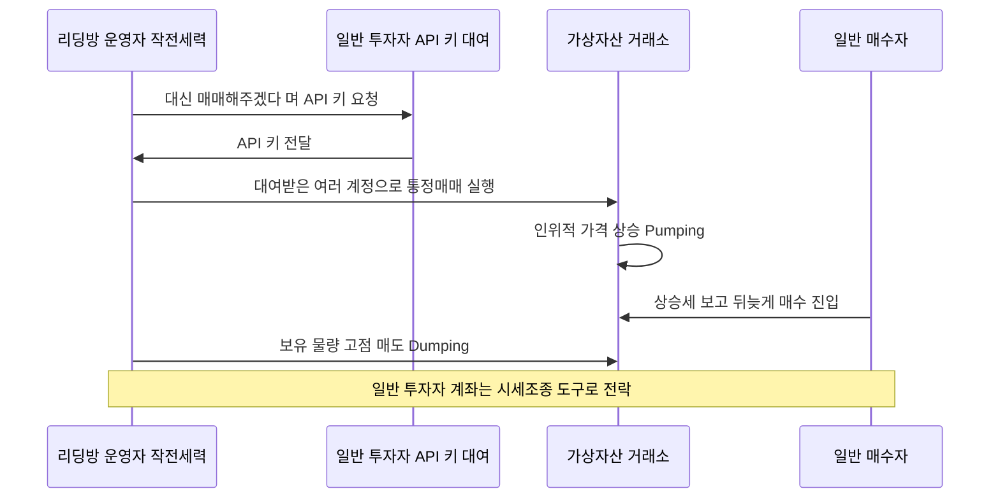
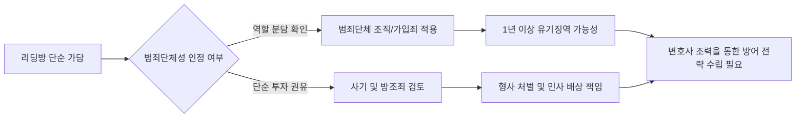

내가 산 코인이 오르는 게 리딩방 방장의 실력 덕분이라고 믿었다면, 그건 아주 위험한 착각이에요. 실상은 내 계좌와 돈이 누군가의 시세 조종을 위한 소모품으로 쓰였을 가능성이 훨씬 높거든요. 단순히 시키는 대로 매수 버튼만 눌렀을 뿐인데, 어느 날 갑자기 금융당국으로부터 수사 통보를 받는 상황은 이제 가상이 아닌 현실이 되었어요.

<!--more-->

## 가상자산 리딩방 연루 시 형사 처벌 수위와 방어 전략

가상자산 이용자 보호법이 시행되면서 금융당국의 감시망은 이전과는 비교할 수 없을 정도로 촘촘해졌어요. 2026년 4월 29일, 금융위원회는 제8차 정례회의를 통해 가상자산 시장 시세조종 혐의자들을 수사기관에 통보하기로 의결했죠. 이는 법 시행 이후 당국이 불공정거래 행위에 대해 본격적으로 칼을 빼든 사례로 평가받고 있어요.

단순히 "몰랐다"는 변명은 더 이상 통하지 않아요. 리딩방 운영자가 특정 종목을 미리 매집한 뒤, 회원들에게 매수 사인을 보내 가격을 인위적으로 띄우는 행위는 명백한 시세 조종이에요. 이 과정에서 본인의 계좌가 사용되었다면, 수익을 보지 못했더라도 수사 대상에 오를 수 있다는 점을 분명히 인지해야 해요.

### API 키 대여와 통정매매의 치명적인 리스크

최근 적발된 사례를 보면, 지인이나 리딩방 관계자에게 "매매를 대신 해주겠다"는 제안을 받고 가상자산 거래소의 API 키를 넘겨준 경우가 많아요. 별 생각 없이 넘겨준 이 키는 작전세력이 여러 계정 사이에서 물량을 주고받으며 거래량을 부풀리는 **통정매매**의 핵심 도구가 돼요. 

금융당국 조사 결과에 따르면, 혐의자들은 짧은 시간 동안 높은 가격으로 매수 주문을 반복 제출해 시장 가격을 인위적으로 끌어올린 뒤, 뒤늦게 뛰어든 일반 투자자들에게 물량을 떠넘겨 수천만 원의 부당이득을 챙겼죠. 이때 API 키를 빌려준 사람은 본인도 모르는 사이에 시세 조종의 공범으로 몰릴 수 있어요. 거래소의 IP 등록 의무화와 이상거래 차단 시스템(FDS)이 강화되면서, 이러한 비정상적 거래는 반드시 꼬리가 밟히게 되어 있거든요.


본인의 거래소 계정 접근 권한(API Key)을 타인에게 공유하는 행위는 본인의 인감도장을 남에게 맡기는 것과 다름없으며, 형사 처벌의 직접적인 원인이 될 수 있어요.


### 단순 가담자도 피할 수 없는 범죄단체조직죄 적용

리딩방 사기는 이제 단순한 개인의 일탈을 넘어 조직적인 범죄로 진화하고 있어요. 투자자를 모집하거나 허위 정보를 퍼뜨리는 아르바이트 형태의 가담이라 할지라도, 검찰과 경찰은 이를 **범죄단체 조직죄**로 다스리는 추세예요. 다수의 인원이 역할을 분담해 범행을 저지르는 구조라면, 단순 가입자나 활동가도 무거운 책임을 피하기 어렵죠.

현행 형법 제114조에 따르면, 무기 또는 4년 이상의 징역에 해당하는 범죄를 목적으로 조직된 단체에 가입하거나 활동한 경우 형사 처벌 대상이 돼요. 특히 가상자산 이용자 보호법에 따라 시세 조종 행위가 인정되면 **1년 이상의 유기징역**에 처해질 수 있습니다. "나는 시키는 대로만 했다"는 논리는 조직범죄의 구성원임을 자백하는 꼴이 될 수 있으니 주의해야 해요.

### 리딩방 사기 피해와 법적 대응의 골든타임

실제 사례 중에는 약 1년 9개월 전의 리딩방 사기 피해에 대해 뒤늦게 고소가 가능한지 묻는 경우가 많아요. 사기꾼들은 보통 빗썸 등 국내 상장 코인을 직접 구매하게 하는 방식을 쓰기도 하지만, 가짜 거래소를 만들어 입금을 유도하는 수법도 흔하죠. 1억 원 이상의 고액 피해가 발생했다면 이건 개인의 힘으로 해결할 수 있는 범위를 넘어선 거예요.

피해 회복을 위해서는 형사 고소뿐만 아니라 자금 추적, 집단 사건화가 동시에 이루어져야 해요. 시간이 지날수록 범죄 수익금은 세탁되어 사라지기 때문에, 이상 징후를 느낀 즉시 관련 대화 내역과 송금 기록을 확보하는 것이 최우선이에요. 캄보디아 등 해외 거점 리딩방의 경우 국제 수사 공조가 더디게 진행되는 경우가 많아, 국내 가담자들을 압박해 합의나 배상명령을 이끌어내는 전략이 현실적이죠.

### 억울한 연루를 벗어나기 위한 단계별 방어 지침

만약 본인도 모르게 시세 조종에 연루되었다는 의심이 든다면, 당황해서 대화방을 나가거나 기록을 삭제하는 행위는 절대 금물이에요. 오히려 증거 인멸의 오해를 살 수 있거든요. 

1.  **모든 로그 기록 보존:** 리딩방에서의 대화 내용, 매수 지시 시점, 본인의 실제 매매 내역을 엑셀 등으로 정리해두세요.
2.  **미필적 고의 부정:** 본인이 시세 조종의 목적이 없었음을 증명할 수 있는 정황(예: 단순 투자 목적으로 믿었다는 근거)을 수집해야 해요.
3.  **전문가 조력:** 금융조사부 등 전문 수사 인력이 투입되는 가상자산 사건은 초기 진술이 판결을 좌우해요. 경찰 단계에서부터 변호사의 도움을 받아 범죄 의도가 없었음을 논리적으로 소명하는 것이 핵심이에요.


가상자산 이용자 보호법은 시세 조종으로 얻은 부당 이득의 최대 5배까지 과징금을 부과할 수 있는 강력한 법안이에요. 단순 가담이라도 경제적 몰락으로 이어질 수 있음을 명심해야 해요.


### 리딩방 연루 리스크 체크 FAQ

### 수익을 전혀 못 봤는데도 시세 조종으로 처벌받을 수 있나요?
네, 수익 발생 여부는 범죄 성립의 필수 요건이 아니에요. 인위적으로 시세에 영향을 주려는 의도가 있었거나, 그러한 행위에 가담했다는 사실만으로도 처벌 대상이 될 수 있어요. 부당 이득이 없더라도 가상자산법 위반으로 기소될 수 있다는 점을 잊지 마세요.

### 친구가 대신 매매해준다고 해서 API 키를 줬는데, 이것도 죄가 되나요?
단순히 키를 넘겨준 행위 자체가 바로 범죄는 아니지만, 그 키가 시세 조종(통정매매 등)에 사용되었다면 방조죄나 공범 혐의를 받을 수 있어요. 특히 거래소 약관 위반은 물론이고, 수사 기관에서는 본인이 시세 조종에 이용될 것을 알고도 묵인했다고 판단할 가능성이 높아요.

### 리딩방에서 준 가짜 거래소 사이트에 입금했는데 돈을 찾을 수 있을까요?
가짜 거래소는 데이터만 조작할 뿐 실제로 코인을 보유하고 있지 않은 경우가 대부분이에요. 입금한 돈은 이미 대포통장을 통해 빠져나갔을 확률이 높죠. 이 경우 즉시 해당 계좌에 대한 지급정지를 신청하고 형사 고소를 진행해야 조금이라도 회수 가능성을 높일 수 있어요.

### 단순 가담자인데 변호사까지 선임해야 할까요?
경찰이 '범죄단체 조직죄' 혐의를 적용하기 시작하면 상황이 매우 심각해져요. 단순 아르바이트라고 생각했던 일이 무거운 실형으로 돌아올 수 있거든요. 초기 대응에서 본인의 역할을 명확히 구분 짓지 못하면 운영진과 같은 급으로 묶여 처벌받을 수 있으니 전문가의 조언은 필수적이에요.

### [References]
- [금융당국, 가상자산 시세조종 2건 적발 …혐의자 수사 통보](http://www.segyebiz.com/newsView/20260429515332?OutUrl=naver)
- ["내 API 키 빌려줬을 뿐인데"... 금융위, 가상자산 시세조종 혐의자 수사...](https://www.pointe.co.kr/news/articleView.html?idxno=78983)
- [코인 리딩방 단순 가담도 범죄단체 사기로 처벌… 변호사 조력으로 대응...](https://www.livesnews.com/news/article.html?no=50830)
- ["캄보디아 경찰 협조 제대로 안 돼"…일본은 이미 수사 공조](https://news.sbs.co.kr/news/endPage.do?news_id=N1008292541&plink=ORI&cooper=NAVER)