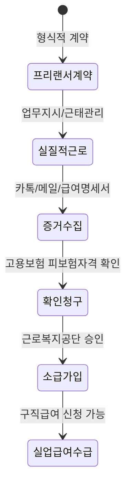

"프리랜서니까 실업급여는 꿈도 못 꾸지"라고 생각했다면 아직 법을 제대로 모르는 거예요. 계약서에 적힌 '위탁계약', '사업자'라는 명칭은 껍데기에 불과하거든요. 중요한 건 당신이 매일 아침 누구의 지시를 받고, 어디로 출근하며, 어떻게 일했느냐는 '실질'에 달려 있어요.

<!--more-->

## 근로자 추정제 적용 프리랜서 실업급여 수급 조건, 계약서 명칭에 속지 마세요

형식은 3.3% 세금을 떼는 프리랜서지만, 실제로는 상사의 눈치를 보며 정해진 시간에 출근하고 지시대로 움직였다면 당신은 법적 근로자예요. 이 간극을 메우기 위해 현재 논의되는 핵심이 바로 근로자 추정제죠.

### 75%가 찬성하는 근로자 추정제, 왜 당신에게 필요할까요

최근 설문조사에 따르면 프리랜서와 플랫폼 노동자 500명 중 75%인 375명이 근로자 추정 제도 도입이 필요하다고 응답했어요. 업체에 소속되어 노동을 제공하면서도 법적으로만 개인사업자로 분류되어 퇴직금이나 연차, 실업급여에서 소외되는 현실 때문이죠.

이 제도의 핵심은 입증 책임의 전환이에요. 현재는 노동자가 직접 '나는 근로자다'라는 사실을 민사소송 등을 통해 증명해야 하지만, 제도 도입 시 노동청 단계부터 근로자로 간주될 가능성이 커져요. 업무 내용이 회사 사업에 필수적이라고 답한 비중이 82.4%에 달하는 만큼, 당신의 노동이 회사의 핵심적인 부분이었다면 권리를 주장할 근거는 충분해요.

### 0.8%에 불과한 가입률, 자영업자 고용보험의 한계

현재 자영업자 고용보험은 본인이 직접 신청해야 하는 '임의가입' 방식이에요. 하지만 2024년 기준 가입률은 약 0.8% 수준으로 사실상 유명무실한 상태죠. 낮은 가입률 때문에 국회와 연구기관에서는 이를 '의무가입'으로 전환하려는 논의를 본격화하고 있어요.

폐업 시 구직급여를 받을 수 있는 요건이 까다롭고 소득 기반 보험료 체계가 미비하다는 지적이 계속되고 있거든요. 만약 당신이 순수 프리랜서가 아닌 '가짜 3.3%'라면, 이런 지지부진한 임의가입 제도를 기다릴 게 아니라 적극적으로 근로자성을 인정받아 일반 고용보험 혜택을 노려야 해요.

### 월급에서 뗀 보험료가 공단에는 없다면?

커뮤니티에서는 급여명세서에는 4대 보험료 공제 내역이 명확히 찍혀 있는데, 막상 공단 홈페이지에서 확인하면 미납으로 나오는 사례가 종종 보고돼요. 사장이 돈만 떼먹고 신고를 안 한 경우죠.

이럴 땐 당황하지 말고 사장이 발행한 급여명세서와 공단에서 발급받은 4대 보험 미납 확인서를 챙기세요. 퇴사 확인 서류나 근로계약서가 없더라도 실질적인 업무 지시 기록이 있다면 '고용보험 피보험자격 확인 청구'를 통해 소급 가입이 가능해요. 한 달 치가 밀렸다면 다음 달에 두 달 치를 내면 되는 단순 미납 케이스와는 차원이 다른 문제니, 반드시 본인의 가입 여부를 모바일 앱으로 수시로 확인해야 해요.

### 경제적 위기가 부르는 사회적 고립, 안전망을 활용하세요

실직과 경제적 어려움은 단순한 돈 문제를 넘어 정신건강까지 위협해요. 전라남도의 사례를 보면 2014년 기준 자살 사망자 618명 중 50대가 가장 많았는데, 이는 경제적 위기와 사회적 고립이 복합적으로 작용한 결과였죠.

이에 대응해 전라남도광역정신건강복지센터는 고용복지플러스센터와 협약해 실직자들을 위한 고용·복지·상담 연계 서비스를 강화하고 있어요. 실업급여 수급 조건을 따지는 것만큼이나, 현재 겪고 있는 심리적 압박을 분산할 수 있는 공공 서비스를 적극적으로 찾아보는 태도가 중요해요.

## 실업급여를 받기 위한 3단계 실전 대응 전략

가만히 앉아 있으면 누구도 당신의 권리를 챙겨주지 않아요. '근로자성'을 인정받아 실업급여를 타내기 위해서는 철저한 기록이 무기예요.

1. **업무 종속성 증거 수집**: 상사가 카톡으로 "이거 언제까지 하세요", "오늘 출근 왜 늦어요?"라고 보낸 메시지는 버리지 마세요. 구체적인 업무 지시와 근태 관리를 받았다는 증거가 돼요.
2. **고용보험 피보험자격 확인 청구**: 퇴사 후 고용센터를 방문해 본인이 실질적 근로자였음을 주장하며 소급 가입을 신청하세요. 이때 수집한 증거들을 제출해야 해요.
3. **근로자 추정 논리 활용**: "내 업무는 회사의 필수 사업 영역이었고, 나는 회사의 지휘·감독을 받는 노동자였다"는 점을 명확히 하세요.

업무 지시를 녹음하거나 캡처할 때, 상대방의 동의 없는 녹음은 상황에 따라 법적 쟁점이 될 수 있지만 본인이 대화 당사자라면 증거로 활용 가능한 경우가 많아요. 단, 사적인 대화가 아닌 '업무 지시' 내용에 집중하세요.

업무 지시 내용을 명확히 기록해두는 것이 나중에 큰 힘이 됩니다. 구두 지시가 많다면 기록용 장치를 활용하는 것도 방법이죠.



### [References]
- [전남 중장년 자살예방 안전망 강화..고용·복지·상담 지원](https://mpmbc.co.kr/NewsArticle/1517884)
- [자영업자 고용보험, '임의가입'에서 '의무화' 전환 논의 본격화](https://www.insnews.co.kr/news/articleView.html?idxno=90623)
- [프리랜서·특고·플랫폼 노동자 75% "근로자 추정제 필요"](https://www.newsis.com/view/NISX20260508_0003622354)
- [프리랜서 75% "근로자 추정제 필요"…'노동청·노동위부터 도입' 주장도](https://www.news1.kr/society/general-society/6161369)

결국 핵심은 하나예요. 당신이 '사장님'처럼 자유롭게 일했는지, 아니면 '직원'처럼 묶여서 일했는지죠. 계약서의 명칭보다 당신의 노동이 가진 실체가 훨씬 강력한 법적 힘을 가집니다. 당장 본인의 업무 지시 기록부터 백업해두십시오. 그것이 당신의 실업급여를 지켜줄 유일한 티켓이니까요.