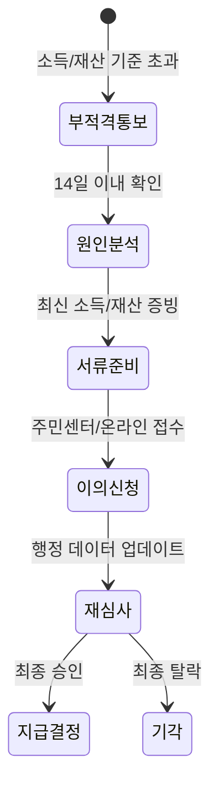
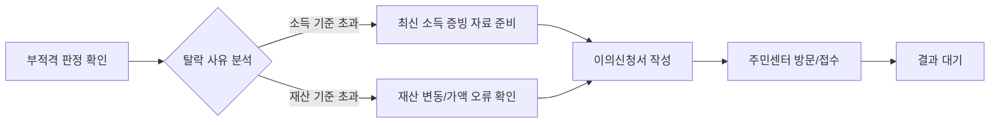

통장 잔고는 바닥인데 정부 시스템은 당신을 '부자'로 분류했다면, 그건 본인의 실제 경제 상황과 행정 데이터 사이에 시차가 발생했기 때문이에요. 억울해하며 손 놓고 있을 게 아니라, 왜 이런 역전 현상이 생겼는지 파악하고 정해진 기한 안에 증빙 서류를 던져주는 게 가장 똑똑한 해결책이죠.

<!--more-->

## 고유가지원금 제외대상 기준 소득 역전 현상 이의신청이 필요한 진짜 이유

고유가 지원금은 기본적으로 **건강보험료 기준 소득 하위 70%**를 선별해서 지급해요. 하지만 소득은 낮아도 **자동차 가액이나 고가 주택 보유** 여부에 따라 소득인정액이 뻥튀기되어 제외대상에 포함될 수 있죠. 특히 지역가입자는 재산이 소득으로 환산되는 비중이 커서 억울한 탈락자가 속출하곤 해요.

### 울산시의 복지 사각지대 해소 의지와 지자체별 온도 차

최근 울산에서는 복지 사각지대 없는 도시를 만들겠다는 공약이 발표되었죠. 이는 역설적으로 현재의 복지 시스템이 얼마나 많은 구멍을 가지고 있는지를 증명해요. 고유가 지원금 같은 보편적 복지조차 데이터의 한계 때문에 누락되는 사람이 생긴다는 뜻이죠. 지자체장이 사각지대 해소를 강조한다는 건, 반대로 말하면 본인이 직접 '나 여기 구멍에 빠졌소'라고 손을 들지 않으면 아무도 챙겨주지 않는다는 현실을 보여줘요.

### 익산시 아동 전수조사 사례가 보여주는 행정 정보의 한계

익산시가 의료 기록이 없는 아동들을 전수조사하는 이유는 행정 시스템에 잡히지 않는 '유령 인구'나 위기 가정을 찾기 위해서예요. 고유가 지원금 신청 시 발생하는 소득 역전 현상도 이와 비슷해요. 시스템은 1~2년 전의 과거 데이터를 기준으로 당신을 판단하거든요. 현재 실직 상태거나 소득이 급감했어도 시스템이 이를 실시간으로 반영하지 못하면 당신은 서류상 여전히 '지원 불필요 대상'일 뿐이죠.

### 하남시 예술인 기회소득 신청 자격과 소득 인정액 산정 방식

하남시에서 시행하는 예술인 기회소득의 사례를 보면 소득 판정의 냉정함을 알 수 있어요. 기준 중위소득 120%(1인 가구 기준 월 3,077,086원) 이하라는 명확한 수치를 제시하죠. 여기서 중요한 건 '예술활동증명' 같은 고유 자격과 소득 인정액이에요. 고유가 지원금도 마찬가지로 건강보험공단의 데이터가 절대적인 기준이 되기 때문에, 이 데이터가 실제와 다르다면 이를 반박할 '공식적인 증거'가 반드시 필요해요.

### 서울시 월세지원금 사례로 본 증빙 서류의 치명적 중요성

온라인 커뮤니티의 실제 사례를 보면 이의신청의 성패는 '디테일'에서 갈려요. 서울시 월세지원금 탈락 후 이의신청을 하려다 기간을 놓친 사례가 있는데, 이는 통보 확인을 제때 하지 않았거나 서류 보완 요청을 무시했기 때문이죠. 특히 이체 내역 캡처본 하나에도 이름, 날짜, 금액이 완벽하게 들어가야 해요. 모호한 자료는 행정 기관에서 바로 컷당한다는 사실을 잊지 마세요.

### 긴급생계지원금 탈락 통보 방식과 능동적인 확인 절차

많은 사람이 탈락하면 친절하게 전화가 올 거라 착각하지만, 현실은 냉정해요. 문자 한 통으로 끝나거나 복지로 홈페이지에서 본인이 직접 확인해야 하는 경우가 허다하죠. 탈락 사유를 정확히 모른 채 시간만 보내면 이의신청 가능 기간인 **14일 이내**라는 골든타임을 놓치게 돼요. 통보를 받은 즉시 관할 읍면동 주민센터에 전화해서 '어떤 항목' 때문에 점수가 깎였는지 물어보는 집요함이 필요해요.


이의신청 시에는 반드시 **최신 소득 증빙 자료를 제출**하세요. 건강보험공단의 데이터보다 더 최신의 소득 감소 증빙(해고통지서, 폐업사실증명원 등)이 있다면 승소 확률이 비약적으로 상승해요.


### 지원금 자격 판정 및 이의신청 대응 가이드

| 구분 | 자동 선별 기준 | 이의신청 필요 상황 | 준비 서류(예시) |
| :--- | :--- | :--- | :--- |
| **소득 기준** | 건보료 하위 70% | 최근 실직/휴직으로 소득 급감 | 소득금액증명원, 퇴직증명서 |
| **재산 기준** | 자동차/주택 가액 합산 | 차량 노후화/폐차, 주택 매각 | 자동차등록원부, 매매계약서 |
| **가구 구성** | 주민등록상 가구원 | 실제 부양가족 유무 차이 | 가족관계증명서, 실제 거주 증빙 |

행정은 당신의 사정을 먼저 물어봐 주지 않습니다.

부적격 판정을 받았다면 고민할 시간에 서류부터 챙기세요. 특히 자동차 가액이 감가상각을 반영하지 않아 높게 책정된 건 아닌지, 혹은 이미 처분한 재산이 여전히 잡혀 있는 건 아닌지 확인하는 게 우선이에요. 이의신청은 단순히 떼를 쓰는 게 아니라, 잘못된 행정 데이터를 바로잡는 정당한 권리 행사니까요.


이의신청 기간은 보통 결과 통보 후 14일 이내로 매우 짧아요. 서류 준비에 며칠만 허비해도 기회 자체가 사라지니, 부적격 문자를 받자마자 행동하세요.


### FAQ

**Q: 작년보다 소득이 줄었는데 왜 제외되었나요?**
A: 지원금 산정 기준이 되는 소득 데이터의 시점(보통 1~2년 전) 때문일 가능성이 높으므로 **최신 소득 증빙으로 이의신청**해야 합니다.

**Q: 자동차가 있으면 무조건 안 되나요?**
A: 아닙니다. 배기량이나 차량 가액 기준이 지자체마다 다르며, 생업용 차량이나 장애인 차량 등 예외 조항이 있으니 이를 증명하면 승산이 있어요.

**Q: 이의신청 결과는 언제 나오나요?**
A: 보통 접수 후 30일 이내에 결정되지만, 서류 보완이 필요하면 더 늦어질 수 있어요. 접수 시 담당자에게 대략적인 소요 기간을 꼭 물어보세요.

**Q: 온라인으로도 이의신청이 가능한가요?**
A: '복지로' 홈페이지를 통해 가능한 사업이 있고, 반드시 방문해야 하는 사업이 있어요. 해당 공고문의 접수처 섹션을 다시 한번 확인하는 게 가장 정확해요.

**Q: 이의신청을 하면 불이익이 있나요?**
A: 전혀 없어요. 오히려 잘못된 행정 정보를 바로잡아 향후 다른 복지 혜택을 받을 때도 유리해질 수 있으니 당당하게 신청하세요.

### [References]
- [김두겸 "사각지대 없는 복지 울산 실현"…공약 발표](https://www.news1.kr/local/ulsan/6162594)
- [익산시, 의료기록 없는 아동 164명 전수조사…사각지대 해소](https://www.yna.co.kr/view/AKR20260511119100055?input=1195m)
- [예술인 기회소득 신청 11일 시작…하남시 만 19세 이상 대상](https://www.gukjenews.com/news/articleView.html?idxno=3578525)
- [[위클리오늘] 하남시, '예술인 기회소득 신청하세요'…최대 연 150만원 ...](http://www.weeklytoday.com/news/articleView.html?idxno=774901)