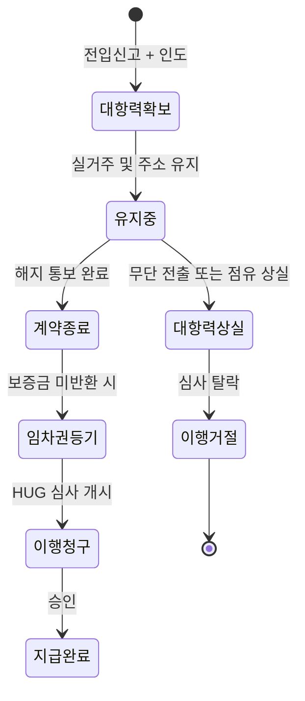
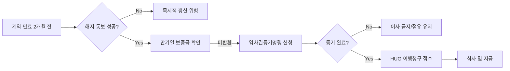

전세보증보험 증서를 손에 쥐었다고 해서 내 보증금이 100% 안전하다는 생각은 위험한 착각이에요. 보험사는 자선단체가 아니며, 약관에 명시된 의무를 단 하나라도 어기면 이행심사 단계에서 가차 없이 거절 통보를 날리거든요. 특히 대항력은 계약 시작부터 보증금을 돌려받는 순간까지 실시간으로 유지되어야 하는 생존 조건이에요.

<!--more-->

## HUG 전세보증보험 이행심사 거절 사유 대항력 상실의 실체

보증보험 이행청구를 했을 때 가장 빈번하게 발생하는 거절 사유는 바로 임차인의 대항력 상실이에요. 대항력은 주택의 인도와 전입신고를 통해 확보되는데, 이 중 하나라도 중간에 끊기면 보험사는 보증 책임에서 즉시 벗어나요. 많은 임차인이 이사 날짜가 맞지 않아 며칠 먼저 전출을 하거나, 가족 중 일부만 남겨두고 주소를 옮기면 괜찮을 거라 믿지만 이는 법적으로 매우 위험한 도박이죠.

```markmap
# HUG 전세보증보험 리스크 관리
## 대항력 유지 조건
### 주택의 인도(점유)
### 전입신고(유지)
### 확정일자
## 이행거절 주요 변수
### 임대인 변경 통지 누락
### 묵시적 갱신 시 절차 미비
### 대항력 일시 상실
## 법적 방어 기제
### 임차권등기명령
### 내용증명 발송
### 제소전화해
```

### 손보 분쟁조정 65% 급증이 시사하는 보험사의 깐깐한 잣대

올해 1분기 손해보험사 관련 분쟁조정 신청 건수는 1만 3839건으로, 지난해 1분기 8385건 대비 65%나 급증했어요. 단순 반복 민원을 제외하더라도 실제 분쟁조정 신청 자체가 48.9% 증가한 9406건에 달하죠. 이는 소비자들이 자신의 권리에 민감해진 결과이기도 하지만, 역설적으로 보험사가 보험금 지급 심사를 그만큼 까다롭게 진행하고 있다는 방증이기도 해요.

보험 계약 규모가 큰 대형 손보사일수록 분쟁 신청 건수가 집중되는 경향을 보여요. 삼성화재가 3006건으로 가장 많았고 메리츠화재, 현대해상 등이 뒤를 이었죠. 보험사는 블랙박스 영상이나 교통사고 분석 콘텐츠처럼 명확한 증거가 있는 사안에서도 과실 비율을 꼼꼼히 따지는데, 전세보증금처럼 거액이 걸린 사안에서는 약관 위반 여부를 얼마나 더 집요하게 파고들겠어요? 분쟁이 소송으로 번지는 비율은 0.3%로 낮아졌지만, 이는 조정 단계에서 이미 치열한 법리 다툼이 벌어지고 있음을 의미해요. 따라서 이행청구 전 스스로의 결격 사유를 완벽히 제거해야 해요.

### 시니어 케어와 보험업 신성장 동력 이면의 규제 리스크

보험업계는 현재 초고령사회 진입에 맞춰 요양, 간병, 시니어주택 등 신사업 확대를 미래 생존 전략으로 삼고 있어요. 2025년 고령 인구가 1051만 명을 돌파하며 전체의 20%를 넘어서자, 정부와 민간 모두 시니어케어 생태계 조성에 속도를 내는 중이죠. 하지만 이러한 신시장 진출 과정에서도 부지 소유 의무나 자본건전성 규제 같은 이중 장벽이 보험사의 발목을 잡고 있어요.

이처럼 보험사는 규제와 건전성 지표에 극도로 예민한 집단이에요. 시니어주택 사업에서도 비용 부담을 낮춘 일본의 사코주 모델을 검토할 만큼 효율성을 따지죠. 이러한 업계의 생리는 사고 보상 심사에서도 그대로 드러나요. 자신들의 자본건전성을 해칠 수 있는 부실한 지급은 철저히 차단하려 하거든요. 보험사가 규제 완화를 요구하며 수익성을 쫓는 만큼, 임차인에게 지급해야 할 보증금에 대해서도 약관상의 빈틈을 찾아내어 지급을 거부할 논리를 세우는 데 능숙하다는 사실을 잊지 마세요.

### 지자체 안심보험 사례로 본 공공 보증의 한계

최근 경남 지역에서는 소상공인을 위한 안심보험 도입과 임차보증금 지원 공약이 발표되었어요. 외부 요인으로 매출이 감소할 때 안전망 역할을 하거나, 일정 소득 이하 영세 자영업자에게 임차 보증금을 대신 지원하는 형태죠. 2027년부터 연간 1만 명을 대상으로 월 보험료의 50%, 최대 2만 원까지 지원하는 등의 구체적인 계획이 포함되어 있어요.

하지만 이런 공공 성격의 보증이나 지원책 역시 '증빙'과 '조건'이 핵심이에요. 배달 플랫폼 실적이 자동으로 확인되거나 개별 택배 계약 증빙 자료가 완벽해야 지원금이 나오는 것처럼, 전세보증보험도 주택도시보증공사(HUG)가 요구하는 서류와 절차가 완벽해야 작동해요. 지자체가 소상공인의 재기 기반을 지원하듯 HUG도 임차인을 보호하려 하지만, 법적 요건을 갖추지 못한 임차인까지 구제해주지는 않아요. 공공 보증이라는 이름이 주는 안도감에 취해 기본적인 대항력 유지 의무를 소홀히 해서는 안 돼요.


임대인이 변경되었다면 즉시 HUG에 통지하고 변경 승인을 받아야 해요. 이를 누락하면 추후 이행청구 시 '피보험자 의무 위반'으로 거절될 수 있습니다.


### 명도소송과 퇴거 지연이 임대차 관계에 주는 압박

임대차 계약이 종료되었음에도 세입자가 부동산을 반환하지 않으면 임대인은 명도소송을 고려하게 돼요. 특히 임대료를 2회(상가 3회) 이상 연체하거나 계약이 적법하게 해지되었을 때가 주요 대상이죠. 명도소송은 권리관계가 명확해 돌발 변수는 적지만, 판결까지 시일이 걸리기 때문에 임대인에게는 큰 경제적 손실을 야기해요.

이 과정에서 임대인은 피해를 줄이기 위해 점유이전금지 가처분 신청 같은 법적 안전장치를 확보하려 들죠. 임차인 입장에서 보증금을 제때 돌려받지 못해 점유를 유지하고 있다면, 이는 정당한 권리 행사이지만 법적 절차가 시작되면 심리적, 시간적 압박이 상당해요. 보험 이행청구를 하려면 우선 임차권등기명령을 통해 점유를 상실해도 대항력이 유지되도록 조치하는 것이 선행되어야 해요. 무작정 버티는 것보다 법적 절차를 선점하는 것이 유리하죠.

### 관리비 미납 책임 소재로 본 소유주의 법적 의무

한 상가 관리업체가 200만 원의 미납 관리비로 골머리를 앓던 사례가 있었어요. 임차인이 사라지거나 퇴실했음에도 임대인이 책임을 회피했죠. 하지만 법률 전문가들은 집합건물법과 대법원 판례에 따라 공용부분 관리비의 최종 납부 책임은 건물 소유자인 임대인에게 있다고 명시하고 있어요. 임대인이 "보증금을 이미 다 썼다"거나 "임차인이 안 냈다"는 변명은 관리업체에 통하지 않아요.

이 사례는 책임 소재의 명확성을 보여줘요. 전세보증보험에서도 마찬가지예요. 임대인이 보증금을 돌려줄 능력이 없다는 사실은 보험금 지급의 사유가 될 뿐, 임차인이 대항력을 상실했다는 사실을 덮어주지는 못해요. 보험사는 임대인의 잘못과 임차인의 의무 위반을 철저히 분리해서 봐요. 관리비 책임이 소유자에게 귀속되듯, 대항력 유지 책임은 오롯이 임차인에게 귀속된다는 점을 명심하세요.


### 내용증명 단계에서 발생하는 시간적 손실과 대응법

많은 임대인이 월세 연체 세입자에게 내용증명만 보내고 상황이 나아지길 기다리다 6개월 이상의 시간을 허비하곤 해요. 내용증명은 계약 해지 의사를 공식화하는 수단일 뿐, 강제 퇴거를 이끌어내는 마법의 지팡이가 아니거든요. 대응 시기를 놓치면 미납 월세는 쌓이고 보증금은 바닥나며, 결국 회수 불가능한 손실로 이어지죠.

임차인 입장에서도 이 원리는 똑같이 적용돼요. 보증금을 못 받을 것 같을 때 내용증명만 보내고 손 놓고 있으면 안 돼요. 계약 종료 2개월 전까지 해지 통보가 도달했는지 확인하고, 종료 직후 바로 임차권등기명령을 신청해야 해요. 대응이 늦어질수록 HUG의 이행심사 기간만 뒤로 밀릴 뿐이에요. 소송 초기부터 보증금 공제와 재산 조회를 병행해야 하는 임대인의 긴박함처럼, 임차인도 이행청구 서류를 미리 완벽하게 준비해두어야 해요.

### 제소전화해를 통한 분쟁 장기화 방지 전략

임대차 분쟁이 터진 뒤 명도소송에 들어가면 강제집행까지 1년 가까이 소요되기도 해요. 이를 방지하기 위해 '제소전화해' 제도가 활용되죠. 법원의 화해 조서는 확정판결과 같은 효력을 가져서, 분쟁 발생 시 별도 소송 없이 곧바로 강제집행이 가능하거든요. 이는 상가나 주택 임대차에서 강력한 '안전핀' 역할을 해요.

보증보험 가입자에게 이 제소전화해와 같은 역할을 하는 것이 바로 '완벽한 서류 준비'와 '절차 준수'예요. 보험사는 화해 조서처럼 명확한 근거가 있을 때만 움직여요. 계약 시점에 분쟁 시나리오를 명문화하는 임대인들처럼, 임차인도 묵시적 갱신이 되지 않도록 해지 통보 기록을 남기고, 임대인 변경 시 HUG 승인을 받는 등 사전에 리스크를 차단해야 하죠. 법적 효력을 갖춘 조서가 시간을 단축하듯, 꼼꼼한 약관 준수가 여러분의 보증금을 지켜주는 지름길이에요.



### 은행 통지 누락으로 인한 보증보험 거절 실제 사례

한 커뮤니티 사례에 따르면, 보증보험 재가입 당시 은행으로부터 "임대인에게 꼭 알리라"는 안내를 받았음에도 불구하고 절차가 꼬여 거절 통보를 받은 임차인이 있었어요. 통화 녹음본과 거절 통보문까지 챙겨 소송을 고민할 만큼 절박한 상황이었죠. 가입 당시에는 아무 문제 없던 보증서가 실제 사고가 터지자 무용지물이 된 거예요.

이 실패의 핵심 레버는 '통지 의무'에 있었어요. 보험사는 가입자 진술을 기준으로 승인을 내주지만, 실제 이행 단계에서는 과거 기록을 전면 조사해요. 특히 은행 대출과 연계된 보증의 경우, 은행과 보험사, 임대인 사이의 통지 절차 중 하나만 어긋나도 임차인이 독박을 쓰는 구조죠. 단순히 문자를 받았다고 안심할 게 아니라, 해당 내용이 보험사 전산에 정상적으로 반영되었는지 더블 체크하는 집요함이 필요해요.

### 고지의무 위반과 진술 오류가 부르는 보험금 지급 거절

배상책임보험이나 태아보험 사례에서도 알 수 있듯이, 보험사는 '고지의무 위반'을 가장 강력한 거절 명분으로 삼아요. 가해자가 말을 바꾸거나 가입 전 진단 사실을 숨겼을 때 보험사는 구상권 청구나 지급 거절로 대응하죠. 전세보증보험도 마찬가지예요. 계약서상의 특약 사항을 숨기거나, 임대인과의 이면 합의가 나중에 드러나면 보험금은 물 건너가요.

실제로 물혹 진단 시점이나 설명 내용을 입증하지 못해 보험 거절을 당하는 태아보험 사례처럼, 전세 계약에서도 '확정일자 부여 시점'이나 '선순위 채권 금액'에 대한 진술이 사실과 다르면 치명적이에요. 보험사는 가입 시점에는 일일이 검증하지 않다가, 돈을 내줘야 할 때 현미경 심사를 시작한다는 점을 잊지 마세요. 처음부터 끝까지 모든 서류는 팩트에 기반해야 하며, 조금이라도 의심스러운 부분은 미리 보험사에 확인받는 것이 상책이에요.


### 이행청구 승률을 높이는 최후의 체크리스트

보험금 지급 거절이라는 벼랑 끝에 서지 않으려면 지금 당장 자신의 상태를 점검해야 해요. 단순히 "보험 들었으니까 되겠지"라는 안일함이 가장 큰 적이에요.

| 점검 항목 | 필수 확인 내용 | 주의사항 |
| :--- | :--- | :--- |
| **대항력 유지** | 전입신고 및 실제 거주 여부 | 단 하루의 전출도 절대 금지 |
| **통지 의무** | 임대인 변경 시 HUG 신고 여부 | 변경된 계약서로 재승인 필수 |
| **갱신 의사** | 만기 2개월 전 해지 통보 도달 | 문자, 카톡보다는 내용증명 권장 |
| **권리 관계** | 임차권등기명령 완료 여부 | 등기부 등본 기재 확인 후 이사 |



### FAQ

**Q: 가족 중 한 명만 전입을 남겨두고 제가 먼저 이사해도 대항력이 유지되나요?**
A: 이론적으로는 가족의 점유도 인정될 수 있지만, HUG 심사에서는 본인의 전입 유지를 원칙으로 하는 경우가 많아요. 리스크를 줄이려면 임차권등기명령이 완료될 때까지 전 가족의 주소를 유지하는 것이 가장 안전해요.

**Q: 묵시적 갱신이 되었는데 보증보험은 그대로 유효한가요?**
A: 아니요. 묵시적 갱신이 되면 보증 조건이 변경된 것으로 간주되어 보험 효력이 상실될 수 있어요. 갱신 시점에 맞춰 반드시 보증 기간 연장 신청을 하고 승인을 받아야 해요.

**Q: 임대인이 바뀌었는데 연락이 안 되면 어떻게 하나요?**
A: 임대인 변경 사실을 안 즉시 HUG에 알리고, 전 임대인에게 받은 보증금 반환 의무가 승계되었다는 점을 확인해야 해요. 연락 두절 시에는 내용증명을 새 임대인의 주소지로 발송하여 근거를 남기세요.

**Q: 임차권등기 신청만 하고 바로 이사해도 되나요?**
A: 절대 안 돼요. 신청이 아니라 **등기부등본에 임차권등기가 실제로 기재된 것을 확인**한 후에 이사해야 대항력이 유지돼요. 보통 결정 후 등기까지 1~2주 정도 소요되니 여유를 두세요.

### [References]
- [손보 분쟁조정 1분기 65% 급증⋯車보험 과실 다툼 커졌다](https://www.etoday.co.kr/news/view/2584124)
- [[시니어주택] 급부상한 '시니어주택', 규제 개선이 보험업 신성장 열쇠](https://www.insnews.co.kr/news/articleView.html?idxno=90780)
- [박완수, 경남형 소상공인 안심보험·배달비 지원 등 공약](https://www.yna.co.kr/view/AKR20260511081800052?input=1195m)
- [주택, 상가 월세미납 명도소송 언제 시작하는게 좋을까?](https://www.ksilbo.co.kr/news/articleView.html?idxno=1056371)
- [“세입자 탓” 버티던 건물주, 200만원 관리비 청구서 받나](https://lawtalknews.co.kr/article/WKU7SOXDNI8Y)
- [내용증명만 보내다 6개월 날린다…월세 연체 대응법 [집과법]](https://www.donga.com/news/Society/article/all/20260417/133743679/2)
- [월세 밀려도 즉시 명도… 임대차 '안전핀' 제소전화해](https://www.gokorea.kr/news/articleView.html?idxno=865409)