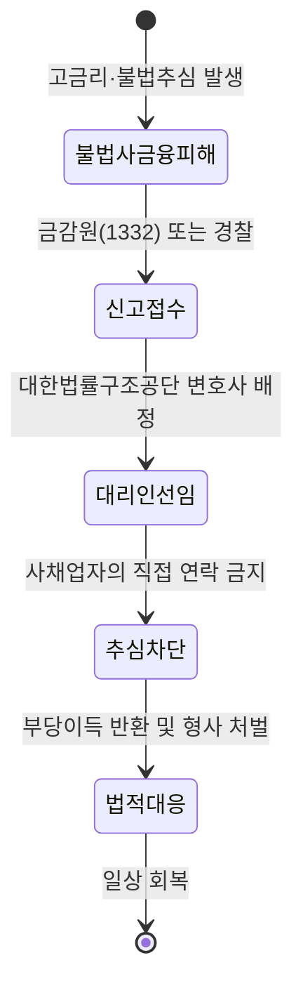

사채업자가 집으로 찾아오거나 가족에게 연락할까 봐 신고를 망설이는 건 지극히 본능적인 공포예요. 하지만 그 공포 때문에 아무것도 하지 않으면 상황은 절대 변하지 않죠. 오히려 신고를 통해 법적 방패를 세우는 것이 보복을 막는 가장 확실한 방법이라는 팩트를 직시해야 해요.

<!--more-->

## 불법사금융 신고 후 보복 방지 채무자대리인 제도로 추심 차단하기

불법 추심의 공포에서 벗어나는 핵심은 사채업자와의 연결 고리를 법적으로 끊어내는 거예요. **불법사금융 신고 후 보복 방지 채무자대리인 제도**를 이용하면, 국가가 선임한 변호사가 당신의 방패가 되어줘요. 변호사가 선임되는 순간 사채업자는 당신에게 직접 전화를 걸거나 찾아오는 행위 자체가 금지되거든요.

이 제도는 단순히 신고만 도와주는 게 아니에요. 금융감독원과 대한법률구조공단이 협력해서 불법 추심을 차단하고, 이미 발생한 피해에 대해 수사를 의뢰하거나 소송까지 지원하는 전 과정을 밀착 관리해요. 사채업자 입장에서는 이제 당신이 아니라 국가가 선임한 법률 전문가를 상대해야 하는 상황에 놓이는 거죠.

만약 대리인이 선임되었는데도 사채업자가 당신이나 가족에게 연락을 시도한다면, 그 자체로 가중 처벌 대상이 돼요. 법은 당신이 생각하는 것보다 훨씬 촘촘하게 보복 방지망을 짜두고 있어요. 혼자서 그들의 협박을 견디는 건 용기가 아니라 무모함일 뿐이에요.



### 금융감독원과 복지부가 구축한 원스톱 밀착 지원망

최근 보건복지부와 금융감독원은 취약계층을 노리는 금융 범죄에 대응하기 위해 업무협약을 체결했어요. 이제는 단순히 금융 당국만이 아니라 복지 체계 안에서도 불법사금융 피해를 걸러내고 지원해요. 자살예방센터나 복지 위기가구 발굴 시스템을 통해 피해가 확인되면 즉시 '불법사금융 원스톱 종합·전담 지원 시스템'으로 연결되죠.

이 시스템의 강점은 피해자가 여기저기 찾아다닐 필요가 없다는 점이에요. 전담자가 배정되어 불법 추심 차단부터 수사 의뢰, 채무자 대리인 선임까지 모든 과정을 한 번에 도와주거든요. 특히 자립준비청년이나 노인처럼 법적 대응이 어려운 계층을 위해 맞춤형 재무 상담과 교육까지 확대하고 있어요.

정부는 자살 고위험군 상담 시 불법사금융 피해 여부를 반드시 확인하도록 시스템을 개편했어요. 이는 불법 사채가 개인의 삶을 파괴하는 심각한 범죄라는 점을 국가가 공식적으로 인정한 거예요. 국가 기관들이 서로 정보를 공유하며 당신을 보호하기 위해 움직이고 있다는 사실을 잊지 마세요.

### 법정 이율을 넘긴 불법 대출은 원금도 갚을 필요 없어요

정부의 입장은 단호해요. 법정 허용치를 초과하는 불법 대부 계약은 원칙적으로 무효라는 기조가 강화되고 있죠. 최근 정부 발표에 따르면, 초고금리 불법 대출의 경우 이자뿐만 아니라 **원금 상환 의무 자체를 부정**하는 강도 높은 조치가 논의되고 있어요. 불법 사금융 시장의 뿌리를 뽑겠다는 의지죠.

기존에는 법정 최고 금리를 초과한 이자만 무효였지만, 이제는 불법 대출 계약 자체가 법적 보호를 받을 수 없는 '반사회적 행위'로 간주되는 분위기예요. 사채업자가 "돈을 빌렸으면 갚아야지"라고 협박하는 건 법 앞에서 아무런 힘이 없는 헛소리에 불과해요. 법정 금리를 어긴 순간, 그들의 채권은 법적 권리를 잃게 돼요.

신용회복위원회도 불법 대부 광고와 추심에 이용된 전화번호를 차단하는 속도를 높이고 있어요. 사채업자가 당신을 괴롭힐 수 있는 수단들을 하나씩 제거하고 있는 셈이죠. 그들이 가장 무서워하는 건 당신의 신고가 아니라, 당신의 채무 자체가 법적으로 소멸하여 수익을 전혀 올리지 못하게 되는 상황이에요.

### 보복이 두려워 망설이는 이들을 위한 법적 방어 기제

사채업자가 보복할까 봐 무서운가요? 특정범죄 가중처벌 등에 관한 법률 제5조의9를 보면 보복 범죄에 대해 매우 엄중한 처벌을 규정하고 있어요. 수사 기관에 신고했다는 이유로 해를 가하면 일반 범죄보다 훨씬 무거운 형량을 살게 되죠. 사채업자들도 본인들이 감옥에 갈 리스크를 계산하며 움직여요.

효과적인 대응을 위해서는 증거 수집이 필수예요. 협박 문자, 통화 녹음, 집 방문 시 촬영된 영상 등을 차단하지 말고 모아두세요. 채무자 대리인으로 선임된 변호사는 이 증거들을 바탕으로 사채업자를 압박해요. **제3자 고지 금지 위반**은 사채업자가 가장 흔하게 범하는 실수이자, 당신이 그들을 법적으로 몰아넣을 수 있는 강력한 무기예요.


가족이나 지인에게 연락하겠다는 협박을 받았다면 즉시 녹취하세요. 이는 채무자대리인 제도를 통해 즉각적인 형사 처벌과 손해배상 청구가 가능한 핵심 증거가 됩니다.


신고 절차는 점점 단순해지고 있고, 정부는 불법 추심의 통로를 원천 차단하는 제도 개선을 병행하고 있어요. 당신이 숨어 있을수록 사채업자의 목소리는 커지지만, 법의 테두리 안으로 들어오는 순간 그들은 범죄자일 뿐이에요. 지금 바로 금융감독원 1332번을 통해 당신의 방패를 요청하세요.

```markmap
# 불법사금융 대응 전략
## 채무자대리인 제도
### 변호사가 모든 연락 대행
### 사채업자 직접 접촉 금지
### 무료 지원 (금감원/법률구조공단)
## 법적 보호망
### 법정 금리 초과 시 원금 무효 가능성
### 보복 범죄 가중 처벌 (특가법)
### 제3자 고지 금지 위반 처벌
## 실행 지침
### 증거 수집 (녹취, 문자, 영상)
### 금감원 1332 신고
### 원스톱 지원 시스템 연계
```

### 사채 보복 대응에 대해 자주 묻는 질문

### 변호사 비용이 너무 비싸서 엄두가 안 나는데 어쩌죠?
걱정 마세요. 금융감독원과 대한법률구조공단을 통해 신청하면 **무료로 변호사 지원**을 받을 수 있어요. 저소득·저신용 취약계층이라면 국가가 비용을 전액 부담하니까 돈 걱정 때문에 권리를 포기하지 마세요.

### 이미 가족들에게 사채 쓴 사실이 알려졌는데 신고가 의미 있나요?
이미 알려졌더라도 추가적인 괴롭힘을 막기 위해 신고는 반드시 필요해요. 가족에게 연락하는 행위는 '채무의 제3자 고지 금지' 위반으로 강력한 형사 처벌 대상이에요. 이를 근거로 사채업자를 압박하고 추가 피해를 차단할 수 있어요.

### 신고하면 사채업자가 진짜로 집으로 찾아오지 않을까요?
오히려 신고를 안 했을 때 찾아올 확률이 더 높아요. 채무자 대리인이 선임되면 방문 자체가 불법이 되고, 방문 시 즉시 경찰 출동 및 가중 처벌이 가능해져요. 법적 방패가 있을 때 사채업자는 함부로 움직이지 못해요.

### 빌린 돈이 너무 많은데 이 제도 하나로 해결이 되나요?
채무자대리인 제도는 '추심 차단'이 주 목적이에요. 하지만 이를 시작으로 법정 금리 초과분 무효화, 채무 조정 프로그램 연계 등 근본적인 해결책을 찾을 수 있어요. 첫 단추를 끼워야 다음 단계로 나갈 수 있는 법이에요.

### 신고했다는 사실을 사채업자가 알면 더 화내지 않을까요?
사채업자가 화를 내는 건 본인들의 불법 행위가 드러나 수익이 끊길까 봐 두렵기 때문이에요. 그들의 감정보다 당신의 안전이 우선이죠. 변호사가 개입하는 순간 그들은 감정적으로 대응하기보다 법적 처벌을 피하기 위해 몸을 사리게 됩니다.

### [References]
- [복지부·금감원, 불법사금융 피해 차단부터 채무대리인까지 '밀착 지원...](https://www.newspim.com/news/view/20260507000771)
- [자살예방센터에서 불법사금융 피해 지원 시스템 연계한다](https://www.yna.co.kr/view/AKR20260507042800530?input=1195m)
- [이 대통령의 6년 전 이 말 "불법사금융이 피해입을까봐?... 헛소리"](https://www.ohmynews.com/NWS_Web/View/at_pg.aspx?CNTN_CD=A0003230698&CMPT_CD=P0010&utm_source=naver&utm_medium=newsearch&utm_campaign=naver_news)
- [이재명 대통령, 불법대부 무효 선언… "안 갚아도 된다" 압박](https://www.topstarnews.net/news/articleView.html?idxno=16050669)