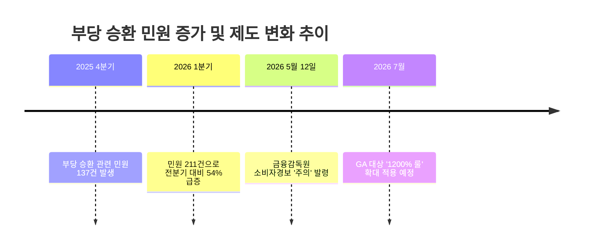
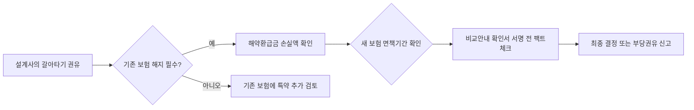

기존 보험보다 보장이 훨씬 좋고 보험료는 저렴하다는 설계사의 감언이설이 사실이라면, 왜 금융감독원이 직접 소비자 경보까지 발령하며 주의를 당부했는지 의심해봐야 해요. 보험을 갈아타는 순간 독자가 얻는 이득보다 설계사가 챙기는 수수료가 압도적으로 크다는 것이 이 시장의 감춰진 민낯이죠.

<!--more-->

## 보험 승환 계약 시 발생하는 위약금 및 손실 방어의 핵심

보험을 해지하고 새로운 계약을 체결하는 '승환'은 겉보기엔 리모델링처럼 보이지만, 실상은 가입자의 자산을 갉아먹는 행위가 될 가능성이 높아요. 특히 최근처럼 모집 질서가 어지러운 시기에는 더욱 신중해야 하죠.

### 법인보험대리점 1200% 룰 적용이 불러온 설계사 유치 전쟁

금융감독원에 따르면 오는 7월부터 법인보험대리점(GA)에도 '1200% 룰'이 확대 적용될 예정이에요. 이 제도는 보험 판매 1차 연도에 지급하는 수수료를 월 보험료의 12배 이내로 제한하는 규제인데, 이를 앞두고 영업 현장에서는 유례없는 과열 경쟁이 벌어지고 있어요.

일부 영업 조직에서는 설계사를 끌어오기 위해 거액의 정착 지원금을 뿌리고 있고, 이직한 설계사들은 지원금을 받은 만큼 실적을 채워야 하는 압박에 시달리죠. 결국 이 실적 압박은 기존 고객의 멀쩡한 보험을 해지시키고 자기 실적으로 돌리는 '부당 승환'으로 이어지게 돼요. 설계사가 수수료를 챙기기 위해 고객의 미래 보장을 담보로 위험한 도박을 벌이는 셈이에요.

가입자는 이 과정에서 기존 보험의 해약환급금 손실을 고스란히 떠안아야 하며, 설계사가 약속한 '더 좋은 보장'은 사실상 수수료를 정당화하기 위한 명분에 불과한 경우가 많아요.

### 1분기 부당 승환 민원 211건이 시사하는 위험 신호

실제로 올해 1분기 금융감독원에 접수된 부당 승환 관련 민원은 총 211건에 달해요. 이는 직전 분기인 137건과 비교했을 때 무려 54.0%나 급증한 수치죠. 통계가 보여주는 경고는 명확해요. 지금 이 순간에도 수많은 가입자가 설계사의 권유에 속아 불리한 계약으로 갈아타고 있다는 증거예요.

이런 민원의 대부분은 기존 계약을 해지하면 발생하는 금전적 손실이나 보장 공백에 대해 충분한 설명을 듣지 못했다는 내용이에요. 설계사는 오직 신규 계약의 장점만 부각할 뿐, 가입자가 포기해야 하는 기존 계약의 가치는 의도적으로 축소하거나 생략하죠.

금융당국이 '소비자 경보 주의'를 발령했다는 것은 시장의 자정 능력이 한계에 도달했다는 뜻이기도 해요. 단순한 권유를 넘어 조직적인 부당 승환이 이루어지고 있으니, 가입자 스스로가 방어 기제를 갖추지 않으면 속수무책으로 당할 수밖에 없어요.



### 중도 해지 시 마주하게 될 4가지 치명적 페널티

보험을 갈아탈 때 설계사가 절대 강조하지 않는 사실이 있어요. 바로 기존 보험을 중도 해지할 때 발생하는 확정적 손실이죠. 첫 번째는 **해약환급금의 급격한 감소**예요. 보험은 초기 사업비 비중이 높아 중도 해지 시 내가 낸 원금조차 건지지 못하는 경우가 허다해요.

두 번째는 **보험료 상승**이에요. 나이가 들수록 보험료는 비싸질 수밖에 없는데, 과거에 가입한 보험을 해지하고 지금 나이로 새 보험에 가입하면 당연히 더 많은 비용을 지불해야 하죠. 세 번째는 **면책기간의 재적용**이에요. 암 보험처럼 가입 후 일정 기간(보통 90일)이 지나야 보장이 시작되는 상품은 승환하는 순간 보장 공백 상태에 놓이게 돼요.

마지막으로 **건강 상태에 따른 가입 거절** 리스크가 있어요. 과거 보험 가입 시점보다 건강이 나빠졌다면, 새 보험 가입이 거절되거나 특정 질병이 보장에서 제외되는 '부담보' 조건이 붙을 수 있어요. 멀쩡한 보장을 버리고 구멍 뚫린 보장을 선택하는 꼴이죠.

### 승환 시점의 보장 공백과 면책기간의 함정

승환 계약의 가장 무서운 점은 가입자가 보장을 받고 있다고 착각하는 사이에 발생하는 사고예요. 기존 보험을 해지하고 새 보험을 청약하는 사이, 혹은 새 보험의 면책기간이 끝나지 않은 시점에 질병이 발견되면 가입자는 어디에서도 보상을 받을 수 없어요.

금융감독원은 이 점을 강력하게 경고하고 있어요. 특히 암이나 뇌혈관 질환처럼 면책기간과 감액기간이 복잡하게 얽힌 상품일수록 승환은 치명적이에요. 설계사는 "바로 보장된다"고 말할지 모르지만, 약관상의 면책기간은 예외 없이 다시 시작된다는 점을 명심해야 해요.

또한, 과거 상품일수록 예정이율이 높아 가입자에게 유리한 경우가 많아요. 지금처럼 저금리 기조가 고착화된 상황에서 과거의 고금리 확정형 상품을 해지하는 것은 황금알을 낳는 거위의 배를 가르는 것과 다름없어요.


### 손해사정사의 동의서 요구와 계약 해지의 상관관계

커뮤니티 사례를 보면 보험금 청구 과정에서 손해사정사가 방문해 여러 서류에 동의를 요구하고, 이후 갑작스럽게 계약 해지 통보를 받는 경우가 종종 발생해요. 이는 고지의무 위반 등을 근거로 보험사가 계약을 강제로 종료시키는 상황인데, 승환 계약 시에도 비슷한 문제가 생길 수 있어요.

새 보험으로 갈아탈 때 설계사가 "이 정도 병력은 말 안 해도 된다"며 고지의무를 소홀히 하도록 유도하는 경우가 있죠. 하지만 나중에 보험금을 청구하면 보험사는 정밀 조사를 통해 과거 병력을 찾아내고, 이를 근거로 계약을 해지해버려요. 

결국 기존 보험은 본인 손으로 해지했고, 새 보험은 보험사에 의해 강제 해지당하면서 보장은커녕 그동안 낸 보험료만 날리는 최악의 상황에 직면하게 되는 거예요. 이런 분쟁은 민사 소송으로 이어질 만큼 복잡하고 고통스러운 과정이 돼요.

### 7월 신규 가입을 위한 무리한 기존 보험 정리의 결말

최근 한 온라인 커뮤니티에는 7월에 새로운 보험에 가입하기 위해 기존의 종합보험을 모두 해지했다가 낭패를 본 사례가 올라왔어요. 설계사의 말만 믿고 미리 자리를 비워뒀는데, 막상 신규 가입 심사에서 거절되거나 예상보다 훨씬 높은 보험료가 책정되면서 보장 공백 상태에 빠진 것이죠.

이런 사례는 승환 계약이 얼마나 가입자의 상황을 고려하지 않고 설계사의 영업 스케줄에 맞춰 진행되는지를 잘 보여줘요. 설계사는 7월의 수수료 정책 변화에 맞춰 본인의 이익을 극대화하려 하지만, 그 과정에서 발생하는 리스크는 오롯이 가입자의 몫이 돼요.

한번 해지된 보험은 되살리기 매우 어렵고, 특히 과거의 좋은 조건은 다시는 돌아오지 않아요. 당장 눈앞의 작은 혜택에 현혹되어 수년간 유지해온 보장의 기둥을 뽑아버리는 우를 범해서는 안 돼요.

```markmap
# 보험 승환 리스크 구조도
## 금전적 손실
### 해약환급금 손실 (원금 미달)
### 보험 연령 증가로 인한 보험료 상승
## 보장 리스크
### 면책기간 재시작 (보장 공백)
### 건강상태 악화 시 가입 거절/부담보
## 제도적 허점
### 1200% 룰 회피를 위한 설계사 이직
### 정착지원금 실적 채우기용 부당 권유
```

### 호구 잡히지 않는 보험 리모델링 방어 전략

보험이 부족하다고 느껴진다면 무조건 해지할 게 아니라 **특약 추가**를 먼저 검토해야 해요. 기존 계약의 뼈대는 유지하면서 필요한 보장만 단독형 상품으로 보충하는 것이 훨씬 경제적이죠. 이것이 금융감독원이 권고하는 가장 안전한 보장 확대 방법이에요.

만약 이미 갈아타기를 진행했다면 '비교안내 확인서'를 다시 꺼내 보세요. 신·구 계약의 중요 사항을 꼼꼼히 비교했는지, 설계사가 불이익을 제대로 설명했는지 확인해야 해요. 만약 부당 승환이 의심된다면 보험사가 동일한 경우 계약 소멸일로부터 **6개월 이내에 기존 계약 부활**을 요청할 수 있어요.

또한 가입 시 제공받은 설명자료, 설계사와 나눈 문자나 메신저 대화 내용은 반드시 보관하세요. 나중에 분쟁이 발생했을 때 본인을 지켜줄 유일한 증거가 될 테니까요.

설계사가 무조건적인 해지를 유도한다면, 그것은 당신의 보장을 위해서가 아니라 본인의 수수료를 위해서일 확률이 99%입니다.

중요한 보험 서류들은 잃어버리지 않게 전용 바인더에 보관하는 습관을 들이는 것이 좋아요.

---

### 관련 상품 한눈에 보기

[**쿠팡에서 "보험증권 보관 바인더" 관련 상품 보러가기 →**](https://www.coupang.com/np/search?q=%EB%B3%B4%ED%97%98%EC%A6%9D%EA%B6%8C%20%EB%B3%B4%EA%B4%80%20%EB%B0%94%EC%9D%B8%EB%8D%94&channel=affiliate&trackingCode=AF7891014)

> 이 포스팅은 쿠팡 파트너스 활동의 일환으로, 일정액의 수수료를 제공받습니다.

### 부당 승환 방지를 위한 의사결정 프로세스

보험 갈아타기를 제안받았을 때, 감정에 휘둘리지 말고 아래의 흐름에 따라 냉정하게 판단해 보세요. 이 과정을 거치는 것만으로도 불필요한 손실을 절반 이상 줄일 수 있어요.



금융감독원은 앞으로 부당 승환에 대해 기관 제재를 강화하고 의도적인 위반 행위에는 제재 수준을 대폭 높일 계획이라고 밝혔어요. 이미 최근 5년간 20개 보험사에 76억 6천만 원의 과징금을 부과할 정도로 단속 의지가 강하죠. 하지만 당국의 제재보다 중요한 건 가입자 본인의 눈이에요.

보험은 가입하는 것보다 유지하는 것이 훨씬 어렵고 중요해요. 설계사의 화려한 언변 뒤에 숨겨진 수수료의 논리를 꿰뚫어 보고, 본인의 소중한 자산과 보장을 지키는 현명한 선택을 하길 바라요.

### FAQ

**기존 보험을 해지하고 바로 새 보험에 가입하면 보장이 이어지나요?**
아니요, 그렇지 않아요. 암 보험 같은 경우 가입 후 90일간의 면책기간이 새롭게 시작되기 때문에 그사이에 병이 발견되면 보장을 전혀 받을 수 없어요. 또한 기존 보험의 예정이율이 지금보다 높다면 장기적으로 엄청난 금리 손해를 보게 돼요.

**설계사가 비교안내 확인서를 대충 설명하고 서명하라고 하는데 어떡하죠?**
절대 그냥 서명하면 안 돼요. 확인서에는 기존 보험과 새 보험의 보험료, 보장 내용, 예상 해약환급금 등이 상세히 적혀 있어요. 이를 꼼꼼히 읽어보지 않고 서명하는 것은 본인의 권리를 스스로 포기하는 행위예요.

**이미 부당하게 보험을 갈아탄 것 같은데 되돌릴 방법이 있나요?**
보험사가 동일하다면 기존 계약 소멸일부터 6개월 이내에 계약 부활을 청구할 수 있어요. 또한 신계약에 대해서는 품질보증해지 등을 통해 취소권을 행사할 수 있으니, 즉시 해당 보험사 고객센터나 금융감독원에 문의해야 해요.

**보장이 부족해서 갈아타려는 건데 해지 말고 다른 방법은 없나요?**
가장 좋은 방법은 기존 보험에 부족한 보장만 '특약'으로 추가하거나, 필요한 보장만 담보하는 '단독형 상품'에 별도로 가입하는 것이에요. 이렇게 하면 기존의 좋은 조건은 유지하면서 부족한 부분만 실속 있게 채울 수 있어요.

**설계사가 이직하면서 관리해 주겠다고 갈아타기를 권유하는데 믿어도 될까요?**
이직한 설계사가 정착 지원금을 받았다면 실적을 채워야 하는 상황일 가능성이 매우 높아요. '관리'를 빌미로 부당 승환을 유도하는 전형적인 수법일 수 있으니, 제안받은 내용이 본인에게 정말 유리한지 금융감독원의 '실손24' 등을 통해 객관적으로 비교해 보세요.

### [References]
- [설계사 정착지원금 경쟁 과열…'부당승환' 우려에 소비자경보](https://www.yna.co.kr/view/AKR20260512085500002?input=1195m)
- [설계사 유치 과열경쟁에 부당승환 우려…금감원, '소비자 경보'](https://www.newsis.com/view/NISX20260512_0003625555)
- [“보험 갈아타기 권유 주의하세요”…금감원, 소비자 경보 발령](https://www.mk.co.kr/article/12044622)