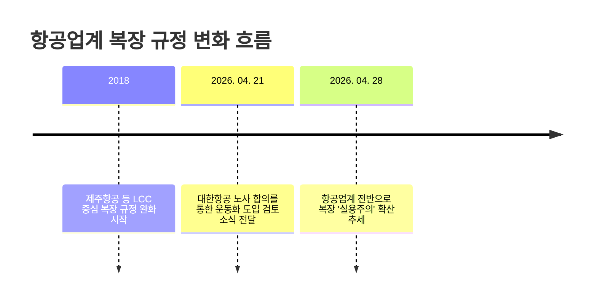

대한항공이 1969년 창립 이후 57년 동안 유지해 온 승무원의 구두 착용 원칙을 내려놓기로 했어요. 단순한 복장 변화를 넘어 항공 안전과 서비스의 패러다임이 '격식'에서 '실용'으로 이동하고 있다는 신호죠.

<!--more-->

## 57년 고집을 꺾은 실용주의, 무엇이 달라지나요?

최근 항공업계에 따르면 대한항공은 노사 협의를 통해 객실 승무원이 기내 업무 중 운동화나 기능성 신발을 착용할 수 있도록 복장 규정 개편을 검토 중이에요. 2026년 4월 28일 기준으로 아직 확정된 바는 없지만, 브랜드 이미지의 핵심이었던 '구두' 규정을 손질한다는 사실만으로도 업계의 관심이 뜨거워요.

그동안 승무원들은 장시간 서서 근무하며 하지정맥류나 무지외반증 같은 직업병에 노출되는 경우가 많았어요. 이번 규정 개편은 승무원의 신체적 피로도를 낮춰 기내 서비스의 질을 높이려는 실질적인 움직임으로 풀이돼요.

## 발 편한 승무원이 승객의 안전을 더 잘 지키는 이유

기내에서 승무원의 가장 중요한 임무는 서비스가 아니라 '안전'이에요. 난기류로 기체가 흔들리거나 비상 탈출이 필요한 긴박한 상황에서 굽 높은 구두는 승무원의 기동력을 떨어뜨리는 치명적인 약점이 될 수 있죠.

**비상 상황 시 안정적인 접지력을 제공하는 운동화**는 승무원이 승객을 더 빠르고 안전하게 대피시키는 데 큰 도움을 줘요. 실제로 많은 네티즌이 이번 검토 소식에 대해 승무원의 건강뿐만 아니라 기내 안전 강화 측면에서 긍정적인 반응을 보이고 있어요.


대한항공 관계자는 복장 규정 개편에 대해 "아직 확정된 바는 없다"고 밝혔지만, 노사 간의 공감대가 형성된 만큼 긍정적인 결과가 기대되는 상황이에요.


## 국내외 항공사가 복장 규정을 서둘러 바꾸는 배경

이미 글로벌 항공 안전 트렌드는 '보여주기식 격식'보다 '실무 효율성'을 강조하는 방향으로 흐르고 있어요. 국내에서도 LCC(저비용 항공사)를 중심으로 이러한 변화가 먼저 시작되었죠.

| 구분 | 주요 변화 내용 | 기대 효과 |
| :--- | :--- | :--- |
| **LCC 사례** | 2018년 제주항공 등 복장 자율화 도입 | 유연한 기업 문화 조성 및 피로도 감소 |
| **대한항공(검토 중)** | 57년 만에 구두 원칙 폐지 및 운동화 허용 | **기내 비상 대응 능력 강화** |
| **글로벌 트렌드** | 성별 구분 없는 유니폼 및 편한 신발 확산 | 직무 중심의 실용주의 가치 실현 |

과거에는 승무원의 용모와 복장이 항공사의 품격을 상징한다고 믿었지만, 이제는 **직원의 컨디션이 곧 고객의 안전**이라는 인식이 자리 잡았어요. 혜택을 얻기 위해 감수해야 했던 승무원들의 신체적 고통을 줄이는 것이 결국 항공사 경쟁력으로 이어진다는 분석이에요.

### "진짜 운동화 신고 비행기 타나요?" 궁금증 풀기

**언제부터 운동화를 신게 되나요?**
현재 노사 협의를 거쳐 복장 규정 변경을 검토 중이며, 조만간 구체적인 시행 시기와 허용되는 신발 종류가 확정될 예정이에요.

**왜 갑자기 규정을 바꾸는 건가요?**
엄격한 복장 규정으로 인한 승무원의 신체적 피로를 줄여, 비상 상황 시 대응 능력을 높이고 서비스 품질을 개선하기 위함이에요.

**운동화 브랜드는 정해져 있나요?**
아직 구체적인 브랜드나 디자인 가이드라인은 발표되지 않았어요. 다만 항공사의 브랜드 이미지를 해치지 않는 선에서 기능성이 강조된 신발이 선택될 가능성이 높아요.

### [References]
- ["구두 대신 운동화"…항공업계, 복장 '실용주의' 확산](https://news.tf.co.kr/read/economy/2317865.htm)
- [구두 대신 운동화… 항공기 승무원 ‘드레스 코드’ 변화 바람](https://www.segye.com/newsView/20260427514814?OutUrl=naver)
- [승무원 운동화 허용 검토 소식에 네티즌 “건강에도 좋을 것”](https://www.joongang.co.kr/article/25423657)