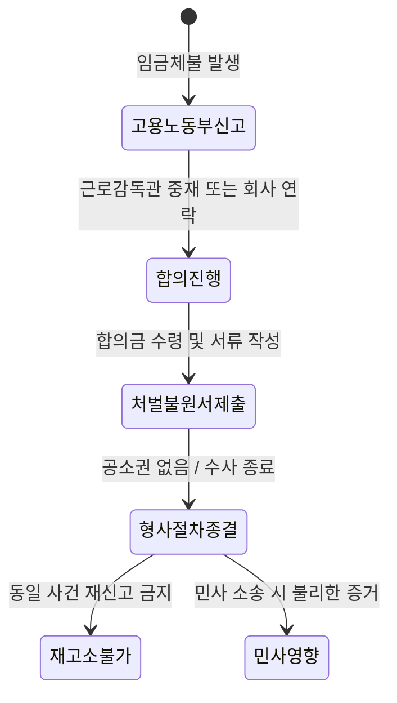

회사가 미안하다며 내미는 합의금 몇십만 원이 과연 진심 어린 사과일까요? 아니면 당신의 입을 막으려는 저렴한 '면죄부'일까요? 처벌불원서를 써주는 순간, 국가가 당신 대신 회사를 압박할 수 있는 유일한 칼날이 꺾인다는 사실을 먼저 직시해야 해요.

<!--more-->

## 합의금 30만 원에 팔아넘기는 당신의 법적 권리

최근 대형 물류 기업인 쿠팡풀필먼트서비스(CFS) 사례를 보면 임금체불의 민낯이 그대로 드러나요. 퇴직금을 제때 주지 않아 발생한 피해자들에게 회사가 제시한 합의금은 고작 30만 원에서 50만 원 수준이었죠. 문제는 이 소액의 돈을 주는 조건으로 '처벌불원서' 작성을 강요했다는 점이에요. 

회사가 왜 이렇게 서두를까요? 근로기준법 위반은 반의사불벌죄에 해당하기 때문이죠. 피해자가 "처벌을 원하지 않는다"는 서류 한 장만 제출하면, 검찰은 기소할 수 없고 경찰 수사도 그 즉시 종결돼요. 수억원대의 임금과 퇴직금을 체불해 징역 5년을 구형받은 언론사 회장 사례처럼, 법정에서 선처를 호소하기 위해 가장 목매는 서류가 바로 이 처벌불원서예요.


회사가 제시하는 합의금은 당신의 위로금이 아니라, 자신들의 형사 처벌을 피하기 위한 '방어 비용'일 뿐이라는 점을 잊지 마세요.


### 처벌불원서가 가져오는 비가역적 결과

처벌불원서는 단순히 "이번만 봐줄게요"라는 약속이 아니에요. 법적으로는 훨씬 무거운 무게를 가집니다.

가장 치명적인 리스크는 **한 번 제출된 처벌불원서는 원칙적으로 철회가 불가능**하다는 사실이에요. 서류가 수사기관이나 법원에 들어가는 순간, 마음이 바뀌었다고 해서 되돌릴 수 없죠. 또한, 이 서류는 **동일 사건으로 다시 형사 고소를 할 수 없게** 만드는 강력한 방어막이 돼요. 만약 합의금을 일부만 받고 처벌불원서를 써줬는데 회사가 잔금을 주지 않는다면? 당신은 가장 강력한 압박 수단인 '형사 고소권'을 이미 잃어버린 상태가 되는 거예요.

## 처벌불원서와 합의서, 무엇이 당신을 지키는가

많은 퇴사자가 합의서와 처벌불원서를 동일하게 생각하지만, 법적 효력은 천지 차이예요. 합의서는 당사자 간의 '약속'일 뿐이지만, 처벌불원서는 국가의 '처벌권'을 소멸시키는 서류죠.

### 전략적 합의를 위한 필수 체크리스트

회사가 합의를 종용할 때, 주도권을 뺏기지 않으려면 아래 원칙을 고수해야 해요.

1.  **전액 입금 확인 후 서류 전달**: "돈은 내일 입금할 테니 서류부터 달라"는 말은 전형적인 수법이에요. **미지급 퇴직금 전액을 먼저 입금받은 뒤에 서류를 건네는 것**이 유일하게 안전한 순서예요.
2.  **합의 내용의 구체화**: 합의서에 "이후 어떠한 이의도 제기하지 않는다"는 문구를 무심코 넣지 마세요. 이는 퇴직금 외에 발생할 수 있는 연차수당, 시간 외 수당 등에 대한 권리까지 포기하는 결과를 초래할 수 있어요.
3.  **민사상 권리 유보**: 처벌불원서가 **민사 소송 과정에서 불리한 증거로 작용**할 수 있다는 점을 명심하세요. "형사상 처벌만 원하지 않을 뿐, 나머지 채권에 대한 민사상 청구권은 유지한다"는 내용을 명시하는 것이 현명하죠.

### 법적 효력 범위의 제한적 작성

실제 사례 중에는 처벌불원서를 작성할 때 대상 사건번호나 행위 내용을 아주 구체적으로 한정하여, 그 범위 밖의 부분에 대해서는 공소 제기가 가능하도록 방어하는 경우도 있어요. 하지만 일반인이 이를 완벽히 수행하기는 어렵죠. 그래서 가장 좋은 방법은 노동청 근로감독관 앞에서 확정된 금액을 모두 수령한 뒤에 서류를 작성하는 거예요.

## 눈앞의 푼돈보다 중요한 것은 기록과 절차

회사가 "우리 사정 알잖아, 이거라도 받고 끝내자"라고 감정에 호소할 때 흔들리지 마세요. 체불 임금은 회사가 어려워서 발생하는 경우도 있지만, 쿠팡 사례처럼 시스템이나 고의성에 의해 발생하는 경우도 많아요.


노동청 조사가 시작되었다면, 근로감독관을 통해 공식적인 체불 임금 확인원을 발급받으세요. 이 서류가 있어야 나중에 회사가 말을 바꿔도 민사 소송이나 소액체당금 신청을 진행할 수 있어요.


당신이 써주는 종이 한 장은 회사의 범죄 기록을 지워주는 지우개와 같아요. 그 지우개를 단돈 30만 원에 넘겨주기에는 당신이 그동안 흘린 땀의 가치가 너무나 큽니다. 법은 권리 위에 잠자는 자를 보호하지 않아요. 특히 그 권리를 스스로 포기하겠다고 서명한 사람에게는 더더욱 냉정하죠.

### 퇴직금 합의 전 마지막 점검

| 점검 항목 | 주의사항 |
| :--- | :--- |
| 입금 시점 | 반드시 서류 제출 전 전액 입금 확인 |
| 합의 금액 | 미지급 퇴직금 원금 + 지연 이자 포함 여부 확인 |
| 서류 종류 | 단순 합의서인지, 형사 처벌 면제용 처벌불원서인지 구분 |
| 효력 범위 | 퇴직금 외 다른 미지급 임금(연차 등) 포함 여부 확인 |

### 이미 제출했다면 정말 방법이 없을까?

이미 처벌불원서를 냈다면 상황은 매우 어렵습니다. 다만, 작성 과정에서 회사의 강박이나 기망(속임수)이 있었다는 점을 객관적으로 증명할 수 있다면 아주 희박한 확률로 다퉈볼 여지는 있어요. 하지만 이는 고도의 법적 논리가 필요하므로, 처음부터 서명하지 않는 것이 최선이에요.

### FAQ

**처벌불원서를 이미 제출했는데 취소할 수 있나요?**
한 번 제출된 처벌불원서는 원칙적으로 철회가 불가능해요. 법적 안정성을 위해 한 번 포기한 처벌권은 다시 되살릴 수 없도록 규정되어 있으니 서명 전 반드시 신중해야 해요.

**회사가 합의금을 주겠다고 약속만 하고 안 주면 어떡하죠?**
그래서 선입금이 중요해요. 만약 처벌불원서를 먼저 써줬는데 돈을 안 준다면, 형사 처벌은 물 건너간 상태라 민사 소송을 따로 진행해야 해요. 시간과 비용이 배로 들게 되죠.

**합의서만 쓰고 처벌불원서는 안 써줘도 되나요?**
회사는 처벌을 피하는 게 목적이라 처벌불원서를 원할 거예요. 합의 조건으로 "돈을 다 받으면 처벌불원서를 써주겠다"고 협상하되, 반드시 입금 확인 후에 서류를 넘기세요.

**소액이라도 받고 끝내는 게 정신 건강에 이롭지 않을까요?**
그 소액이 체불된 원금보다 현저히 적다면 손해예요. 국가에서 대신 주는 '대지급금' 제도 등을 먼저 알아보고, 회사의 꼼수에 넘어가지 않는 것이 장기적으로는 더 이득일 수 있어요.

**처벌불원서를 써주면 민사 소송도 못 하나요?**
형사 처벌만 포기하는 것이 원칙이지만, 합의서 문구에 "민형사상 이의를 제기하지 않는다"는 내용이 포함되면 민사 소송도 기각될 확률이 매우 높아요. 문구 하나하나를 꼼꼼히 읽어야 해요.

### [References]
- [[단독]쿠팡, ‘퇴직금 미지급’ 피해자에 30만~50만원 합의금 제시···...](https://www.khan.co.kr/article/202605040600111)
- ['수억원 체불' 제주 언론사 회장 선처 호소…2심서도 징역 5년 구형](https://www.news1.kr/local/jeju/6154042)
- [쿠팡, 퇴직금 미지급자에 "30만원 주겠다"며 처벌불원서 작성 요구](https://www.ytn.co.kr/_ln/0103_202605041359057194)
- [[자막뉴스] '퇴직급 미지급' 쿠팡, '처벌불원서' 써달라며 합의금은 최...](https://news.sbs.co.kr/news/endPage.do?news_id=N1008545188&plink=ORI&cooper=NAVER)