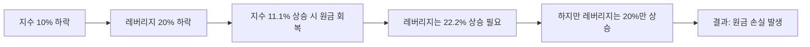

지수가 원래 자리로 돌아오면 내 레버리지 계좌도 본전이 될 거라는 생각은 아주 위험한 착각이에요. 시장이 횡보만 해도 계좌가 녹아내리는 현상은 단순히 운이 없어서가 아니라, 레버리지 상품이 가진 태생적인 설계 구조 때문이죠.

<!--more-->

## 레버리지 ETF 변동성 잠식 수익률 하락 원인, 지수는 횡보하는데 왜 내 돈만 사라질까

레버리지 ETF는 기초 지수의 '일간 수익률'을 2배 혹은 3배로 추종하도록 설계되어 있어요. 여기서 핵심은 '누적 수익률'이 아니라 '일간 수익률'이라는 점이죠. 지수가 100에서 110이 되었다가 다시 100으로 돌아오는 상황을 가정해 볼게요. 일반 주식은 수익률이 0%지만, 2배 레버리지는 첫날 20% 상승 후 다음 날 약 18.2% 하락하게 되어 결국 원금보다 낮은 98.18이 돼요.

이처럼 오르내림을 반복할수록 원금이 갉아먹히는 현상을 **변동성 잠식(Volatility Drag)** 혹은 **음의 복리 효과**라고 불러요. 변동성이 크면 클수록, 보유 기간이 길어질수록 이 파괴력은 기하급수적으로 커지죠. 하락장이나 횡보장에서 레버리지를 '존버'하는 행위가 곧 계좌를 삭제하는 지름길인 이유예요.

### 금융당국이 삼성전자·SK하이닉스 2배 레버리지 출시 전 '경고장'을 날린 이유

최근 금융위원회와 금융감독원은 오는 27일 삼성전자와 SK하이닉스 등 단일 종목을 기초 자산으로 하는 레버리지 및 인버스 상품 상장을 앞두고 강도 높은 투자 주의보를 발령했어요. 기존 ETF가 여러 종목을 섞어 변동성을 분산했다면, 이번 상품은 오직 한 종목의 움직임에 모든 사활을 거는 구조이기 때문이죠.

국내 주식시장의 가격 제한폭이 ±30%라는 점을 고려하면, 2배 레버리지 상품은 이론적으로 **하루 만에 최대 60%의 손실**이 발생할 수 있어요. 분산 투자 효과가 전혀 없는 상태에서 변동성 잠식까지 더해지면 일반적인 지수 추종 상품보다 훨씬 치명적인 타격을 입게 돼요. 금융당국이 이 상품들을 "단기 투자용으로만 제한적으로 활용하라"고 명시한 것은 결코 빈말이 아니에요.


단일 종목 레버리지는 일반 ETF와 달리 'ETF'라는 명칭을 사용하지 못할 정도로 위험성이 높으니, 상품명을 반드시 확인하고 접근해야 해요.


### 미국 시장 사례로 증명된 '음의 복리'가 만드는 처참한 수익률 격차

실제 미국 시장의 데이터를 보면 레버리지의 위험성이 더 명확하게 드러나요. 특정 종목의 2025년 1월 이후 1년간 수익률을 비교했을 때, 개별 주식은 18%의 수익률을 기록하며 선방했지만, 해당 주식을 2배로 추종하는 레버리지 상품은 오히려 **-20%라는 처참한 손실**을 기록한 사례가 있어요.

주가는 올랐는데 레버리지는 마이너스가 나는 이 기묘한 상황은 결국 변동성 때문이에요. 주가가 일직선으로 오르지 않고 위아래로 흔들리며 우상향할 때, 레버리지 상품은 매일매일 발생하는 음의 복리 효과를 견디지 못하고 수익분을 다 까먹게 되는 거죠. 방향성을 맞히더라도 보유 기간이 길어지면 수학적으로 이길 수 없는 싸움을 하고 있는 셈이에요.

### 내부자 거래 규정까지 적용되는 단일 종목 레버리지의 법적 리스크

이번에 상장되는 단일 종목 레버리지 상품은 자본시장법상 '특정증권 등'에 해당하여 매우 엄격한 규제를 받게 돼요. 만약 삼성전자 임직원이 자사주를 기초로 하는 레버리지 상품을 거래한다면 일반 주식과 마찬가지로 내부자 거래 규정이 적용되죠.

특히 상장사 임원 등이 자사주 기초 레버리지 상품을 거래해 **6개월 이내에 수익을 낼 경우 '단기매매차익 반환' 대상**이 된다는 점을 명심해야 해요. 단순히 투자 수단이 하나 늘어난 것이 아니라, 법적으로도 일반 주식에 준하는 책임이 따르는 고위험 금융 상품이라는 뜻이에요. 수익을 내더라도 규정을 어기면 토해내야 할 수도 있다는 사실을 잊지 마세요.

### 폭락장에서의 상장폐지 공포와 액면병합이라는 숨겨진 장치

온라인 커뮤니티에서는 나스닥100을 3배로 추종하는 TQQQ나 S&P500을 추종하는 UPRO 같은 상품이 닷컴 버블 수준의 폭락을 맞으면 상장폐지되는 것 아니냐는 우려가 종종 올라와요. 결론부터 말하면, 지수가 하루 만에 33.3% 이상 폭락하지 않는 한 즉각적인 상장폐지는 드물어요.

대신 운용사는 주가가 너무 낮아져 거래가 불편해지면 **액면병합(Reverse Stock Split)**을 통해 주식 수를 줄이고 단가를 높이는 방식을 사용하죠. 하지만 이는 겉모습만 바꾸는 것일 뿐, 변동성 잠식으로 인해 이미 녹아버린 원금을 복구해주지는 않아요. 폐지 여부보다 무서운 건, 내 계좌의 숫자가 0에 수렴해가는 과정 그 자체라는 점을 깨달아야 해요.

| 구분 | 일반 ETF (1x) | 레버리지 ETF (2x) | 비고 |
| :--- | :---: | :---: | :--- |
| **기초 자산 하락 시** | 하락폭만큼 손실 | 하락폭의 2배 손실 | 하락장에서 치명적 |
| **횡보장(등락 반복)** | 원금 유지 수준 | **변동성 잠식으로 손실** | 장기 보유 시 불리 |
| **일일 최대 손실폭** | 30% (국내 기준) | **60% (이론적 최대치)** | 단기 변동성 매우 높음 |
| **추천 투자 기간** | 중장기 가능 | **단기(Day Trading)** | 금융당국 권고 사항 |

### ISA 계좌에서 레버리지를 굴릴 때 놓치기 쉬운 기회비용의 함정

절세 혜택을 위해 ISA(개인종합관리계좌)에서 반도체나 2차전지 레버리지 ETF를 보유하는 투자자들이 많아요. 매도 시 실현 이익에 대해 비과세나 저율 과세 혜택을 노리는 전략이죠. 하지만 여기서 간과하는 사실은, 세금을 아끼는 것보다 **원금을 지키는 것이 훨씬 중요하다**는 거예요.

레버리지 상품은 운용 보수 자체가 일반 ETF보다 훨씬 높게 책정되어 있어요. 여기에 선물 교체 비용(Roll-over)과 변동성 잠식 비용까지 고려하면, 횡보장에서 지출되는 '보이지 않는 비용'이 ISA의 절세 혜택을 가볍게 상회하죠. 세금 몇 퍼센트 아끼려다 원금의 수십 퍼센트를 변동성이라는 세금으로 내고 있는 건 아닌지 냉정하게 계산해봐야 해요.


ISA 계좌는 의무 가입 기간이 있으므로, 변동성이 큰 레버리지 상품을 장기 보유하게 될 위험이 커요. 본인의 투자 성향이 장기 투자라면 레버리지는 피하는 것이 상책이에요.


### 방향성이 확실한 구간에서만 '도구'로 사용해야 하는 이유

레버리지는 투자의 대상이라기보다 **단기적인 방향성에 베팅하는 '도구'**에 가까워요. 주가가 계단식으로 확실하게 우상향하는 구간에서는 복리 효과가 플러스로 작용해 지수 수익률의 2배 이상을 가져다주기도 하죠. 하지만 그런 구간은 시장 전체 역사에서 그리 길지 않아요.

대부분의 시간 동안 시장은 흔들리며 움직이고, 그 과정에서 레버리지 투자자의 체력(증거금)은 깎여 나갈 수밖에 없어요. "언젠가 오르겠지"라는 믿음으로 레버리지를 들고 가는 건, 구멍 난 독에 계속 물을 붓는 것과 다를 바 없다는 사실을 인정해야 해요. 지금 내 계좌가 지수보다 더 많이 망가져 있다면, 그건 시장의 문제가 아니라 상품 선택의 오류일 가능성이 99%예요.

### FAQ

**Q: 레버리지 ETF는 무조건 장기 투자하면 망하나요?**
A: 이론적으로 지수가 부침 없이 꾸준히 우상향만 한다면 엄청난 수익을 주죠. 하지만 현실 시장은 늘 등락을 반복해요. 이 과정에서 발생하는 '음의 복리 효과' 때문에 지수가 제자리로 돌아와도 내 계좌는 마이너스가 될 확률이 매우 높아요. 그래서 장기 투자는 극도로 위험하다고 하는 거예요.

**Q: 곱버스(인버스 2배)는 일반 레버리지보다 더 위험한가요?**
A: 기본적으로 변동성 잠식 원리는 같아요. 다만 시장은 장기적으로 우상향하는 경향이 있기 때문에, 하락에 베팅하는 인버스 상품은 시간마저 내 편이 아니라는 점에서 더 불리하죠. 하락장에서의 짧은 헤지 용도로만 써야 해요.

**Q: 운용 보수가 높다고 하는데 얼마나 차이 나나요?**
A: 일반 지수 추종 ETF는 0.01~0.05% 수준인 경우도 많지만, 레버리지 상품은 0.6% 이상인 경우가 흔해요. 여기에 선물 증거금 관리 비용 등이 추가로 발생하므로 실제 투자자가 체감하는 비용은 공시된 보수보다 더 클 수밖에 없어요.

**Q: 단일 종목 레버리지는 어떤 사람이 투자해야 하나요?**
A: 해당 종목의 강력한 호재가 있어 단기간에 주가가 폭등할 것이라고 확신할 때, 아주 짧은 시간 동안만 활용하는 전문 트레이더 영역이에요. 일반적인 적립식 투자나 가치 투자자에게는 절대 어울리지 않는 상품이죠.

**Q: 계좌가 이미 -50%인데 지금이라도 팔아야 할까요?**
A: 레버리지에서 -50%가 났다는 건 원금이 회복되려면 100%가 올라야 한다는 뜻이에요. 지수가 50% 올라준다고 해도 내 계좌는 본전에 못 미칠 가능성이 커요. 냉정하게 손절 후 일반 ETF로 갈아타서 복구 기회를 노리는 것이 수학적으로는 더 현명한 판단일 수 있어요.

### [References]
- [삼전·닉스 레버리지 ETF 27일 상장… 당국 “단타용으로만” 경고](https://biz.chosun.com/stock/stock_general/2026/05/15/IYC3AY6W55BMVLCK7HVZ4YKMFY/?utm_source=naver&utm_medium=original&utm_campaign=biz)
- [삼전닉스 2배 레버리지 상품 출격에…금융당국 '투자 주의보' 내려](https://www.nocutnews.co.kr/news/6518093?utm_source=naver&utm_medium=article&utm_campaign=20260515061248)
- ['삼전' 2배 레버리지 ETF 출시 앞두고…금융위 "일반 상품보다 손실 커"](https://view.asiae.co.kr/article/2026051518184211131)
- [단일종목 레버리지 27일 출시…"하루 60% 손실도, 단기투자용"](https://www.yna.co.kr/view/AKR20260515157900002?input=1195m)
- [삼전·하닉 급락 마감…금융당국, 개미 향해 '경고장'](https://www.dailian.co.kr/news/view/1644970/?sc=Naver)
- [단일종목 레버리지 27일 상장…하루 최대 60% 손실 주의보](http://www.fnnews.com/news/202605151806267377)