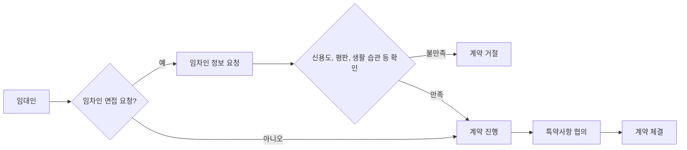
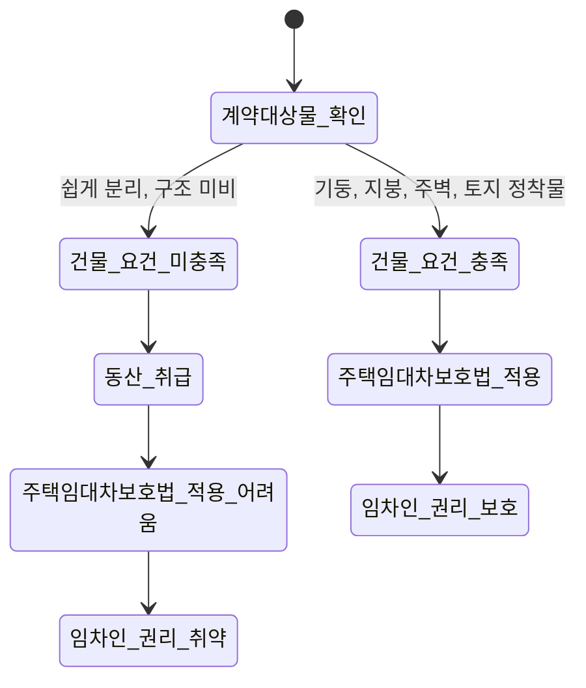
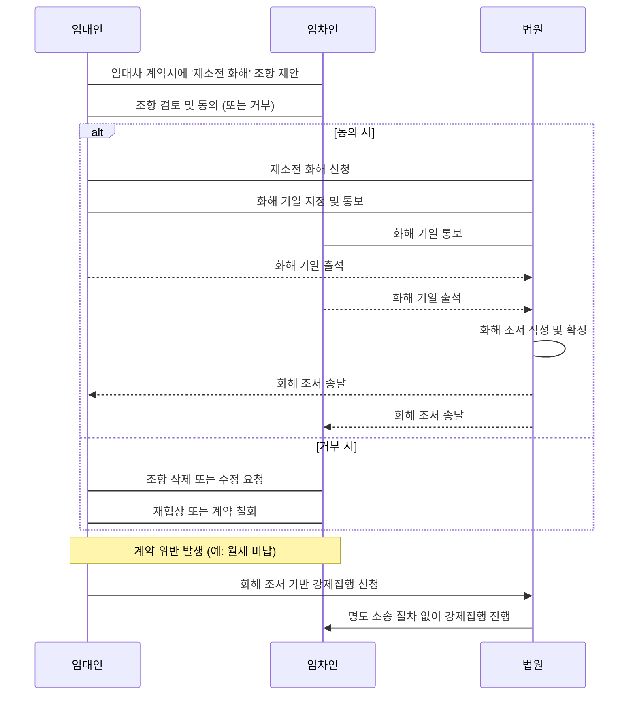

보증금 없는 월세, 언뜻 보면 부담 없이 시작할 수 있는 좋은 기회처럼 보이죠. 하지만 보증금 부담이 없다는 달콤한 말 뒤에는 임차인의 권리를 순식간에 빼앗아갈 수 있는 '독소 조항'과 '명도 소송'이라는 예상치 못한 지뢰밭이 숨어있을 때가 많아요. 단순히 보증금이 없다는 이유만으로 계약서를 꼼꼼히 확인하지 않는다면, 나중에 돌이킬 수 없는 피해를 볼 수 있다는 점을 명심해야 해요.

<!--more-->

## 무보증 월세, 숨겨진 함정부터 파악해야 해요

최근 전세 시장의 불안정성과 전세사기 여파로 월세가 대세로 자리 잡는 추세예요. 특히 보증금 부담이 없는 무보증 월세는 사회초년생이나 단기 거주 희망자들에게 매력적인 선택지처럼 보이죠. 하지만 이런 계약일수록 숨겨진 위험을 정확히 아는 게 중요해요.

### 전세의 월세화 가속, 임차인 면접제까지 등장하는 현실

전세 시장이 빠르게 위축되고 월세로 무게 중심이 이동하는 건 이제 피할 수 없는 현실이에요. 국토교통부 통계에 따르면 올해 1~10월 거래된 전·월세 거래 중 **62.7%가 월세 거래**였다고 해요. 서울은 이보다 더 높은 63.6%를 기록했죠. 이는 전세사기, 대출 규제, 금리 부담, 그리고 공급 부족 등 여러 요인이 복합적으로 작용한 결과예요.

이런 상황에서 임대인들은 보증금이 적은 월세 계약에서 임대료 체납 등의 위험을 줄이기 위해 임차인을 더욱 까다롭게 선별하려는 움직임을 보이고 있어요. 심지어 '임차인 면접제' 도입까지 논의될 정도예요. 대한주택임대인협회는 2026년 상반기 서비스 출시를 목표로 임대차 계약 전 임대·임차인의 기본 정보를 상호 제공·검증하는 서비스를 준비 중이라고 밝혔어요. 이 서비스에는 임차인의 임대료 납부 내역, 신용정보, 이전 임대인의 추천 등 평판 데이터, 흡연 여부, 반려동물 보유, 동거인 유무 등이 담길 예정이라고 하죠.

이런 현상은 임대인의 지배력을 강화하고 세입자 차별로 이어질 수 있다는 우려를 낳아요. 결국, 임대인의 요구사항이 점점 많아지고, 불합리한 특약도 늘어날 가능성이 커지는 거죠. 계약 전 임대인의 요구사항을 꼼꼼히 확인하고, 불합리한 조건은 단호하게 거부할 용기가 필요해요.

 

### 무보증 월세 플랫폼 '사라바', 새로운 대안인가?

전세사기와 보증금 미반환 사고로 주거 불안이 확산되는 가운데, 무보증 월세 기반의 직거래 플랫폼 '사라바(SARAVA)' 같은 서비스가 새로운 대안으로 주목받고 있어요. 이 플랫폼은 보증금 없이 월세만으로 주거 공간을 이용할 수 있도록 설계되었고, '사라바 안심패스'를 통해 월세 미납이나 파손 등 발생 가능한 문제에 대해 임대인을 보호하는 장치도 마련했다고 해요.

이러한 플랫폼은 보증금 리스크를 줄여준다는 장점이 분명 있어요. 하지만 플랫폼 내에서 제공하는 '안심패스'나 기타 계약 조건들을 꼼꼼히 확인해야 해요. 플랫폼이 임대인을 보호하기 위한 장치를 마련하는 과정에서 임차인에게 불리한 조항이 포함될 수도 있거든요. 예를 들어, 월세 미납 시 즉시 퇴거를 강제하는 조항이나, 과도한 위약금 조항 등이 있을 수 있다는 거죠.

여기서 많은 사람이 놓치기 쉬운 한계점이 있어요. 플랫폼이 보증금 리스크를 줄여준다고 해도, 임차인 면접이나 '안심패스' 내부 규정 등 플랫폼 자체의 독소 조항이 있을 수 있다는 점을 간과하기 쉽다는 거예요. 새로운 형태의 계약일수록 그 이면의 약관과 조건을 법률 전문가와 함께 검토하지 않고 덜컥 계약하면 낭패를 볼 수 있어요. 플랫폼의 계약 조건, 특히 임차인 보호 장치와 월세 미납 시 처리 방식을 명확히 이해하고, 불리한 조항은 없는지 반드시 확인해야 해요.

### '일시 사용' 계약 함정: 컨테이너 판례에서 배우는 대항력의 허점

무보증 월세 계약 중에는 주택임대차보호법의 보호를 받지 못하게 하는 '일시 사용을 위한 임대차' 특약을 넣는 경우가 있어요. 이 경우 임차인은 계약 갱신 요구권, 권리금 회수 기회 보호 등 주택임대차보호법상 핵심 권리를 주장할 수 없게 돼요.

최근 대법원 판례는 컨테이너 임대차를 '동산'으로 판단하여 상가임대차보호법 적용을 배제한 사례가 있었어요. 대법원은 법률상 독립된 부동산인 '건물'이라고 하려면 토지의 정착물로서 최소한의 기둥과 지붕 및 주벽이 있어야 한다고 명확히 했죠. 토지로부터 쉽게 분리할 수 있거나 기둥과 지붕 및 주벽이 없다면 '건물'이 아닌 '동산'에 불과하다는 거예요.

이 판결은 단순히 상가 임대차에만 국한되지 않아요. 주거용으로 사용하는 컨테이너나 가설 건축물, 혹은 '단기 임대차'라는 명목으로 주택임대차보호법 적용을 회피하려는 계약에도 유사하게 적용될 수 있어요. 만약 당신이 계약하려는 무보증 월세 주택이 법률상 '건물'의 요건을 갖추지 못했거나, 계약서에 '일시 사용을 위한 임대차'라는 문구가 있다면, 주택임대차보호법의 보호를 전혀 받지 못하고 언제든 쫓겨날 수 있다는 치명적인 위험이 있다는 뜻이에요. 임대차 목적물이 법률상 '건물'의 요건을 갖추었는지, 그리고 계약서에 '일시 사용' 문구가 없는지 꼼꼼히 확인하고, 필요하다면 전문가의 조언을 구해야 해요.

 

## 무보증 월세 계약서 독소 조항, 명도 소송 위험 줄이는 방법

무보증 월세는 보증금이 없다는 장점만큼이나, 임차인의 권리가 취약해질 수 있다는 위험을 안고 있어요. 특히 계약서에 숨겨진 독소 조항들은 나중에 큰 분쟁으로 이어질 수 있으니 각별히 주의해야 해요.

### 월세 미납, 보증금으로 충당될까? 커뮤니티 사례 분석

온라인 커뮤니티에서 월세 미납으로 퇴거 문제에 직면한 사례를 보면, 많은 사람이 보증금이 있다면 월세 미납액을 보증금에서 제하는 것이 당연하다고 생각해요. 하지만 무보증 월세에서는 이런 상식이 통하지 않을 수 있어요.

한 사례에서는 월세 1회 미납만으로 집주인이 즉시 퇴거를 요구해 당황했다는 경험담이 있었죠. 일반적인 주택임대차보호법은 2기 또는 3기 이상 월세 연체 시 계약 해지가 가능하다고 보지만, 무보증 월세 계약에서는 **'월세 1회 미납 시 즉시 계약 해지 및 퇴거'와 같은 특약**이 들어가는 경우가 흔해요. 이런 특약이 있다면 법적으로 즉시 강제퇴거는 어렵더라도, 내용증명 발송 후 2기 연체가 성립하면 해지 효력이 발생할 수 있어 임차인이 매우 불리해져요.

예치금(보증금과 유사하게 소액으로 받는 돈)이 있는 경우에도, 임대인이 미납 임대료를 예치금에서 충당해 주지 않고 바로 퇴거를 요구할 수 있어요. 이는 계약서에 예치금 사용에 대한 명확한 규정이 없거나, 임대인이 임의로 사용을 거부할 때 발생하는 문제예요. 결국, 계약서 내 '월세 미납 시 즉시 해지 및 명도' 조항 여부를 반드시 확인하고, 내용증명 도달 시점 및 2기 연체 기준을 명확히 인지해야 해요. 예치금의 사용 범위와 반환 조건도 구체적으로 명시하는 것이 중요해요.

### 제소전 화해 조항, 임차인의 대항력을 무력화한다

무보증 월세 계약에서 가장 위험한 독소 조항 중 하나가 바로 **'제소전 화해' 조항**이에요. 이 조항은 임대인과 임차인이 미리 법원에서 화해 조서를 작성하는 것으로, 임차인이 계약 내용을 위반할 경우 별도의 명도 소송 없이도 곧바로 강제집행을 할 수 있도록 하는 제도예요.

임대인 입장에서는 명도 소송 절차를 간소화하고 임차인의 대항력을 약화시켜 자신의 권리를 빠르게 확보하려는 목적이 있죠. 하지만 임차인에게는 치명적인 독소 조항으로 작용해요. 제소전 화해 조서가 작성되면, 임차인은 나중에 정당한 사유가 있어도 사실상 방어권이 크게 제한되며, 법원의 판결 없이도 바로 강제집행을 당할 위험에 처하게 돼요. 이는 주거권을 심각하게 침해할 수 있는 문제예요.

**제소전 화해 조항이 있다면, 해당 계약은 절대 피하는 것이 상책이에요.** 만약 불가피하게 계약해야 한다면, 변호사와 상의하여 조항의 효력과 범위를 최소화하고, 임차인에게 불리한 내용은 삭제하거나 수정해야 해요. 이 조항은 당신의 주거 안정성을 근본적으로 위협하는 요소라는 점을 잊지 마세요.

 

### 전세사기 특별법 개정, 무보증 월세는 사각지대인가?

최근 국회에서 전세사기 피해자 보호 강화를 위한 특별법 개정안이 통과되면서 피해 구제에 진전이 있었어요. 하지만 여전히 많은 사각지대가 존재하고, 특히 무보증 월세는 이러한 특별법의 보호를 받기 어려울 가능성이 커요. 전세사기 특별법은 보증금을 돌려받지 못한 피해자를 위한 최소 보장 방안 등을 포함하고 있지만, 보증금 자체가 없는 무보증 월세 계약은 법 적용 대상에서 벗어날 여지가 많기 때문이에요.

'전세위기의 제도적 해법'이라는 책에서도 전세 피해가 개인의 불운이 아니라 위험이 세입자에게 전가되도록 설계된 구조의 결과라고 지적해요. 전세 시스템의 붕괴가 임차인에게 집중되는 위험을 만들어냈다는 거죠. 무보증 월세는 이런 위험 전가 구조에서 보증금이라는 최소한의 안전장치마저 없는 형태예요.

결국, 무보증 월세 임차인은 전세사기 피해자처럼 정부의 직접적인 구제책을 기대하기 어렵다는 현실을 인지해야 해요. 주거 불안이 심화될 수 있으므로, 계약 전 철저한 법률 검토와 위험 회피가 그 어떤 계약보다 최우선이 되어야 해요.

### 장기수선충당금, 무보증 월세에도 해당될까?

공동주택에 거주하는 세입자라면 매달 관리비와 함께 '장기수선충당금'을 납부하는 경우가 많아요. 이 비용은 주택 소유자가 부담해야 하는 것이 원칙이지만, 실제로는 세입자가 먼저 납부하고 퇴거 시 집주인에게 돌려받는 구조가 일반적이죠. 하지만 상당수 세입자가 이 권리를 모르거나, 임대인이 반환을 거부하며 분쟁이 발생하기도 해요.

최근 국회에서는 장기수선충당금 반환 권리 강화를 위한 법 개정안이 발의되기도 했어요. 관리 주체가 세입자에게 반환 관련 사항을 서면으로 안내하고, 공인중개사가 임대차 계약 체결 전 권리 관계를 설명하도록 의무를 부여하겠다는 내용이죠.

무보증 월세 계약이라도 아파트나 오피스텔 같은 공동주택에 거주한다면, 관리비 내역에 장기수선충당금이 포함되어 있을 수 있어요. 보증금이 없다고 해서 이 비용도 없다고 생각하면 오산이에요. 퇴거 시 돌려받지 못하면 손해로 이어지기 때문에, 계약 전 관리비 내역을 꼼꼼히 확인하고, 장기수선충당금이 포함되어 있다면 **반환에 대한 특약을 계약서에 명확히 기재**해야 해요.

---

보증금이 없다는 건, 당신의 주거권에 대한 담보도 없다는 뜻이에요. 무보증 월세는 초기 부담이 적어 보이지만, 그 이면에는 임차인의 권리를 쉽게 무력화할 수 있는 독소 조항들이 숨어있을 가능성이 커요. 계약서를 꼼꼼히 확인하고, 불리한 조항은 과감히 거부하거나 전문가의 도움을 받아 수정해야 해요. 단기 거주나 사회초년생이라는 이유로 계약서의 중요성을 간과하면, 예상치 못한 명도 소송 위험에 휘말려 길거리에 나앉을 수도 있다는 점을 잊지 마세요.

### 무보증 월세, 이거 진짜 조심해야 할 질문들이에요!

**Q: 월세 하루만 밀려도 바로 나가야 하나요?**
A: 일반적인 주택임대차보호법은 2기(두 달치) 이상 월세 연체 시 계약 해지가 가능하다고 봐요. 하지만 무보증 월세 계약서에 **'1회 월세 미납 시 즉시 계약 해지 및 퇴거'와 같은 독소 조항**이 있다면, 임대인이 이를 근거로 해지를 주장할 수 있어요. 법적으로 즉시 강제퇴거는 어렵더라도, 분쟁의 빌미가 되니 계약서 내용을 반드시 확인해야 해요.

**Q: '제소전 화해' 조항이 있는 계약은 무조건 피해야 하나요?**
A: 네, 특별한 사정이 없는 한 **무조건 피하는 게 좋아요.** 제소전 화해 조항은 임대인이 명도 소송 없이도 바로 강제집행을 할 수 있도록 하는 강력한 조항이에요. 이 조항이 있다면 임차인의 방어권이 사실상 사라지므로, 당신의 주거 안정성을 심각하게 위협할 수 있어요.

**Q: 무보증 월세 계약 시 주택임대차보호법 적용은 어떻게 되나요?**
A: 무보증 월세도 주거용 건물 임대차라면 기본적으로 주택임대차보호법의 보호를 받을 수 있어요. 하지만 계약서에 **'일시 사용을 위한 임대차'라는 특약**이 있거나, 임대차 목적물이 법률상 '건물'의 요건(기둥, 지붕, 주벽, 토지 정착물)을 갖추지 못했다면 보호받지 못할 수 있어요. 계약 전 이 부분을 철저히 확인해야 해요.

**Q: 무보증 월세로 인한 명도 소송에 휘말리면 어떻게 대응해야 하나요?**
A: 만약 명도 소송에 휘말렸다면