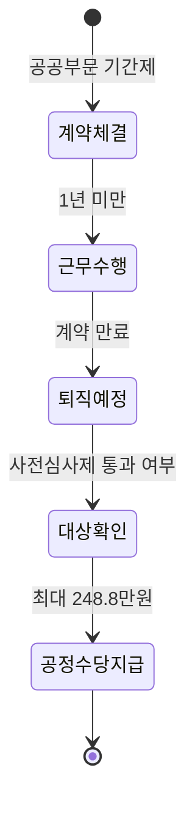

1년 미만으로 계약하고 퇴직금 한 푼 없이 짐을 싸야 했던 억울한 상황, 이제는 법적으로 보상받을 길이 열렸어요. 고용노동부가 발표한 대책에 따르면, 퇴직금을 받지 못하는 공공부문 단기 근로자를 위해 '공정수당'이라는 제도가 도입되거든요.

<!--more-->

## 퇴직금보다 유리할 수 있는 공정수당의 실질적 혜택

기존에는 1년(365일)에서 단 하루만 모자라도 퇴직금을 전혀 받을 수 없었죠. 하지만 새롭게 도입되는 공정수당은 1년 미만 근무자에게 퇴직금에 준하는, 혹은 그 이상의 금액을 보전해 주는 것이 핵심이에요. 

특히 11개월 계약직의 경우, 퇴직금 산정 방식보다 공정수당을 적용했을 때 수령액이 더 높아지는 구간이 존재해요. 이는 단기 근로라는 고용 불안정성을 금액으로 보상하겠다는 취지가 반영되었기 때문이죠.

| 구분 | 1년 미만 근무 (공정수당) | 1년 이상 근무 (퇴직금) |
| :--- | :--- | :--- |
| 지급 근거 | 공공부문 비정규직 처우개선 대책 | 근로자퇴직급여 보장법 |
| 최대 수령액 | **최대 248만 8,000원** | 평균임금 30일분 × 근속연수 |
| 주요 특징 | 11개월 계약 시 약 249만 원 수준 | 1년 미만 퇴직 시 0원 |

## 공정수당 지급 대상과 수령 가능 금액 확인하기

모든 근로자가 대상은 아니에요. 현재는 **공공부문 기간제 근로자**를 중심으로 우선 시행돼요. 정부는 내년부터 1년 미만 일한 공공부문 비정규직 노동자에게 퇴직 시점에 맞춰 이 수당을 지급할 계획이에요.

고용노동부가 발표한 자료에 따르면, 지급액은 전국 생활임금 평균 등을 고려해 설정되었어요. 11개월을 꽉 채워 근무할 경우 **최대 248만 8,000원**까지 받을 수 있다는 점이 가장 큰 매력이에요. 1년 미만 계약이라서 당연히 빈손으로 나갈 줄 알았던 분들에게는 매우 실질적인 도움이 되죠.


정부는 1년 미만 기간제 노동자를 채용할 때 '사전심사제'를 거치도록 하여, 무분별한 쪼개기 계약을 방지하고 공정수당 지급의 정당성을 확보할 방침이에요.


## 신청 전 반드시 체크해야 할 행정 절차

공정수당은 자동으로 입금되는 보너스가 아니에요. 본인이 근무하는 기관이 공공부문에 해당되는지, 그리고 채용 당시 **사전심사제**를 거친 직무인지 확인하는 과정이 필요해요.

현재 고용노동부는 민간 부문까지 이 제도를 확대하기 위해 실태조사와 사회적 대화를 진행 중이에요. 지금 당장은 공공기관이나 지자체 소속 기간제 근로자에게 혜택이 집중되어 있지만, 향후 민간 영역으로의 확산 가능성도 열려 있다는 점을 참고하세요.


1년 이상 근무하여 이미 퇴직금 지급 대상이 된 경우에는 공정수당을 중복으로 받을 수 없어요. 퇴직금과 공정수당 중 본인에게 유리한 쪽을 선택하는 것이 아니라, '퇴직금 사각지대'를 메우는 용도라는 점을 명심해야 해요.


### 1년 미만 계약직 퇴직금 대신 받는 수당 궁금증

#### 1년 미만 근무자도 무조건 공정수당을 받을 수 있나요?
아니요, 현재는 공공부문 기간제 근로자를 대상으로 우선 시행돼요. 퇴직금을 받지 못하는 1년 미만 근무자에게 퇴직금 보전 성격으로 지급되는 수당이에요.

#### 공공기관 기간제 공정수당 얼마 정도 받을 수 있나요?
통상임금과 근무 기간에 따라 달라지지만, 고용노동부 발표 기준 11개월 근무 시 **최대 248만 8,000원** 수준까지 수령이 가능한 것으로 확인되었어요.

### [References]
- [내년부터 1년 미만 공공부문 기간제 근로자 최대 250만원 ‘공정수당’...](https://www.donga.com/news/Society/article/all/20260428/133825790/1)
- [퇴직금 못 받는 공공부문 1년 미만 노동자에 ‘공정수당’ 248만원 지급](https://view.asiae.co.kr/article/2026042808424526959)
- [11개월 계약시 249만원…비정규직 '공공수당' 도입](http://www.wowtv.co.kr/NewsCenter/News/Read?articleId=A202604280367&t=NN)