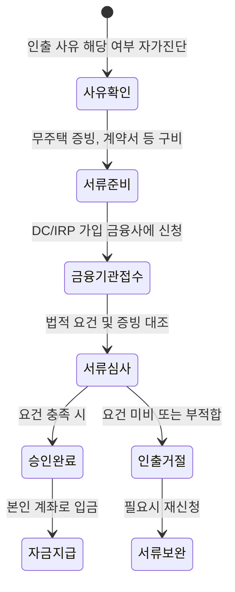

퇴직연금을 은행 예금처럼 언제든 뺄 수 있는 쌈짓돈으로 생각했다면 큰 오산이에요. 근로자퇴직급여 보장법은 이 자산을 '노후 최후의 보루'로 규정하고 있어서, 아무리 급전이 필요해도 법이 정한 엄격한 사유에 해당하지 않으면 단 1원도 내어주지 않거든요.

<!--more-->

## 퇴직연금 중도인출 거절 사유 및 승인 조건의 핵심 원칙

퇴직연금은 가입 유형에 따라 중도인출 가능 여부부터 갈려요. 확정급여형(DB)은 원칙적으로 중도인출이 불가능하고, 확정기여형(DC)이나 개인형 퇴직연금(IRP) 가입자만 법정 사유가 충족될 때 돈을 찾을 수 있죠. 하지만 서류만 갖췄다고 다 승인되는 건 아니에요. 법적 기준과 현장의 해석 차이 때문에 고배를 마시는 경우가 허다해요.

### 주택 구입 목적 인출 급증과 까다로워진 심사 문턱

지난해 집을 사기 위해 퇴직연금을 중도인출한 인원은 약 3만 8천 명으로 역대 최다를 기록했어요. 전체 중도인출 인원인 6만 6,531명 중 절반 이상인 56.5%가 주택 구입을 사유로 꼽았죠. 대출 규제가 강화되면서 부족한 자금을 연금에서 충당하려는 움직임이 수치로 증명된 셈이에요.

하지만 주택 구입 자금으로 인출 승인을 받으려면 '무주택자'라는 조건이 철저하게 검증되어야 해요. 단순히 지금 집이 없다는 사실만으로는 부족하고, 세대원 전원이 무주택인지를 서류상으로 완벽히 입증해야 하죠. 특히 29살 이하 가입자들은 주택 구입보다는 주거 임차(전세보증금) 목적으로 인출하는 비중이 가장 컸다는 점도 주목할 만한 흐름이에요.

### 오피스텔과 멸실 토지에서 발생하는 의외의 거절 사례

커뮤니티와 상담 현장에서 가장 빈번하게 발생하는 거절 사례는 '용도'와 '상태'의 불일치예요. 주거용 오피스텔을 분양받으면서 중도인출을 신청했는데, 건축물대장상 '업무시설'로 분류되어 있으면 은행에서는 주택 구입으로 인정하지 않고 인출을 거절해요. 이럴 때는 해당 시설이 실제 주거용으로 사용될 것임을 증빙하는 추가 서류와 행정해석을 논리적으로 제시해야만 승인 가능성이 열려요.

또한, 본인 명의의 땅에 집을 새로 짓는 경우도 복병이 숨어 있어요. 기존 건물을 멸실하고 무주택자 상태에서 신축을 진행하더라도, 멸실 과정이나 토지 소유권 관계에 따라 '무주택자' 지위를 인정받지 못해 거절되는 케이스가 보고되고 있죠. 단순히 "내 땅에 내가 짓는데 왜 안 되냐"는 식의 접근은 통하지 않는다는 뜻이에요.

### 근로자퇴직급여 보장법이 허용하는 6가지 승인 조건

법적으로 퇴직연금을 중도에 인출할 수 있는 사유는 아래와 같이 딱 6가지로 제한되어 있어요. 이 범위를 벗어나면 아무리 사정이 딱해도 승인될 방법이 없어요.

| 인출 사유 구분 | 세부 인정 조건 및 특징 |
| :--- | :--- |
| **무주택자 주택 구입** | 본인 명의로 주택을 구입하는 경우 (생애 1회 한정 아님) |
| **무주택자 주거 임차** | 전세보증금 또는 월세 보증금 부담 (한 사업장에서 1회 한정) |
| **6개월 이상 요양** | 본인, 배우자, 부양가족의 질병·부상으로 인한 의료비 지출 |
| **회생 및 파산** | 최근 5년 이내 파산 선고 또는 개인회생 절차 개시 결정 |
| **천재지변** | 태풍, 홍수 등 재난으로 고용노동부 장관이 정한 사유 발생 |
| **사회적 재난** | 코로나19 등 감염병 확산에 따른 경제적 어려움 (한시적 적용) |


무주택자 주거 임차 목적의 인출은 한 직장에서 단 한 번만 사용할 수 있어요. 이직 후에는 다시 기회가 생기지만, 같은 회사에 다니는 동안에는 두 번 쓸 수 없으니 신중해야 해요.


### 연금 인출 프로세스와 상태 변화

퇴직연금 중도인출은 신청부터 실제 지급까지 여러 단계의 검증을 거쳐요. 특히 서류 미비로 한 번 거절되면 사유만 회사에 노출되고 자금 확보는 실패하는 최악의 상황이 벌어질 수 있죠.

### 인출 대신 담보대출을 고려해야 하는 구조적 이유

금융당국은 퇴직연금이 일시금으로 인출되어 노후 자산이 고갈되는 상황을 심각하게 보고 있어요. 실제로 퇴직연금 수령을 시작한 사람 10명 중 8명 이상(83.5%)이 연금이 아닌 일시금 수령을 선택하고 있거든요. 이 때문에 은퇴 전 실직이나 급전이 필요한 경우 IRP를 해지하기보다 담보대출을 활용하도록 유도하는 정책이 추진되고 있어요.

연금 계좌를 해지하거나 중도인출하면 그동안 누렸던 세제 혜택을 뱉어내야 할 뿐만 아니라, 운용 수익에 대한 기회비용도 사라져요. 특히 주식이나 ETF 비중이 높은 상태에서 시장 상황이 좋지 않을 때 인출을 강행하면 손실이 확정되는 '역복리' 상황에 직면하게 되죠. 이는 단순한 평가손실을 넘어 평생 받을 연금액의 안정성을 뿌리째 흔드는 결과를 초래합니다.

### 청약통장 부분 인출 논의와 퇴직연금의 차이

최근 청약통장을 해지하지 않고도 일부 금액을 인출할 수 있게 하는 법 개정안이 발의되었어요. 청약 가점을 유지하면서 급전을 마련할 수 있게 하려는 취지죠. 하지만 퇴직연금은 이보다 훨씬 보수적이에요. 퇴직연금은 '부분 인출' 개념보다는 '사유에 따른 전액 또는 일부 인출'이 법으로 엄격히 통제되고 있어, 청약통장처럼 유연한 제도가 도입되기까지는 상당한 시간이 걸릴 것으로 보여요.

결국 지금 당장 돈이 필요해서 퇴직연금을 깨려고 한다면, 본인이 가입한 상품이 실적배당형인지 원리금보장형인지부터 확인하세요. 만약 수익률이 마이너스인 상태에서 주택 구입을 위해 인출을 강행한다면, 나중에 시장이 회복되어도 내 노후 자금은 회복될 기회 자체를 잃게 된다는 점을 반드시 기억해야 합니다.

### FAQ

**전세금 올릴 때도 중도인출이 가능한가요?**
네, 현재 무주택자라면 전세보증금 상승분이나 신규 계약 보증금 목적으로 인출이 가능해요. 다만, 현재 직장에서 딱 한 번만 쓸 수 있는 카드라는 점을 잊지 마세요.

**개인회생 절차 중인데 신청하면 무조건 나오나요?**
법원에서 '개인회생 절차 개시 결정'을 받은 날로부터 5년 이내라면 신청 가능해요. 하지만 단순히 빚이 많다는 사실만으로는 안 되고, 반드시 법원의 결정문 등 공식 서류가 필요해요.

**부모님 병원비가 많이 나왔는데 인출 사유가 되나요?**
본인이 부양하는 가족이 6개월 이상 요양을 필요로 하는 질병이나 부상을 당했을 때 가능해요. 이때 의료비 지출 규모가 본인 연봉의 일정 수준을 초과해야 한다는 세부 조건이 붙을 수 있으니 가입 금융사에 먼저 확인해야 해요.

**중도인출 하면 회사에서 알게 되나요?**
DC형의 경우 회사가 승인 절차에 관여하기 때문에 사유를 알게 될 가능성이 높아요. IRP는 금융기관과 직접 진행하므로 회사에 노출될 확률이 낮지만, 서류 준비 과정에서 회사 직인이 필요한 서류가 있을 수 있으니 주의가 필요해요.

### [References]
- [[전문가 기고] 연금은 지키는 돈이다](https://www.seoulfn.com/news/articleView.html?idxno=628258)
- [대출 어렵자 ‘퇴직연금’ 헐어 집 샀다…지난해 중도인출 최대](https://www.hani.co.kr/arti/economy/economy_general/1234633.html)
- [퇴직연금 일시금 인출 83.5%…금감원, 연금수령기간 장기화 유도](https://www.naeil.com/news/read/588604?ref=naver)
- [“돈은 주식으로 간다”…연금보험 ‘반전 카드’ 찾을까](https://www.ekn.kr/web/view.php?key=20260419021208170)
- ["한국은 해지·해외는 인출"…청약통장 '중도 인출' 길 열리나](https://www.mt.co.kr/estate/2026/04/28/2026042713303879907)