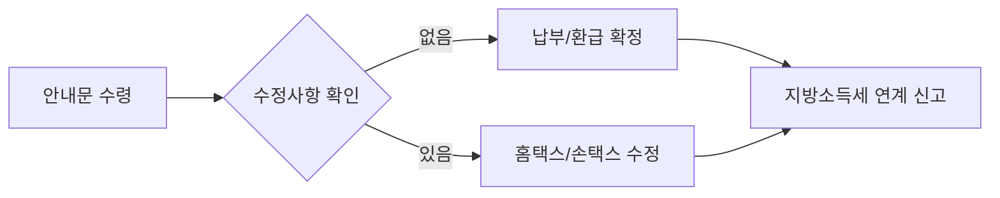

부업으로 치킨값 좀 벌어보려다가 5월만 되면 세금 폭탄 맞을까 봐 검색창만 붙잡고 있는 상황, 꽤 스트레스죠. 연 100만 원 이하의 소액이라면 사실 겁부터 먹을 게 아니라 내가 낸 세금을 어떻게 '회수'할지 전략을 짜는 게 훨씬 스마트해요.

<!--more-->

## 연 100만원 이하 소액 부업러를 위한 종소세 환급 및 절세 전략의 핵심

부업 소득이 발생하면 가장 먼저 확인해야 할 건 내 돈이 어떤 명목으로 묶여 있느냐는 점이에요. 보통 3.3%를 떼고 받았다면 사업소득, 일정 금액 이상에서 8.8% 등을 뗐다면 기타소득으로 분류되죠. 100만 원 이하 소액 구간에서는 이 구분에 따라 환급액이 달라지기 때문에 정확한 분류가 첫 단추예요.

### 기업의 지위보다 수익의 실질이 우선인 이유
최근 법원 판결을 보면 세금을 매길 때 기업의 형태가 아니라 실질적으로 어떤 영업을 통해 수익을 냈는지를 따져야 한다는 점을 명확히 하고 있어요. 신용카드사가 보험 판매를 대리해 얻은 수수료 수익에 대해 교육세를 부과하는 것이 부당하다는 판결이 그 예시죠.

이건 개인 N잡러에게도 시사하는 바가 커요. 본업이 따로 있는 상태에서 발생한 부업 소득은 그 수익의 원천에 따라 과세 표준이 달라져야 해요. 카드사가 보험 판매를 '부업'으로 인정받아 세금을 아낀 것처럼, 개인도 본인의 부업 소득이 어떤 성격인지 명확히 규정해야 불필요한 세금 지출을 막을 수 있어요. 당장 내가 받은 수수료의 성격이 본업과 연관성이 있는지부터 따져봐야 해요.

### 50년 소득세 역사로 본 N잡러의 숙명
종합소득세는 1975년에 도입되어 벌써 50년이 넘은 제도예요. 근로소득자라면 매달 세금을 떼어가니 신경 쓸 일이 없겠지만, 부업을 시작하는 순간 3,000만 사업자와 함께 5월의 고민에 동참하게 되죠.

과거에는 소득세가 국세에서 차지하는 비중이 적었지만, 이제는 국민 전체 소득에 촘촘하게 세금을 매기는 체계가 자리 잡았어요. 특히 소득 종류별로 흩어져 있던 세금을 하나로 합산해 과세하는 방식이라, 부업 소득이 적더라도 전체 소득과 합쳐졌을 때의 세율 변화를 체크하는 건 필수예요. 하지만 100만 원 이하 소액이라면 합산하더라도 실제 내야 할 세금보다 미리 낸 원천징수 세액이 더 많을 확률이 높으니 환급 가능성을 먼저 보세요.

### 지자체 합동신고창구와 가산세 리스크 관리
지방자치단체에서는 5월 종합소득세 신고 기간에 맞춰 합동신고창구를 운영하며 1대 1 신고 지원에 나서기도 해요. 완주군처럼 행정복지센터에 창구를 설치해 소규모 납세자들의 신고를 돕는 사례가 많죠.

여기서 주의할 점은 개인지방소득세예요. 국세인 종합소득세만 신경 쓰다가 지방소득세를 별도로 신고하지 않으면 가산세가 부과될 수 있거든요. 소액이라도 신고 의무를 놓치면 배보다 배꼽이 더 큰 상황이 벌어질 수 있어요. 지자체 지원 창구를 활용하면 이런 실수를 줄일 수 있으니, 혼자 끙끙 앓기보다 집 근처 지원 센터가 있는지 확인하는 게 훨씬 효율적이에요.

### 모두채움 안내문과 스마트폰 간편 신고 활용법
국세청은 소규모 사업자나 종교인, 주택임대소득자 등에게 '모두채움' 안내문을 발송해요. 거창군 등의 사례를 보면 안내문에 기재된 금액에 수정 사항이 없다면 그대로 납부(혹은 환급 신청)하는 것만으로 신고가 끝나요.

홈택스 누리집이나 스마트폰 손택스 앱을 이용하면 종합소득세 신고 후 바로 위택스로 연결되어 지방소득세까지 한 번에 처리가 가능해요. 100만 원 이하 부업러라면 대부분 이 모두채움 대상에 해당할 가능성이 높으니, 복잡한 계산기 두드리기 전에 안내문부터 기다려보는 게 답이죠.

### 투잡 세금 폭탄 공포의 실체와 대응
온라인 커뮤니티에서는 저녁 부업을 시작하려다가 '세금 폭탄'을 맞을까 봐 걱정하는 글을 쉽게 볼 수 있어요. 연말정산과 5월 종소세 신고가 겹치면서 세금이 감당 못 할 수준으로 나올까 봐 겁을 먹는 거죠.

하지만 소액 부업에서 세금 폭탄이 터지는 경우는 극히 드물어요. 대부분은 소득 구간이 바뀌면서 발생하는 미미한 차이거나, 신고 자체를 누락해서 생기는 가산세 문제예요. 뻔한 매뉴얼대로만 하면 폭탄은커녕 환급금을 챙길 기회가 되는데, 막연한 공포 때문에 신고를 기피하는 게 진짜 손해라는 사실을 명심하세요.

### 잘못된 신고가 부르는 억 단위 참사의 교훈
드문 케이스지만, 세무 대리인이 사실과 다른 자료를 넣어 신고했다가 수억 원의 세금이 부과되어 고통받는 사례도 있어요. 기장 신고 후 추계 신고로 변경이 가능한지 묻는 절박한 질문들이 커뮤니티에 올라오곤 하죠.

이건 소액 부업러에게도 남의 일이 아니에요. 내가 내 소득의 성격을 제대로 모른 채 남에게 전적으로 맡기거나 잘못된 항목으로 신고하면 나중에 감당하기 힘든 결과로 돌아올 수 있어요. 100만 원 이하 소액일수록 본인이 직접 홈택스의 간편 장부나 모두채움 서비스를 이용해 흐름을 파악하고 있어야 이런 어이없는 실수를 방지할 수 있어요.

## 부업 소득 유형별 신고 전략 비교

소액 부업러가 마주하는 가장 흔한 두 가지 소득 유형을 비교해 드릴게요. 본인의 입금 내역을 보고 어디에 해당하는지 판단하세요.

| 비교 항목 | 사업소득 (3.3% 원천징수) | 기타소득 (강연, 원고료 등) |
| :--- | :--- | :--- |
| **원천징수 세율** | **지방세 포함 3.3%** | **보통 8.8% (경비 60% 인정 시)** |
| **신고 의무** | 금액 상관없이 무조건 합산 신고 | 연간 합계 300만 원 이하는 선택 가능 |
| **환급 가능성** | 소득이 적을수록 환급 확률 매우 높음 | 결정세액이 원천징수액보다 적으면 환급 |
| **주요 사례** | 배달 라이더, 프리랜서, 학원 강사 | 일시적인 원고료, 경품 당첨금 |


연 소득이 낮다면 기타소득도 종합과세를 선택해 신고하는 게 미리 뗀 8.8%를 돌려받는 데 유리할 수 있어요.


## 상황별 결론: 넌 그냥 이렇게 하면 돼

고민할 시간도 아까운 분들을 위해 딱 정해 드릴게요.

1.  **3.3% 떼고 돈을 받았다:** 5월에 홈택스 들어가서 '모두채움' 확인하고 환급금 있으면 바로 신청하세요. 100만 원 이하라면 거의 100% 환급돼요.
2.  **연간 부업 소득이 100만 원도 안 된다:** 세금 폭탄 걱정은 시간 낭비예요. 오히려 신고 안 해서 가산세 무는 게 더 무서운 일이니 무조건 신고하세요.
3.  **회사 몰래 하는 중이다:** 종소세 신고한다고 회사에 바로 통보 안 가요. 다만 부업 소득이 커져서 건강보험료가 오르면 그때는 알 수도 있지만, 100만 원 수준으로는 기별도 안 가니 안심하세요.

### FAQ

**회사 몰래 부업 중인데 종소세 신고하면 걸리나요?**
종합소득세 신고 자체로 회사에 통보되지는 않아요. 다만, 부업 소득이 일정 기준을 초과해 건강보험료가 인상되는 시점에는 노출될 가능성이 있지만, 연 100만 원 이하 소득으로는 건강보험료 인상 요인이 되지 않으니 걱정 말고 신고해도 돼요.

**부업 소득이 너무 적은데 아예 신고 안 하면 어떻게 되나요?**
원천징수된 3.3%를 국가에 기부하는 꼴이 돼요. 그리고 소액이라도 사업소득으로 잡혀 있다면 무신고 가산세가 붙을 수 있으니, 환급도 받고 리스크도 없애기 위해 신고하는 게 무조건 이득이에요.

**모두채움 안내문을 못 받았는데 어떻게 신고하죠?**
안내문은 우편이나 알림톡으로 오지만, 안 왔다고 해서 대상이 아닌 건 아니에요. 5월에 홈택스나 손택스에 접속하면 본인이 대상자인지 바로 조회할 수 있으니 직접 확인하는 게 가장 빨라요.

**기타소득과 사업소득 중 선택할 수 있나요?**
보통은 돈을 주는 곳에서 어떤 성격으로 지급하느냐에 따라 이미 결정되어 있어요. 하지만 지속적으로 발생하는 소득이라면 사업소득으로, 일시적이라면 기타소득으로 신고하는 게 원칙이에요. 소액일 때는 사업소득으로 신고하는 게 환급 면에서 유리한 경우가 많아요.

### [References]
- ["보험 판매는 부업일 뿐"…법원이 카드사 세금 깎아준 까닭](https://www.hankyung.com/article/202605032405i)
- [소득세 50년사 "라떼는 세금이 70%였다?"](https://www.taxwatch.co.kr/article/tax/2026/05/04/0001/naver)
- [완주군, '종합소득세 합동신고창구' 운영](https://news.skbroadband.com/news/articleView.html?idxno=226435)
- [[거창소식]5월 개인지방소득세 신고·납부 창구 운영 등](https://www.newsis.com/view/NISX20260507_0003620002)