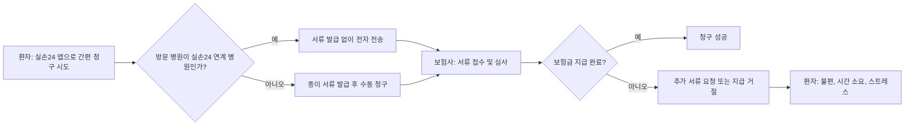

병원 갈 일 많은데, 실손보험 청구할 때마다 서류 떼고 보내는 거 진짜 귀찮죠? '실손24' 앱이 나왔다고 해서 이제 좀 편해지려나 했더니, 오히려 서류 누락이나 지급 지연 때문에 더 스트레스받는다고요? 간편하다는 말만 믿고 썼다가 낭패 보는 일 없게, 뭐가 문제인지 정확히 짚어줄게요.

<!--more-->

## 실손24 앱, 간편함 뒤에 숨겨진 서류 누락과 지급 지연의 함정

정부가 야심 차게 내놓은 '실손24' 앱, 서류 없이 보험금을 청구할 수 있다는 말에 많은 사람이 기대를 걸었어요. 하지만 현실은 녹록지 않죠. 특히 병원 이용이 잦은 만성질환자나 고령층 가족이라면, 이 앱의 '반쪽짜리 간편함' 때문에 오히려 더 복잡한 상황에 부닥칠 수 있어요.

### 금융위의 '실손24' 야심찬 시작, 그러나 현실은?

정부는 실손보험 청구 전산화를 위해 '실손24' 앱을 내놓고, 금융위원회 주재로 유관기관 점검 회의까지 열어가며 적극적으로 홍보했어요. 병원에서 종이 서류를 발급받지 않고도 계산서, 영수증, 진료비 세부산정내역서, 처방전 등을 앱으로 보험사에 전자 전송할 수 있게 하겠다는 거죠. **서류 발급 없이 간편하게 청구한다**는 게 핵심이었어요.

하지만 문제는 현실에서 터졌어요. 제도 시행에도 불구하고 **의료기관 연계율이 30%에도 못 미치는 상황**이에요. 정부는 하반기까지 90% 이상 연계를 추진하겠다고 밝혔지만, 아직 갈 길이 멀죠. 대형 병원은 그나마 나은 편이지만, 동네 의원이나 중소 규모 병원은 참여율이 저조해요. 결국 환자 입장에서는 '간편 청구'를 기대했다가, 병원에서 앱 연동이 안 된다는 말에 다시 서류를 떼야 하는 이중고를 겪게 되는 거예요. 이런 상황은 보험금 청구 과정에서 추가 서류 요청이나 지급 지연으로 이어질 수밖에 없어요.

이런 상황을 피하려면, **병원 방문 전에 해당 병원이 실손24 앱과 연계되어 있는지 미리 확인하는 습관을 들이세요.** 앱 내에서 연계 병원을 검색하거나, 병원에 직접 문의하는 게 가장 확실한 방법이에요. 그렇지 않으면 간편 청구는커녕, 서류를 다시 떼러 병원에 가야 하는 불상사가 생길 수 있어요.

### '실손보험청구화' 이용률 저조, 왜 그럴까요?

'실손보험청구화' 제도가 시작된 지 꽤 됐는데도, 여전히 이용률이 저조한 건 단순히 의료기관 연계율 문제만은 아니에요. 물론 연계율이 낮은 것이 가장 큰 원인이지만, 사용자들의 **앱 사용에 대한 인지 부족**이나 **복잡하게 느껴지는 절차**도 한몫하고 있어요.

결국 많은 사람이 여전히 과거처럼 종이 서류를 발급받아 직접 보험사에 보내거나, 보험사 자체 앱을 통해 사진을 찍어 청구하는 방식을 고수하고 있어요. '간편 청구'라는 본래 취지가 제대로 발휘되지 못하고 있는 거죠. 이런 상황이 지속되면, 편리함을 기대했던 만성질환자나 고령층 가족들은 여전히 시간과 노력을 들여야 해요.

**앱 사용 전 병원 연계 여부와 청구 절차를 정확히 숙지하는 것이 중요해요.** 단순히 '간편하다'는 말만 듣고 무작정 시도하기보다는, 어떤 서류가 필요하고 어떤 과정을 거치는지 미리 알아두는 게 좋아요.

### 보험금 지급 거절? 소멸시효에 대한 법원의 판단

보험금 청구에서 간과하기 쉬운 중요한 부분이 바로 '소멸시효'예요. 최근 고 이예람 중사 유족의 사망보험금 소송 승소 사례를 보면, 보험사가 '소멸시효가 지났다'며 지급을 거절했지만, 법원은 유족의 손을 들어줬어요. 법원은 **순직 결정 통보를 받은 시점부터 소멸시효가 발생한다**고 판단했죠.

이 사례는 보험금 청구권의 소멸시효가 단순히 사고 발생일로부터 기산되는 것이 아니라, 특정 조건이나 사건 발생 시점에 따라 달라질 수 있다는 걸 보여줘요. **무심코 지나치면 보험금을 받을 권리를 잃을 수 있다는 거죠.** 특히 장기간 치료가 필요하거나 복잡한 상황에서는 소멸시효가 언제 시작되고 끝나는지 정확히 아는 게 정말 중요해요.

보험금 청구 가능성이 있다면 **최대한 빨리 보험사에 문의하고 필요한 서류를 준비해야 해요.** 만약 보험사가 소멸시효를 이유로 지급을 거절한다면, 법적 판단 기준을 숙지하고 전문가의 도움을 받는 것도 방법이에요.

### 가족 일상생활배상책임보험, 서류 누락으로 확인하는 이유

온라인 커뮤니티에서 화재보험을 청구했는데, 보험사에서 등본상 가족 조회를 위한 개인정보 동의를 요구받았다는 사례가 있어요. 보험금 청구 서류를 보냈는데, 누락된 서류가 있다며 가족 중 **일상생활배상책임보험** 가입 여부를 확인하려 했던 거죠.

이런 상황은 보험사가 **가족 중 다른 보험으로 보상 가능한 부분이 있는지 확인하는 과정**에서 발생해요. 예를 들어, 가족 구성원 중 누군가가 이미 일상생활배상책임보험에 가입되어 있다면, 동일한 사고에 대해 중복 보상이 불가능하거나, 보상 주체가 달라질 수 있기 때문이에요.

이럴 땐 당황하지 말고, **사전에 어떤 서류가 필요한지 명확히 문의하고, 개인정보 동의 범위와 목적을 정확히 이해해야 해요.** 보험사가 요구하는 서류나 정보가 왜 필요한지 설명을 요청하는 건 당연한 권리예요.

### 이혼 후 양육비 청구, 필요한 서류와 놓치기 쉬운 지연이자

이혼 후 양육비 청구는 단순한 서류 준비를 넘어, 법적인 조건을 꼼꼼히 챙겨야 하는 복잡한 과정이에요. 커뮤니티 사례를 보면, 양육비 청구 서류로 가사비송사건 심판청구서나 조정신청서를 작성해 제출하는데, 여기서 **월별 금액, 지급 기한, 지급 방법(계좌이체), 인상·감액 조건, 그리고 지연손해금** 같은 세부 조건을 명시해야 해요.

많은 사람이 서류 준비에만 집중하다가, **지연손해금(민법상 연 5% 또는 판결 선고 다음 날부터 지연이자)** 같은 중요한 법적 권리를 놓치기 쉬워요. 양육비는 아이의 안정적인 성장을 위한 필수적인 비용이므로, 청구 시 이런 세부 조건들을 명확히 해두는 것이 매우 중요하죠.

**가사비송사건 심판청구서 또는 조정신청서 작성 시, 모든 조건을 구체적으로 명시해야 해요.** 특히 지연손해금 조항은 상대방이 양육비 지급을 지체할 경우 발생할 수 있는 추가적인 권리이므로 반드시 포함하는 게 좋아요.

## 만성질환자와 고령층 가족을 위한 '진짜' 간편 청구 가이드

실손24 앱이 편리한 건 맞지만, 모든 상황에 만능은 아니라는 걸 알았을 거예요. 특히 병원 이용이 잦고, 앱 사용에 익숙하지 않은 만성질환자나 고령층 가족이라면 더더욱 꼼꼼함이 필요해요.


실손24 앱은 아직 모든 의료기관과 연계되지 않았어요. 특히 동네 의원이나 소규모 병원은 연계율이 낮아 **'간편 청구'를 기대했다가 오히려 서류 발급을 위해 다시 병원에 가야 하는 병목 현상**이 자주 발생해요. 앱이 모든 걸 해결해 줄 거라는 기대는 금물이에요.


이제 '진짜' 간편하게, 그리고 안전하게 보험금을 청구하는 방법을 알려줄게요.

1.  **병원 방문 전 '실손24 연동 여부' 확인은 필수예요.**
    *   방문할 병원이 실손24 앱과 연동되어 있는지 미리 확인하는 게 가장 중요해요. 앱 내 검색 기능을 활용하거나, **병원에 직접 전화해서 "실손24 앱으로 서류 전송 가능한가요?"라고 물어보는 게 확실하죠.** 연동되지 않았다면, 어차피 종이 서류를 받아야 하니 미리 준비할 수 있어요.

2.  **필수 서류 목록을 미리 숙지하세요.**
    *   실손24 앱으로 청구하더라도, 병원 규모나 진료 내용에 따라 추가 서류를 요구할 수 있어요. **진료비 영수증, 세부내역서, 처방전은 기본이고, 고액 진료나 특정 질병의 경우 진단서, 소견서 등이 필요할 수도 있죠.** 보험사마다 요구하는 서류가 다를 수 있으니, 미리 보험사에 문의해서 필요한 서류 목록을 확인해 두세요.

3.  **보험금 지급이 거절되거나 지연되면 이렇게 대처하세요.**
    *   앱으로 청구했는데도 보험금 지급이 거절되거나 지연된다면, **보험사로부터 서면으로 거절 사유를 받아두세요.** '구두' 설명만으로는 나중에 문제 해결이 어려울 수 있어요. 이후 거절 사유가 부당하다고 생각되면, 금융감독원이나 한국소비자보호원에 민원을 제기하거나 상담을 받아볼 수 있어요.

4.  **보험금 청구 소멸시효를 절대 잊지 마세요.**
    *   대부분의 보험금 청구권은 **사고 발생일로부터 3년 이내**에 행사해야 해요. 이 기간을 넘기면 보험금을 받을 권리를 잃을 수 있으니, 진료 후에는 미루지 말고 최대한 빨리 청구하는 게 좋아요. 특히 만성질환자는 소액 청구가 잦아 소멸시효를 놓치기 쉬우니 더욱 주의해야 해요.

**자, 이제 결론이에요.**

*   **병원 방문이 잦고, 앱 사용에 익숙하지 않은 고령층이라면:** **굳이 실손24 앱에만 의존하지 마세요.** 여전히 종이 서류를 발급받아 직접 청구하는 방식이 더 확실하고 마음 편할 수 있어요. 병원에 방문할 때마다 필요한 서류를 바로 발급받아 두는 게 가장 안전하죠.
*   **만성질환으로 특정 병원만 꾸준히 다니는 경우라면:** **해당 병원이 실손24와 연계되어 있는지 확인부터 하세요.** 연계되어 있다면 앱 청구가 매우 편리하겠지만, 아니라면 여전히 수동 청구를 염두에 둬야 해요. 만약 연계 병원이라면, 앱으로 간편하게 청구하고, 혹시 모를 추가 서류 요청에 대비해 진료비 세부내역서 정도는 출력해두는 게 좋아요.

## 결론: 결국 내 손으로 챙겨야 할 보험금, '실손24'는 보조 수단일 뿐

실손24 앱, 분명 편리한 기능이에요. 하지만 **아직은 완전한 솔루션이 아니에요.** 특히 병원 이용이 잦은 만성질환자나 고령층 가족이라면, 간편함에만 혹해서는 안 돼요. 앱은 어디까지나 보조 수단으로 활용하고, **가장 중요한 건 필요한 서류를 꼼꼼히 챙기고, 혹시 모를 지급 거절에 대비하는 거예요.**

넌 그냥 이거 해: **병원이 실손24 앱과 연계되어 있더라도, 청구 서류는 항상 확인하고, 중요한 진료라면 종이 서류도 함께 받아두는 습관을 들이세요.** 이게 내 돈을 지키는 가장 스마트한 방법이에요.

### 실손24 앱, 아직도 궁금한 점이 많다고요?

**Q: 모든 병원에서 다 실손24 앱으로 청구할 수 있나요?**
A: 아쉽지만 아직 아니에요. 특히 중소 의원급 병원이나 일부 병원에서는 실손24 앱과 연계가 안 된 곳이 많아요. **방문 전에 해당 병원이 실손24 앱과 연동되어 있는지 꼭 확인해야 해요.**

**Q: 실손24 앱으로 청구했는데 왜 추가 서류를 요구하죠?**
A: 앱을 통해 기본 서류가 전송되더라도, **진료 내용이나 보험금 규모에 따라 보험사에서 추가 진단서, 소견서 등을 요구할 수 있어요.** 이는 앱의 문제가 아니라 보험금 심사 과정에서 필요한 절차일 수 있으니, 보험사의 요청에 따라 추가 서류를 제출해야 해요.

**Q: 보험금 청구 소멸시효는 어떻게 되나요?**
A: 대부분의 보험금 청구권은 **사고 발생일 또는 보험금 청구 사유 발생일로부터 3년 이내**에 행사해야 해요. 이 기간을 넘기면 보험금을 받을 수 없으니, 진료를 받았다면 최대한 빨리 청구하는 게 좋아요.

**Q: 실손24 앱 이용 중 문제가 생기면 어디에 문의해야 하나요?**
A: 앱 자체의 오류나 사용법 문의는 실손24 앱 고객센터에 연락할 수 있어요. 보험금 지급 관련 문제라면 해당 **보험사에 직접 문의**하고, 해결이 어렵다면 금융감독원이나 한국소비자보호원에 상담을 요청하는 것이 좋아요.

### [References]
- ["실비 서류 발급없이 '실손24' 앱에서 간편 청구하세요"](https://www.newsis.com/view/NISX20260511_0003624563)
- ['실손보험청구화' 시작한 게 언젠데…이용률 저조한 이유](http://www.edaily.co.kr/news/newspath.asp?newsid=03995046645447936)
- [故이예람 중사 유족, 사망보험금 소송 승소 [H-EXCLUSIVE]](https://biz.heraldcorp.com/article/10735153?ref=naver)
- [故이예람 중사 유족, 보험금 소송 1심 승소…法 "청구권 유효"](https://www.newsis.com/view/NISX20260510_0003623417)