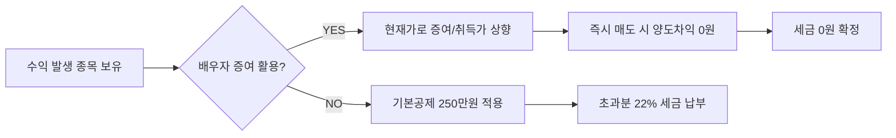

밤잠 설치며 종목 골라서 수익 냈더니, 수익금의 22%를 세금으로 떼어가는 고지서를 보면 허탈함부터 밀려오기 마련이에요. 해외주식 투자가 대중화되면서 이제 양도소득세는 소수 자산가만의 고민이 아니라, 250만 원 이상의 수익을 낸 평범한 직장인 모두의 현실적인 페인 포인트가 되었죠.

<!--more-->

## 해외주식 양도소득세 0원 만드는 합법적 증여 절세술의 핵심

세금을 줄이는 가장 확실한 방법은 '수익' 자체를 낮추는 것이 아니라, 세법이 허용하는 테두리 안에서 '취득 가액'을 높이는 데 있어요. 특히 배우자 증여를 활용하면 10년 합산 6억 원까지 증여세가 면제된다는 점을 이용해, 주식의 취득 단가를 현재 시세로 끌어올려 양도 차익을 인위적으로 소멸시킬 수 있죠.

### 과세 형평성 논란 속에서 더 중요해진 자산 방어

최근 가상자산 과세 유예 여부를 두고 1,326만 명에 달하는 투자자들이 민감하게 반응하는 이유는 명확해요. 투자 수익에 대한 국가의 개입이 본격화되고 있다는 신호거든요. 코인뿐만 아니라 주식 시장에서도 세금은 이제 수익률을 갉아먹는 가장 큰 변수가 되었어요. 정책의 흐름을 읽지 못하고 방치하면, 공들여 쌓은 수익의 상당 부분을 허무하게 납부해야 하는 상황에 직면하게 되죠.

### 다주택자 중과세 사례로 본 양도세의 파괴력

부동산 시장에서 다주택자 양도소득세 중과 조치가 재개될 때마다 시장이 요동치는 것을 보면 양도세의 위력을 실감할 수 있어요. 특정 조건에서는 지방소득세를 포함해 실효세율이 최고 82.5%까지 치솟기도 하거든요. 주식 역시 마찬가지예요. 현재는 해외주식에 대해 22% 단일 세율을 적용하지만, 금융투자소득세 도입 논의 등 과세 체계가 변할 때마다 투자자가 느끼는 압박은 커질 수밖에 없죠. 미리 합법적인 절세 경로를 확보해두는 것이 지능적인 투자자의 자세예요.

### 6월 1일이라는 데드라인이 주는 경고

지난해 주식을 팔아 수익을 냈다면 **6월 1일까지 반드시 양도소득세를 신고**해야 해요. 국세청은 이미 약 22만 명의 납세 대상자에게 안내문을 발송하며 감시망을 좁히고 있죠. 예정신고를 누락했거나 여러 계좌의 손익을 합산하지 않았다면 이 기한을 놓치는 순간 **20%의 무신고 가산세**라는 치명적인 페널티를 받게 돼요. 세금은 내는 것보다 '제때 제대로' 신고하는 것이 절세의 첫걸음이에요.



### 서학개미 50만 명 시대와 1인당 평균 수익의 함정

해외주식 양도세를 신고하는 인원이 52만 명을 넘어서고, 1인당 평균 차익이 2,800만 원에 달한다는 통계는 시사하는 바가 커요. 250만 원이라는 기본 공제액은 이들에게 턱없이 부족한 수준이죠. 단순히 '남들도 내니까 나도 낸다'는 안일한 생각은 버려야 해요. 평균 수익이 높을수록 배우자 증여를 통한 취득가액 높이기 전략의 효율은 극대화되거든요.

### 복수 증권사 이용 시 발생하는 합산 신고의 오류

많은 투자자가 두 군데 이상의 증권사를 이용하면서 한 곳의 수익(예: 400만 원)과 다른 곳의 손실(예: -200만 원)을 별개로 생각하는 실수를 범해요. 홈택스에서 해외주식 양도세를 신고할 때는 반드시 모든 증권사의 손익을 합산해야 하죠. 이를 누락하면 실제보다 더 많은 세금을 내거나, 반대로 과소 신고로 인한 불이익을 당할 수 있어요.


여러 증권사를 쓴다면 각 사의 '양도소득세 대행 신고 서비스'를 활용하되, 최종 합산 금액이 본인의 실제 전체 손익과 일치하는지 반드시 대조해 보세요.


### 전략적 선택: 직접 매도 vs 배우자 증여 후 매도

| 비교 항목 | 직접 매도 (기본 전략) | 배우자 증여 (절세 전략) |
| :--- | :--- | :--- |
| **취득 가액 기준** | 본인의 최초 매수 가격 | **증여 당시의 시가** |
| **비과세 한도** | 연간 250만 원 (기본공제) | **10년간 6억 원 (증여세 면제)** |
| **실제 세부담** | 수익금의 22% (공제 제외) | 사실상 0원 (취득가=매도가) |
| **행정적 절차** | 단순 매도 및 신고 | 증여 신고 및 매도 절차 필요 |


### 현실적인 제약: 증여 절세법이 무용지물이 되는 경우

이 방법이 만능은 아니에요. 만약 배우자에게 이미 10년 이내에 6억 원 자산(부동산 등 포함)을 증여했다면 추가 증여 시 증여세가 발생해 배보다 배꼽이 더 커질 수 있죠. 또한 증여 후 매도 시 취득가액 산정 방식은 증여일 전후 2개월(총 4개월)의 종가 평균으로 계산된다는 점도 계산기에 넣어야 할 변수예요.

```markmap
# 해외주식 절세 마스터플랜
## 1단계: 현황 파악
- 모든 계좌 손익 합산
- 확정 수익 250만 원 초과 여부 확인
## 2단계: 전략 선택
- 수익 250만 원 이하: 그냥 매도
- 수익 250만 원 초과 + 배우자 증여 한도 여유: **증여 후 매도**
- 손실 종목 보유: **손실 확정(Loss Harvesting)** 후 수익 상쇄
## 3단계: 실행 및 신고
- 5월 확정 신고 기간 준수
- 증여 신고 누락 주의
- 가산세 20% 방어
```

### 고민은 수익만 늦출 뿐, 결론은 정해져 있어요

수익이 250만 원을 살짝 넘는 수준이라면 손실 난 종목을 팔아 수익을 상쇄하는 '손실 확정'만으로도 충분해요. 하지만 수익이 천만 원 단위를 넘어간다면 귀찮더라도 배우자 증여 카드를 꺼내야 하죠. 22%라는 세율은 결코 작지 않아요. 합법적인 테두리 안에서 취득가를 높여 세금을 0원으로 만드는 것, 이것이 투자의 완성이에요.

### FAQ

**수익 난 종목을 배우자에게 증여하고 바로 팔아도 괜찮은가요?**
네, 주식은 부동산과 달리 증여 후 즉시 매도해도 이월과세 규정이 적용되지 않아 취득가액 상향 효과를 즉시 누릴 수 있어요. 다만 증여 가액 산정 기준(전후 2개월 평균가)은 꼭 확인해야 해요.

**손실 중인 종목을 팔았다가 1분 뒤에 바로 다시 사도 절세가 되나요?**
네, 손실을 확정 짓는 행위 자체가 당해 연도 전체 수익을 낮춰주기 때문에 아주 유용한 기술이에요. 수수료보다 아끼는 세금이 훨씬 크다면 주저할 이유가 없죠.

**증여 신고는 어디서 어떻게 하나요?**
홈택스에서 직접 할 수 있어요. 증여받은 날이 속하는 달의 말일부터 3개월 이내에 신고해야 하며, 증여 계약서와 해당 시점의 잔고 증명서 등이 필요해요.

**미성년 자녀에게 증여해서 절세하는 것도 방법일까요?**
자녀는 증여세 면제 한도가 10년당 5,000만 원(미성년자 2,000만 원)으로 배우자보다 훨씬 적어요. 한도 내라면 추천하지만, 초과 시 세금 계산기를 정밀하게 두드려봐야 해요.

### [References]
- [코인 과세 임박, 1326만명 투자자들 뿔난 진짜 이유](http://www.edaily.co.kr/news/newspath.asp?newsid=01088966645445312)
- [다주택자 양도소득세 9일부터 중과…남은 일주일 시장 향방은](https://www.segye.com/newsView/20260501506915?OutUrl=naver)
- [“지난해 부동산·주식 팔았다면?”…양도소득세 6월1일까지 신고해야](https://www.nongmin.com/article/20260504500330)
- [서학개미 등 22만명, 내달 1일까지 양도세 신고·납부](https://news.einfomax.co.kr/news/articleView.html?idxno=4413019)