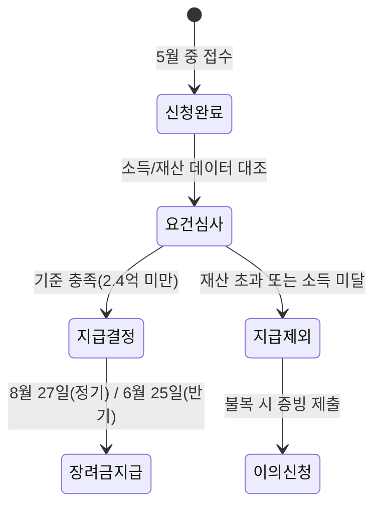
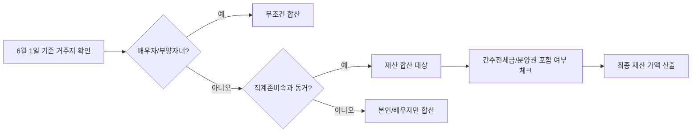

본인 소득이 기준치 이내라고 해서 근로장려금 수령을 확신했다면, 국세청의 재산 산정 방식에서 뒤통수를 맞을 확률이 높아요. 많은 이들이 본인 명의의 예금이나 아파트만 재산으로 생각하지만, 실제 심사에서는 가구원 전체의 재산은 물론이고 보증금과 분양권까지 샅샅이 훑거든요.

<!--more-->

## 국세청 심사 레이더에 걸리는 324만 가구의 실상

올해 국세청은 근로·사업·종교인 소득이 발생한 약 324만 가구를 대상으로 장려금 신청 안내를 마쳤어요. 이번 정기분은 심사를 거쳐 최대 330만 원까지 지급될 예정이며, 공식적인 지급 시점은 8월 27일로 계획되어 있죠. 이미 신청을 마쳤더라도 안심하기엔 일러요. 신청 직후부터 소득과 재산 요건을 종합적으로 검토하는 '현미경 심사'가 시작되기 때문이에요.

특히 2026년 반기 근로장려금 지급일인 6월 25일을 기다리는 가구라면 더욱 긴장해야 해요. 국세청은 신청서에 적힌 숫자만 보는 게 아니라, 유관 기관의 데이터를 강제로 끌어와 대조해요. 이 과정에서 본인이 누락한 재산 항목이 단 하나라도 발견되면 지급 제외나 감액 결정이 내려지죠.

### 재산 2.4억 원 기준의 함정과 간주전세금의 위력

온라인 커뮤니티에서는 작년에 165만 원을 받았던 대학생이 올해 **재산 합계액이 2.4억 원 이상**이라는 이유로 탈락했다는 사례가 화제가 되었어요. 본인은 모은 돈이 없는데 왜 탈락했는지 의아해하겠지만, 범인은 바로 '가구원 합산'과 '간주전세금'이에요. 

국세청은 신청자 본인뿐만 아니라 배우자, 직계존비속, 그리고 함께 사는 부모님이 가진 재산을 모두 더해요. 이때 부모님 명의의 집에 얹혀살고 있다면, 그 집의 시가표준액 100%를 본인의 임차보증금으로 간주하거나 실제 전세금의 60%를 재산으로 잡아버려요. 이를 간주전세금이라고 하는데, 본인이 직접 계약서를 쓰지 않았어도 재산으로 잡히기 때문에 아슬아슬하게 기준선을 넘기는 경우가 허다해요.

### 분양권과 전세보증금, 누락하면 안 되는 이유

최근 판례와 지침에 따르면 가구원 재산 합산 시 전세보증금은 물론이고 아직 입주하지 않은 분양권까지 재산 가액에 포함돼요. 분양권은 당장 내 손에 쥐어진 실물 자산이 아니라고 생각해서 입력하지 않는 경우가 많은데, 국세청은 이를 '부동산을 취득할 수 있는 권리'로 보고 지금까지 납입한 금액을 재산으로 산정해요.

재산 합계액이 1.7억 원 이상 2.4억 원 미만인 구간에 해당하면 장려금 산정액의 50%만 지급된다는 사실을 반드시 기억해야 해요.

## 맞벌이 부부가 가장 많이 실수하는 가구원 범위

맞벌이 부부라면 '누구까지 우리 가구원으로 보느냐'가 재산 합산의 핵심이에요. 기준은 신청 전년도 **6월 1일 당시 가구원** 상태예요. 이때 주민등록상 같이 거주하는 직계존비속이 있다면 그들의 예적금, 자동차, 주택이 모두 합산 대상에 들어가요. 

만약 부모님과 따로 살고 있더라도 부모님 소유의 집에 무상으로 거주하고 있다면, 국세청은 해당 주택 가액의 일정 비율을 신청자의 재산으로 간주해요. "내 명의는 깨끗한데?"라는 안일한 생각이 탈락의 지름길이 되는 이유죠.

### 이의신청 전 따져봐야 할 기회비용

지급 제외 통보를 받고 무턱대고 이의신청을 준비하는 건 시간 낭비가 될 수 있어요. 국세청이 산정한 간주전세금이 실제 전세금보다 높게 책정된 경우라면 임대차계약서 사본을 제출해 재산 가액을 낮출 수 있죠. 하지만 실제 전세금이 간주전세금보다 높다면 이의신청은 오히려 독이 돼요. 국세청은 **실제 전세금보다 낮은 금액으로 평가**해주는 혜택을 이미 적용하고 있기 때문이에요. 본인의 실제 계약 금액을 증명하는 순간 재산 가액이 더 올라가 탈락이 확정될 수 있음을 명심하십시오.

## 재산 합산 항목 관련 궁금증 해결

### 부모님 댁에 같이 사는데 제 재산으로 잡히나요?
주민등록상 동거 중인 부모님은 가구원에 포함되므로 부모님의 모든 재산이 합산돼요. 또한, 부모님 소유 주택에 거주하는 것 자체가 간주전세금으로 평가되어 본인의 재산 항목에 추가될 수 있으니 미리 조회해봐야 해요.

### 분양권은 아직 등기도 안 쳤는데 왜 재산인가요?
세법상 **분양권 역시 재산 가액에 포함**되는 항목이에요. 지금까지 건설사에 납부한 계약금과 중도금 총액이 재산으로 잡히기 때문에, 이 금액이 다른 자산과 합쳐져 2.4억 원을 넘기면 지급 대상에서 제외돼요.

### 전세 대출받은 건 재산에서 빼주나요?
가장 억울해하는 부분이지만, 근로장려금 재산 산정 시 부채는 차감하지 않아요. 즉, 3억 원짜리 전세 집에 살면서 2억 원을 대출받았더라도 국세청은 대출액을 제외하지 않고 전세보증금 전체(또는 간주전세금)를 재산으로 계산해요.

### 6월 1일 이후에 이사했는데 기준이 어떻게 되나요?
장려금 요건 판정의 기준일은 무조건 전년도 6월 1일이에요. 그 이후에 결혼을 했거나 분가를 해서 가구 구성이 변했더라도, 6월 1일 당시의 주민등록상 가구원 상태를 기준으로 재산을 합산해요.

### [References]
- [근로장려금 접수 개시…최대 330만 원 지급, 8월 27일 계획](https://www.cbci.co.kr/news/articleView.html?idxno=571915)
- [2026 반기 근로장려금 지급일](https://www.ggilbo.com/news/articleView.html?idxno=1155342)
- [최대 330만 원 '근로·자녀장려금' 정기 신청...지급일 언제?](https://www.gukjenews.com/news/articleView.html?idxno=3571792)
- [근로장려금 1일 신청 시작…대상·자격은?](https://www.wikitree.co.kr/articles/1134589)
- ["최대 330만원 지원"-근로·자녀장려금 신청 시작, 6월 1일까지 접수](https://www.mediafine.co.kr/news/articleView.html?idxno=78205)