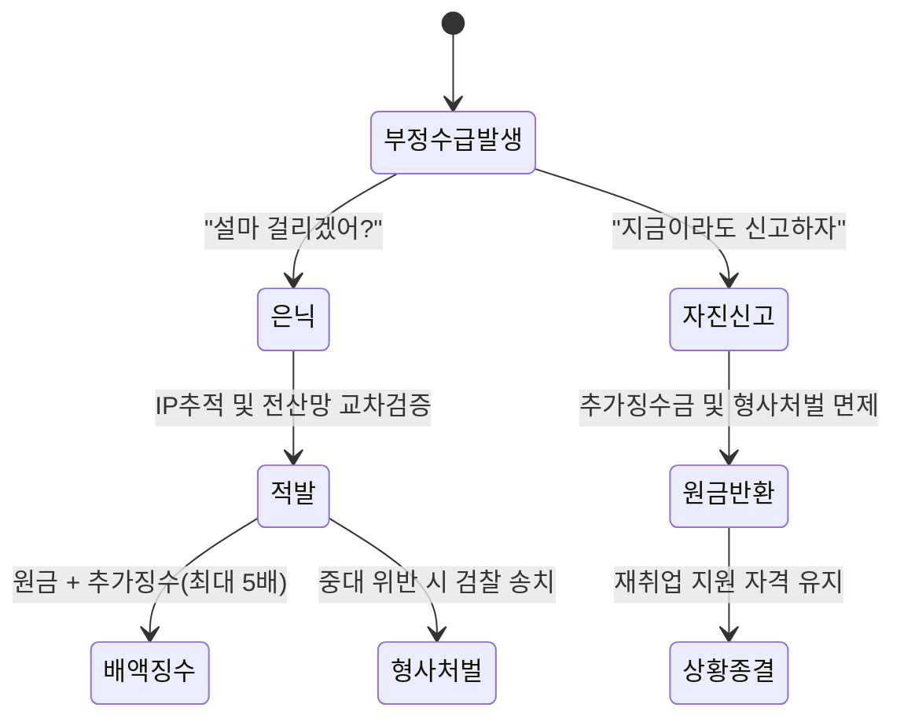

"잠깐이면 되겠지" 혹은 "해외니까 안 걸리겠지"라는 안일한 생각이 인생을 꼬이게 만들어요. 고용노동부의 전산망은 우리가 상상하는 것보다 훨씬 정교하게 설계되어 있거든요.

<!--more-->

## 실업급여 부정수급 환수금 방어 및 자진신고, 전산망은 속이지 못해요

최근 고용노동부의 부정수급 적발 시스템은 단순히 고용보험 가입 여부만 따지는 수준을 넘어섰어요. **IP 추적 및 통신 자료 조사**가 병행되면서 해외에서의 부정 수급이나 대리 신청은 실시간에 가깝게 포착되죠. 의도치 않게 소득이 발생했더라도 이를 숨기는 행위는 결국 더 큰 페널티로 돌아올 뿐이에요.

정부는 현재 국세청, 금융감독원, 그리고 각 지자체와의 전산망 연동을 통해 수급자의 소득 발생 여부를 촘촘하게 들여다보고 있어요. 단 하루의 아르바이트라도 고용주가 비용 처리를 위해 신고하는 순간, 고용보험 전산에는 빨간불이 들어온다고 봐야 해요. '나 하나쯤은 모르겠지'라는 생각은 데이터 앞에서 무용지물이죠.

지금 당장 연락이 오지 않았다고 해서 안전한 상태가 아니에요. 부정수급 조사는 수급이 끝난 뒤에도 수년 동안 소급해서 진행될 수 있거든요. 뒤늦게 적발되면 그동안 받은 급여 전액 반환은 물론이고, 무거운 가산금까지 감당해야 하는 상황에 놓이게 돼요.

### 중기부 보조금 적발 사례가 보여주는 정부의 감시 의지

정부의 보조금 관리 강화 기조는 실업급여에만 국한된 이야기가 아니에요. 최근 중소벤처기업부는 스마트제조 지원 사업을 통해 **112개사의 부정수급 사례를 적발**하고, 그중 26곳을 형사고발하는 강력한 조치를 취했어요. 이는 정부가 공공 자금의 누수를 막기 위해 얼마나 정밀한 조사를 벌이고 있는지 보여주는 단면이죠.

특히 2024년 지원기업 1887개사 중 상당수가 집중 점검 대상이 되었고, 현재 2025년 지원 예정인 1530개사에 대해서도 추가 정밀조사가 예고된 상태예요. 이러한 전방위적 조사는 실업급여 수급자들에게도 시사하는 바가 커요. 관리 사각지대를 완전히 없애겠다는 것이 정부의 확고한 방침이기 때문이죠.

단순히 서류상 문제가 없다고 안심할 단계가 아니에요. 사업 구조 자체를 개편하여 기획부터 운영까지 전 과정을 모니터링하겠다는 계획이 발표된 만큼, 개인의 실업급여 수급 과정 역시 더욱 투명한 증빙을 요구받게 될 거예요.

### 해외 접속과 단기 알바, '설마'가 '확신'으로 변하는 순간

온라인 커뮤니티나 지식인 사연을 보면 해외에서 실업인정을 신청했다가 반환 명령을 받은 사례가 빈번하게 올라와요. 본인은 직접 신청했다고 주장하지만, 고용노동부는 **접속 IP 위치 정보**를 통해 수급자가 국내에 없었음을 단번에 파악하죠. 대리 신청 역시 가족이나 지인의 IP가 노출되면서 덜미를 잡히는 경우가 대다수예요.

단 4일간의 아르바이트를 신고하지 않았다가 부정수급으로 간주되어 반환 명령 처분서를 받은 사례도 있어요. 취업 후 당일에 바로 연락이 올 정도로 전산망은 실시간으로 작동해요. "몰랐다"는 변명은 법적인 방어 논리가 되지 못하며, 원칙적으로 근로 사실을 숨긴 행위 자체가 부정수급의 요건을 충족하기 때문이죠.


부정수급으로 적발될 경우, 수급한 금액의 전액 반환은 물론이고 **최대 5배에 달하는 추가 징수금**이 부과될 수 있습니다.


### 복지 혜택 확대의 이면, 더욱 정교해진 부정수급 필터링

최근 육아휴직 기간이 1년에서 1년 6개월로 늘어나고, '6+6 부모함께 육아휴직제'가 시행되는 등 일·가정 양립 지원 제도가 대폭 강화되었죠. 수급자 수가 역대 최다인 34만 명대를 기록할 정도로 혜택이 커지면서, 정부는 이에 비례해 부정수급 감시 필터를 더욱 촘촘하게 설계하고 있어요.

외국인 계절근로자에 대한 보험 적용 제외 근거를 마련하는 등 제도의 미비점을 보완하는 움직임도 활발해요. 이는 세금이 투입되는 모든 복지 영역에서 '부당한 수령'을 원천 차단하겠다는 의지의 표현이죠. 혜택이 늘어날수록 그 자격 요건을 검증하는 시스템은 더 날카로워질 수밖에 없어요.

따라서 현재 실업급여를 받고 있다면, 본인의 상황이 제도의 취지에 부합하는지 매 순간 점검해야 해요. 수익형 블로그 운영이나 주식 매매 수익 등 모호한 영역에 대해서도 미리 고용센터 담당자에게 문의하는 것이 사후에 벼락을 맞는 것보다 훨씬 현명한 선택이에요.

## 배액 징수를 막는 마지막 기회, 자진신고와 소명 방법

이미 의도치 않은 소득이 발생했거나 신고를 누락했다면, 고용노동부의 연락을 기다리지 말고 먼저 움직여야 해요. 자진신고는 법이 허용하는 유일한 감경 수단이며, 이를 통해 최악의 시나리오를 막을 수 있기 때문이죠.

**자진신고 시 면제**되는 혜택은 생각보다 커요. 원래대로라면 수급액의 몇 배를 더 내야 하지만, 스스로 신고하면 추가 징수금을 면제받을 수 있고 형사 처벌의 위험에서도 벗어날 수 있어요. 신고서는 관할 고용센터에 직접 방문하거나 온라인을 통해 접수할 수 있으며, 당시의 상황을 객관적으로 서술하는 것이 중요해요.

만약 환수금을 한 번에 내기 어려운 경제적 상황이라면 분할 납부나 기한 연장을 신청할 수도 있어요. 하지만 이 역시 자진신고라는 전제 조건이 충족되었을 때 협의가 더 수월하죠. 숨긴다고 해결될 일은 단 하나도 없다는 점을 명심하십시오.

### 실업급여 부정수급 관련 궁금증 해결

### 하루만 알바했는데도 부정수급에 해당하나요?
네, 금액의 크고 적음과 상관없이 근로 사실이나 소득 발생을 신고하지 않고 실업급여를 수급했다면 원칙적으로 부정수급에 해당해요. 단 하루라도 근로를 했다면 반드시 실업인정 시 해당 내용을 기재해야 나중에 뒤탈이 없어요.

### 자진신고하면 벌금이 아예 없나요?
이미 받은 부정수급액 자체는 당연히 반환해야 해요. 하지만 자진신고를 하면 원래 부과되어야 할 **최대 5배의 추가 징수금**을 면제받을 수 있고, 고의성이 낮다고 판단될 경우 형사 처벌 대상에서도 제외될 가능성이 매우 높아요.

### 해외에서 실수로 실업인정 신청을 눌렀는데 어떻게 하죠?
실수라고 하더라도 해외 IP 접속 기록은 즉시 남게 돼요. 이 경우 입국 직후 고용센터에 방문하여 당시 상황을 소명하고 자진신고 절차를 밟는 것이 가장 안전해요. 전산은 실수를 봐주지 않지만, 자진신고 시스템은 소명의 기회를 제공하니까요.

### [References]
- [중기부, ‘스마트제조 보조금’ 부정수급 112개사 적발…사업 구조 개편](https://biz.chosun.com/industry/business-venture/2026/04/28/P3LTRI2GANADJIGRX645M63PBM/?utm_source=naver&utm_medium=original&utm_campaign=biz)
- [소공인 스마트제조 '112개사 부정수급'…26곳 형사고발](https://www.shinailbo.co.kr/news/articleView.html?idxno=5015964)
- [[팩트체크] 1년반으로 늘어난 육아휴직, 누구나 다 쓸 수 있을까](https://www.yna.co.kr/view/AKR20260430169800518?input=1195m)
- [외국인 계절근로자에 대한 노인장기요양보험 적용 제외 근거 마련](https://www.nocutnews.co.kr/news/6512762?utm_source=naver&utm_medium=article&utm_campaign=20260506011854)