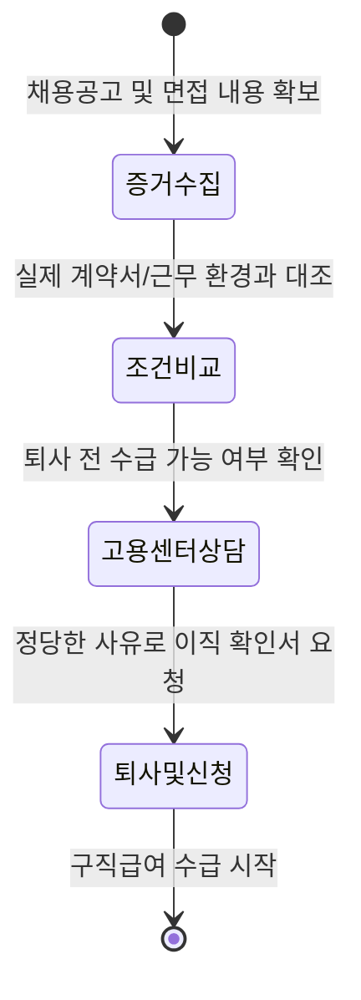

면접 때 들었던 연봉과 실제 계약서의 숫자가 다르거나, 분명히 보장한다던 워라밸이 출근 첫날부터 무너지는 상황을 마주하면 당혹스러울 수밖에 없죠. 억울해서 당장이라도 그만두고 싶지만, 내 발로 나가는 '자발적 퇴사'는 실업급여를 못 받는다는 생각에 발이 묶여 있나요? 하지만 회사가 처음 약속을 어겼다면 이야기가 완전히 달라져요.

### 낚시 채용에 속았다면 '자발적 퇴사'도 실업급여 대상이에요

보통 실업급여는 권고사직이나 계약 만료처럼 타의로 직장을 잃었을 때만 받는다고 생각하죠. 하지만 고용노동부 지침과 전문가 답변에 따르면, **채용 시 제시된 근로조건보다 현저히 낮은 대우**를 받게 된 경우에는 스스로 사표를 내더라도 구직급여를 신청할 수 있는 정당한 이직 사유로 인정받아요.

회사가 채용 공고나 면접에서 약속했던 임금, 근로시간, 복리후생 등을 실제 근무 과정에서 일방적으로 낮췄다면 이는 명백한 근로조건 위반에 해당하기 때문이죠. 즉, 여러분이 무책임하게 회사를 나가는 것이 아니라 회사가 근로 계약의 전제 조건을 파괴한 피해자로 보호받는 셈이에요.

### 실업급여 승률을 높이는 3단계 대처 프로세스

단순히 "말이 다르다"라고 주장하는 것만으로는 부족해요. 고용센터에서 이를 인정받으려면 객관적인 자료가 반드시 필요하죠. 아래 흐름에 따라 차근차근 증거를 확보해야 해요.

가장 먼저 해야 할 일은 **최초 채용 공고 캡처본**을 확보하는 거예요. 워크넷이나 사람인 등에 올라왔던 공고문은 시간이 지나면 삭제될 수 있으니 지금 즉시 저장해두세요. 면접 당시의 대화 녹취나 약속된 조건이 적힌 문자, 이메일도 훌륭한 증거가 돼요.

### 채용 공고 vs 실제 근무 조건 비교 체크리스트

어떤 부분이 달라졌을 때 실업급여를 당당하게 요구할 수 있는지 표로 확인해 보세요. 아래 항목 중 하나라도 해당한다면 근로조건 위반을 주장할 수 있는 근거가 돼요.

| 구분 | 채용 시 약속 (증거 필요) | 실제 근무 상황 (팩트) | 비고 |
| :--- | :--- | :--- | :--- |
| **임금** | 공고에 명시된 월급/연봉 | 계약서상 삭감된 금액 | 포괄임금제 강요 포함 |
| **근로시간** | 주 40시간, 야근 없음 | 상시적인 연장 근로 발생 | 휴게시간 미준수 포함 |
| **직무 내용** | 기획/마케팅 등 전문 직무 | 단순 노무 또는 전혀 다른 업무 | 직무 위반 |
| **근무지** | 본사 근무 (특정 지역) | 갑작스러운 원거리 발령 | 통근 곤란 여부 확인 |


근로계약서를 아예 작성하지 않는 곳도 있어요. 이는 명백한 법 위반이며, 회사는 과태료 처분을 받을 수 있죠. 계약서가 없더라도 채용 공고와 실제 급여 명세서 등을 비교해 차이를 증명하면 실업급여 신청이 가능해요.


### 억울한 퇴사 전 꼭 확인해야 할 병목 구간

의욕만 앞서서 바로 사표를 던지기 전에 반드시 체크해야 할 점이 있어요. 바로 **이전 직장과의 고용보험 가입 기간 합산**이에요. 실업급여를 받으려면 퇴사 전 18개월 동안 고용보험 피보험 단위 기간이 통산 180일 이상이어야 하거든요.

지금 옮긴 직장에서 일주일 만에 그만두더라도, 이전 직장에서의 근무 기간을 합쳐서 180일이 넘는다면 수급 자격이 생겨요. 하지만 이전 직장 퇴사 후 이미 실업급여를 한 번 받았다면 기간 합산이 되지 않으니 본인의 가입 이력을 먼저 조회해 보는 것이 안전해요.

### 궁금해할 만한 상황들

**Q: 출근 첫날 바로 퇴사해도 실업급여가 나오나요?**
단순 변심이 아니라 '채용 시 제시된 근로조건보다 낮아진 경우'임을 증명해야 하며, 이전 직장과의 고용보험 가입 기간 합산이 필요해요. 가입 기간이 부족하면 받을 수 없으니 주의해야 하죠.

**Q: 어떤 증거가 결정적인가요?**
최초 채용 공고 캡처본, 면접 당시의 대화 녹취나 문자, 그리고 실제 작성한 근로계약서가 결정적인 증거가 돼요. 특히 공고 내용과 계약서의 수치 차이를 명확히 보여주는 것이 중요해요.

**Q: 회사가 이직 확인서를 안 써주면 어떡하죠?**
근로조건 위반으로 인한 퇴사임을 고용센터에 직접 설명하고 증거를 제출하면 돼요. 회사가 협조하지 않더라도 고용노동부를 통해 사실관계를 확인받아 처리할 수 있는 방법이 있어요.

회사가 처음의 약속을 어긴 순간, 여러분은 단순한 퇴사자가 아니라 근로 권리를 침해당한 피해자예요. 당당하게 권리를 찾고 더 건강한 환경에서 새로운 시작을 준비하세요.

### [References]
- [아하(Aha) 전문가 답변 - 채용 조건 불일치 시 실업급여](https://www.a-ha.io/questions/4edd45cba6c2ee09992d281783354983)
- [뉴스 - 채용 공고 낚시 및 근로조건 위반 대처법](https://news.google.com/rss/articles/CBMiUkFVX3lxTFA1SGlIVFlxRHBLdUg3bXNpRXpoc3ptRXR3VWFZR1RBZTVRVmRVTkdEQ1NNWnNPU1pxa2xyQ2RDQWVucHZGZVhwX1BmV2ZsU3A5eVE?oc=5)