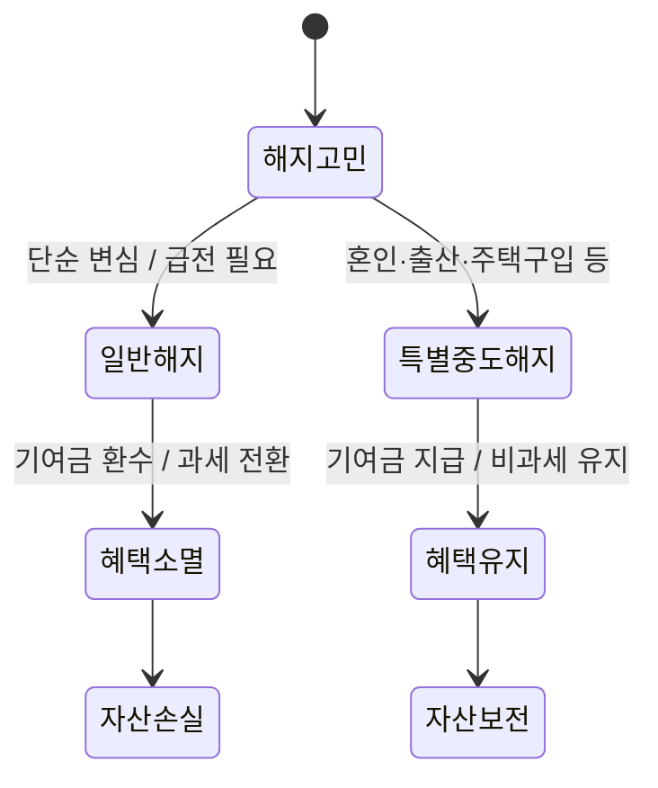

급하게 목돈이 필요해지면 가장 먼저 눈에 들어오는 게 그동안 성실하게 부어온 적금 계좌예요. 하지만 청년도약계좌 해지 버튼을 누르기 전에 반드시 멈춰야 해요. 아무 생각 없이 일반 해지를 선택하는 순간, 그동안 국가에서 넣어준 기여금과 이자소득 비과세 혜택이 한꺼번에 증발해 버리거든요.

<!--more-->

## 청년도약계좌 특별중도해지 요건 기여금 환수 면제 기준과 혜택 유지 전략

정부 지원 상품은 가입 기간을 채우는 것이 원칙이지만, 인생에서 피치 못할 사정이 생겼을 때를 대비한 안전장치가 분명히 존재해요. 이 기준을 정확히 알고 대응하느냐 아니냐에 따라 수백만 원의 실질 수익이 결정되죠.

### 3년 만기 청년미래적금 출시와 도약계좌 해지 리스크의 실체

최근 발표된 청년미래적금은 만기 시점이 3년으로 앞당겨지면서 장기 납입 부담을 줄인 것이 특징이에요. 기본금리 5%에 우대금리 2~3%포인트를 더해 **최대 7~8% 수준의 금리**를 제공하며, 정부 기여금까지 합치면 실질적으로 연 13.2~19.4%의 단리 적금 효과를 낸다고 발표되었죠.

하지만 기존 청년도약계좌 가입자가 단순히 이 상품으로 갈아타기 위해 기존 계좌를 일반 해지하면 치명적인 손해를 입게 돼요. 일반 해지 시에는 정부 기여금은 물론이고 이자소득에 대한 비과세 혜택까지 모두 소멸하기 때문이죠. 결국 본인이 납입한 원금과 아주 낮은 수준의 기본 이자만 손에 쥐게 되는 셈이에요. 기여금 환수 면제 기준을 모른 채 해지하는 것은 본인의 자산을 스스로 깎아먹는 행위입니다.

따라서 당장 자금이 필요하거나 상품 전환을 고려한다면, 반드시 본인의 상황이 '특별중도해지' 사유에 해당하는지부터 따져봐야 해요.

### 혼인과 출산으로 문턱 낮아진 특별중도해지 면제 요건

정부는 청년들의 생애 주기를 고려해 특별중도해지 요건을 대폭 완화하고 있어요. 개인 기준으로 가입 대상이었더라도 혼인 후 가구 소득 합산 시 기준을 초과해 불이익을 받는 사례를 방지하기 위해서죠. 실제로 2인 가구의 경우 중위소득 요건을 일반형은 200%에서 250%로, 우대형은 150%에서 200%로 완화하여 적용하기로 확정했어요.

현재 인정되는 주요 특별중도해지 사유는 다음과 같아요:
- 가입자의 혼인 및 출산
- 생애최초 주택 구입
- 가입자의 사망 또는 해외 이주
- 퇴직, 사업장의 폐업, 천재지변

이러한 사유로 해지할 경우, 중도에 그만두더라도 **정부 기여금을 그대로 받을 수 있고 비과세 혜택도 유지**돼요. 특히 청년도약계좌에서 청년미래적금으로 갈아타는 경우, 일정 우대금리 요건을 충족하면 특별중도해지로 처리되어 기존에 쌓아온 이자 혜택을 온전히 보전받을 수 있다는 점이 핵심이에요.

## 갈아타기와 중도 해지 사이에서 실질 수익 방어하기

커뮤니티나 현장에서는 단순히 '해지하면 손해'라는 말만 듣고 겁을 먹거나, 반대로 아무런 준비 없이 해지했다가 뒤늦게 후회하는 사례가 빈번하게 발생하고 있어요.

### 청년미래적금 갈아타기 시 놓치지 말아야 할 특별 처리

온라인 커뮤니티의 실제 사례를 보면, 청년도약계좌 기존 가입자가 새로운 상품인 청년미래적금으로 옮겨갈 때 손해를 볼까 봐 걱정하는 목소리가 높아요. 금융위원회 안내에 따르면 기존 가입자가 미래적금 가입을 위해 해지하는 경우 이를 **특별중도해지**로 허용해 주기로 했어요.

하지만 여기서 주의할 점은 본인이 직접 '특별중도해지' 프로세스를 밟아야 한다는 거예요. 단순히 은행 앱에서 일반 해지 버튼을 누르면 시스템은 이를 단순 변심으로 인식할 위험이 있어요. 반드시 상품 전환을 위한 특별 해지 요건임을 확인하고, 관련 서류나 절차를 금융기관을 통해 확답받은 뒤 진행해야 하죠. 제대로 확인하지 않고 버튼 하나 잘못 눌렀다가 수년간 쌓아온 우대금리 요건이 날아가는 상황은 누구도 책임져주지 않아요.

### 중도 해지 이자 손실의 현실과 담보대출이라는 우회로

적금을 90% 이상 납입한 상태에서 급전이 필요해 해지를 고민하는 경우도 많죠. 새마을금고나 케이뱅크 등 시중 금융기관의 사례를 보면, 만기를 코앞에 두고 해지할 때 발생하는 이자 손실은 생각보다 뼈아파요. 약정 금리의 절반도 못 미치는 중도해지 이율이 적용되기 때문이죠.

이럴 때 활용할 수 있는 레버리지가 바로 **적금 담보대출**이에요. 본인이 납입한 금액의 일정 범위(보통 90~95%) 내에서 대출을 받는 방식인데, 대출 금리가 적금 금리보다 조금 높더라도 만기 시 받게 될 정부 기여금과 비과세 혜택의 총액을 따져보면 해지하는 것보다 훨씬 유리한 경우가 많아요. 당장의 현금 흐름 때문에 수백만 원의 정부 지원금을 포기하는 우를 범하지 마세요.

적금 담보대출 이용 시 대출 이자가 발생하므로, 남은 만기 기간과 예상 기여금 수익을 반드시 비교 계산해 본 뒤 결정해야 해요.

## 정책적 관점에서 본 기여금 체계와 사회적 논의

정부 기여금은 단순히 주는 돈이 아니라, 국가의 정책적 목적이 담긴 재원이에요. 최근 국회 재정경제기획위원회에서 논의된 '전략수출금융지원법'이나 금융권의 '상생금융기여금' 사례를 봐도 알 수 있듯이, 기여금의 설계와 환수 기준은 항상 논쟁의 중심에 있죠.

### 기여금 설계의 복잡성과 수익자 부담 원칙

국회 공청회 자료를 보면, 국가가 특정 산업이나 계층에 금융 지원을 할 때 그 이익의 일부를 기여금으로 환수하거나 특정 조건에서만 지급하는 구조를 두고 의견이 갈리곤 해요. 방산 수출 지원이나 금융권 횡재세 논란에서 보듯, 기여금은 '공적 비용 투입'에 대한 반대급부 성격이 강하죠.

청년도약계좌의 기여금 역시 마찬가지예요. 청년의 자산 형성을 돕기 위해 세금이 투입되는 만큼, '성실 납입'이라는 조건을 걸어둔 거예요. 만약 아무런 제약 없이 중도 해지자에게도 기여금을 다 퍼준다면 정책의 취지가 몰각되겠죠. 그래서 특별한 사유가 없는 한 기여금을 환수하는 것은 정책적 일관성을 유지하기 위한 최소한의 장치라고 볼 수 있어요.

### 금융권 상생금융기여금 논의가 시사하는 바

정치권에서 논의되었던 상생금융기여금 법안은 금융회사의 초과 이익 일부를 취약계층 지원에 사용하는 내용을 담고 있어요. 이는 결국 사회 전체의 부를 어떻게 재분배하고, 어려운 시기에 금융 안전망을 어떻게 구축할 것인가에 대한 고민이죠.

청년도약계좌의 혜택이 강화되고 특별해지 요건이 완화되는 흐름도 이러한 '상생'의 맥락에서 이해할 수 있어요. 결혼이나 주거 마련처럼 청년의 삶에서 중요한 변곡점이 생겼을 때, 국가가 약속한 혜택을 뺏지 않고 유지해 주겠다는 의지죠. 독자 여러분은 이러한 정책적 배려를 권리로서 당당히 누리되, 요건을 갖추지 못한 성급한 해지로 본인의 권리를 스스로 포기하지 않기를 바라요.

### 청년도약계좌 해지 전 마지막 체크리스트

해지 버튼에 손이 가나요? 아래 질문에 하나라도 해당한다면 지금 당장 멈추세요.

1. **혼인, 출산, 생애최초 주택 구입** 예정인가요? (특별중도해지 사유)
2. 만기까지 남은 기간이 **6개월 미만**인가요? (적금 담보대출 고려)
3. **청년미래적금으로 갈아타기**를 원하는 건가요? (특별 처리 확인 필수)
4. 퇴직이나 폐업 등 **경제적 급변 사정**이 있나요? (증빙 서류 준비)

서민금융진흥원 홈페이지나 가입 은행 상담 센터를 통해 본인의 사유가 '특별중도해지'에 해당하는지 유선으로 먼저 확인하는 것이 가장 정확해요.

### FAQ

**단순히 돈이 없어서 해지하면 이자를 아예 못 받나요?**
아니요, 본인이 낸 원금과 은행에서 약정한 기본 이자는 받을 수 있어요. 하지만 국가가 넣어주는 정부 기여금과 우대금리는 사라지고, 이자소득에 대해 15.4%의 세금도 떼이게 되니 사실상 엄청난 손해죠.

**결혼 때문에 해지하려고 하는데 어떤 서류가 필요한가요?**
혼인관계증명서 등 사유를 증빙할 수 있는 공식 서류가 필요해요. 특별중도해지 요건에 해당하면 기여금과 비과세 혜택을 모두 챙길 수 있으니 꼭 서류를 챙겨서 은행 창구를 방문하세요.

**청년도약계좌에서 청년미래적금으로 갈아타는 게 무조건 이득인가요?**
만기가 3년으로 짧고 실질 금리가 높다는 장점이 있지만, 본인의 남은 도약계좌 기간과 납입 금액에 따라 달라질 수 있어요. 특히 갈아타기 시 특별해지 처리가 되는지 확인하는 게 최우선이에요.

**적금 담보대출은 신용점수에 나쁜 영향을 주나요?**
본인의 예적금을 담보로 하는 대출은 일반 신용대출보다 금리가 낮고 신용점수에 미치는 영향도 상대적으로 적은 편이에요. 해지로 인한 혜택 소멸보다는 대출 이자를 내는 게 경제적으로 유리할 때가 많죠.

### [References]
- [月 50만원씩 3년 부으면 수익 최대 455만원 … 청년에 파격 혜택](https://www.mk.co.kr/article/12047886)
- ["금리 최고 연 19.4% 효과" 청년미래적금 6월 출시](https://www.yna.co.kr/view/AKR20260514112600002?input=1195m)
- [청년미래적금 금리 최대 8%…청년부부 중위소득 250%로 완화](http://www.edaily.co.kr/news/newspath.asp?newsid=04992166645448920)
- [청년미래적금 금리 최대 7~8%로…"19.4% 적금 가입 효과"](https://www.newsis.com/view/NISX20260514_0003629068)
- [재경위, 전략수출금융지원법 공청회…기여금 놓고 ‘이견’](https://www.etoday.co.kr/news/view/2580363)
- [횡재세 입법 논의 수차례 불발…‘상생금융기여금’부터 교육세까지](https://economist.co.kr/article/view/ecn202508180073)