# Mermaid 플로우차트 테스트

아래 다이어그램이 노드/화살표 형태로 렌더링되면 Mermaid가 정상 지원되는 상태입니다.  
코드 블록 그대로 텍스트로 보이면 테마 또는 렌더링 스크립트 설정이 필요한 상태입니다.

## 샘플: Flowchart (기본 TD)

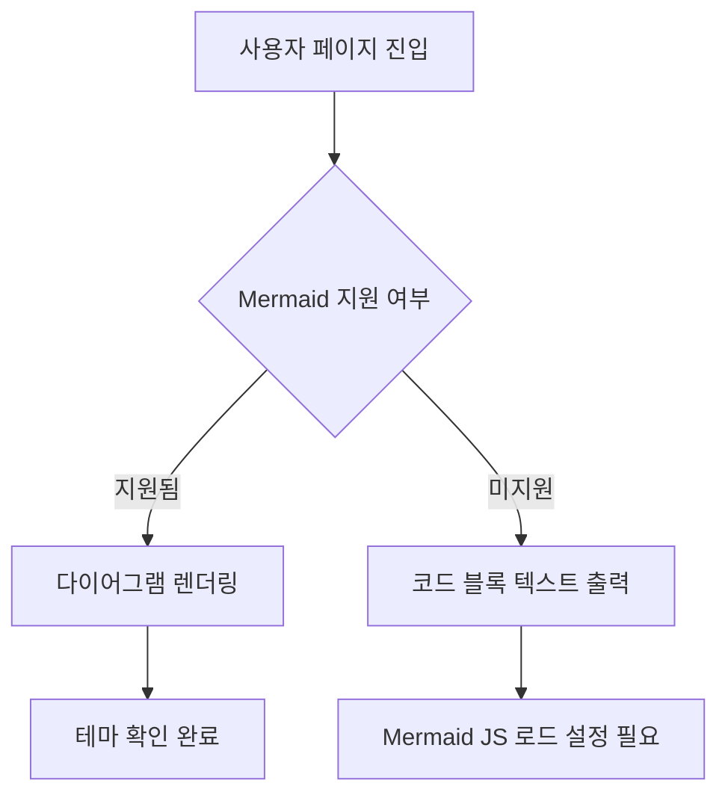

## 확인 체크리스트

- 도형 박스와 화살표가 시각적으로 보이는지
- 다이어그램 내부 한글 텍스트가 깨지지 않는지
- 다크 모드에서 선/텍스트 가독성이 유지되는지

## 추가 샘플: Sequence Diagram

요청과 응답 흐름을 표현할 때 유용한 형태입니다.

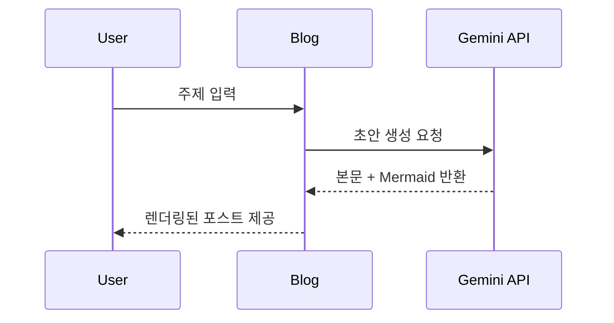

## 추가 샘플: Mindmap

핵심 주제와 하위 키워드 구조를 한 번에 보여줄 때 좋습니다.

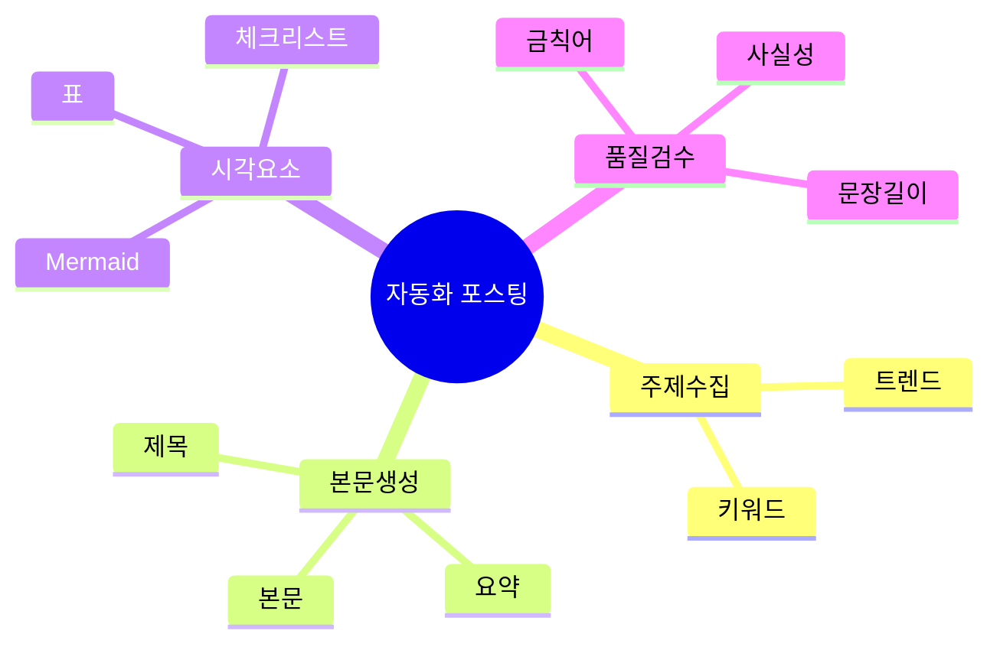

## 추가 샘플: Timeline

이슈 발생 순서나 정책 변화 흐름을 정리할 때 적합합니다.

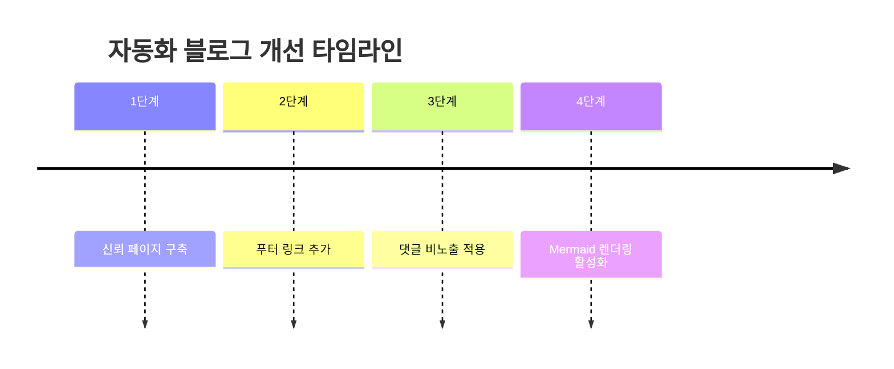

## 추가 샘플: Pie

카테고리 비중이나 트래픽 비율 같은 간단 분포를 보여줄 때 사용합니다.

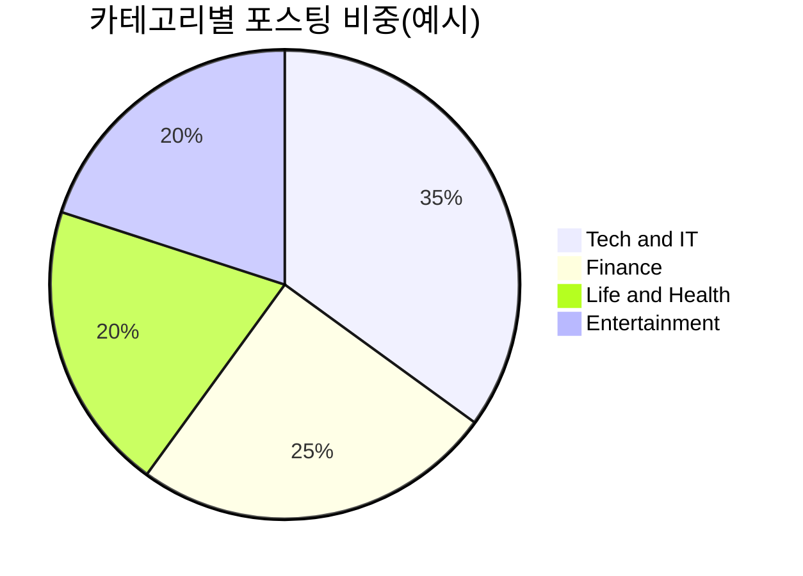

## 추가 샘플: Flowchart (LR)

좌우 흐름형 프로세스를 확인하는 샘플입니다.

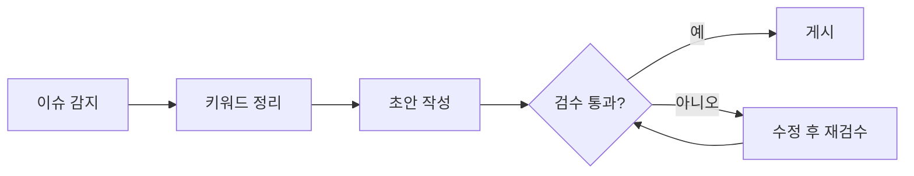

## 추가 샘플: State Diagram

상태 전이(초안 -> 검토 -> 발행 등)를 표현할 때 좋습니다.

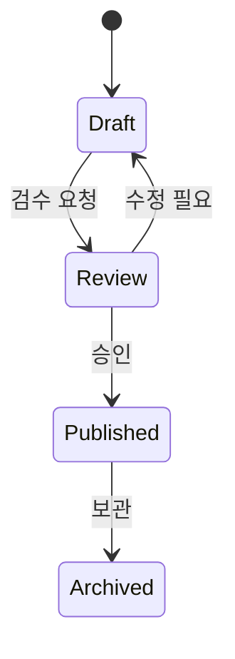

## 추가 샘플: Class Diagram

객체/모듈 구조 관계를 도식화할 때 사용합니다.

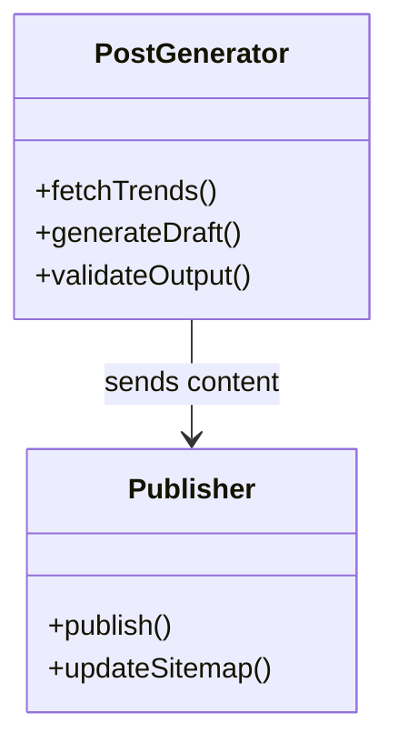

## 추가 샘플: ER Diagram

데이터 구조(엔터티 관계)를 설명할 때 유용합니다.

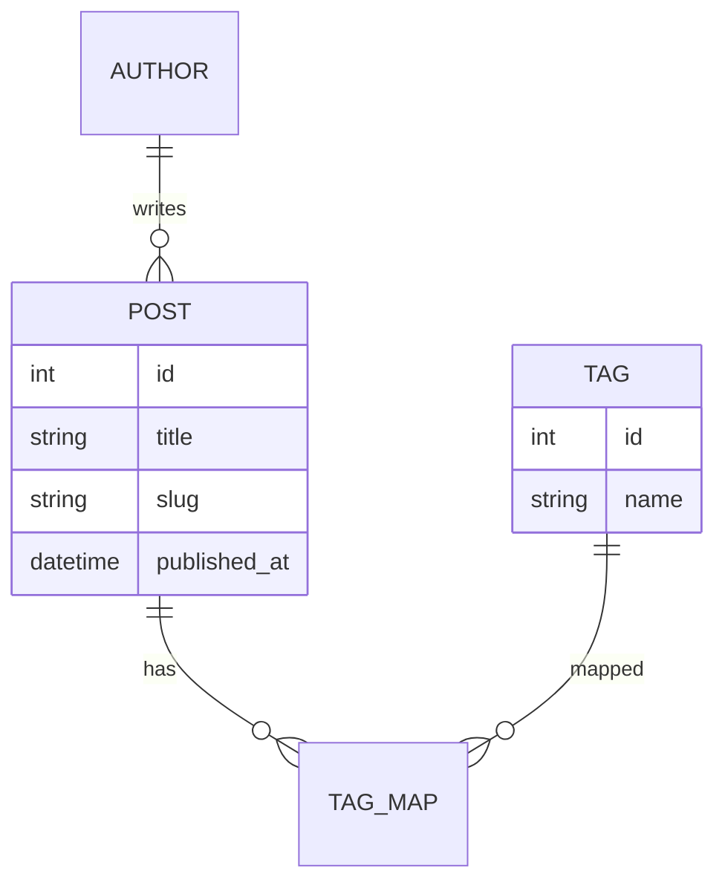

## 추가 샘플: Journey

사용자 경험 단계별 만족도를 보여줄 때 사용합니다.

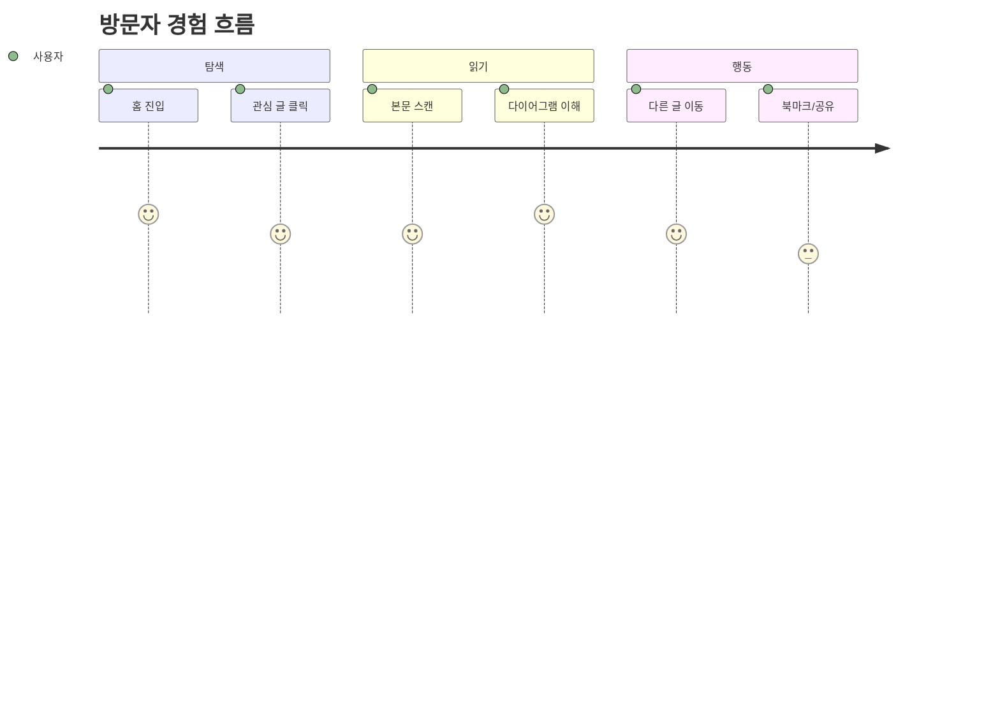

## 추가 샘플: Gantt

콘텐츠 제작 일정을 시각화할 때 적합합니다.

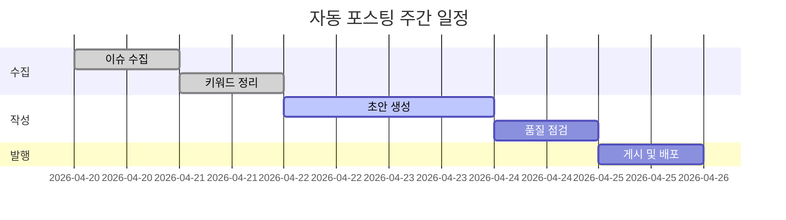

## 추가 샘플: Git Graph

브랜치/배포 흐름을 설명할 때 사용합니다.

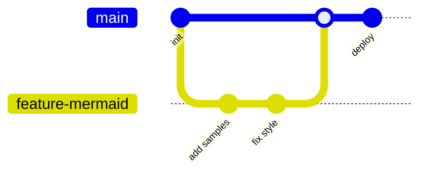

